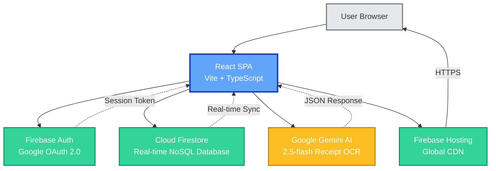
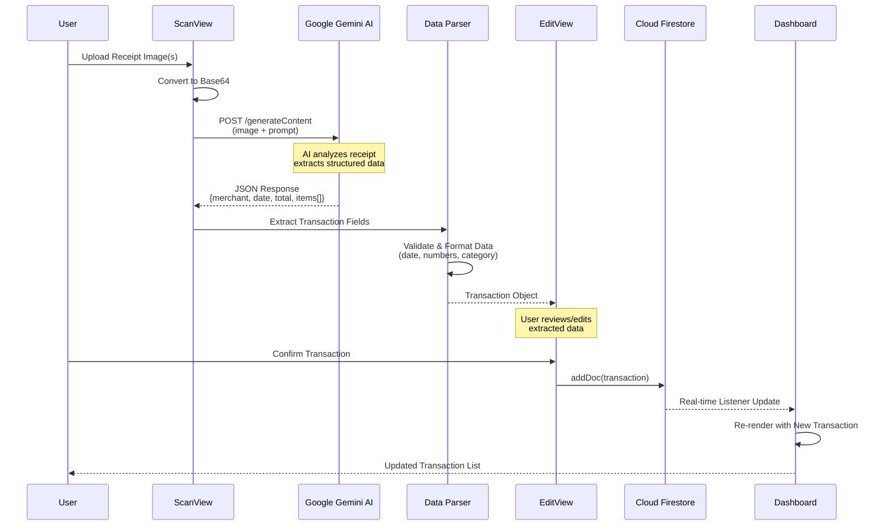
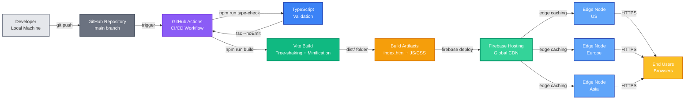

# Architecture Document - Boletapp

**Last Updated:** 2026-01-07 (Epic 14: React Query Migration + Performance Optimizations)

## Executive Summary

Boletapp is a Progressive Web Application (PWA) for expense tracking with AI-powered receipt scanning. Originally built as a single-file React application for rapid MVP development, it has evolved into a **modular architecture** with proper separation of concerns while maintaining its serverless backend and AI integration strengths. This document includes **3 Mermaid diagrams** for visual understanding of the system architecture, data flows, and deployment pipeline.

**Key Architectural Decisions:**
- **Modular Architecture** - 100+ TypeScript files organized into logical layers (Epic 1 transformation, expanded through Epic 14)
- **Serverless Backend** - Firebase handles auth, database, storage, and hosting
- **AI Integration** - Google Gemini API (via Cloud Function) for receipt OCR and data extraction
- **Real-time Sync** - Firestore listeners with React Query caching for instant navigation
- **React Query Caching** - @tanstack/react-query for cache-first data loading (Story 14.29)
- **PWA** - Service worker, offline support, installable on mobile devices
- **Production Deployment** - Live at https://boletapp-d609f.web.app with HTTPS and security rules

**Target Users:** Individuals and families tracking household expenses
**Primary Use Case:** Scan receipts → Auto-categorize → Analyze spending patterns

### System Overview Diagram

The following diagram illustrates the high-level architecture showing how the React SPA integrates with Firebase services and Google Gemini AI:



**Key Integration Points:**
- **Firebase Auth:** Manages user authentication with Google OAuth, provides session tokens
- **Cloud Firestore:** Stores transaction data with real-time synchronization to React app
- **Google Gemini AI:** Processes receipt images and extracts structured transaction data
- **Firebase Hosting:** Serves the React SPA via global CDN with automatic HTTPS

---

## Technology Stack

| Layer | Technology | Version | Purpose |
|-------|-----------|---------|---------|
| **Frontend** | React | 18.3.1 | UI framework |
| | TypeScript | 5.3.3 | Type-safe development |
| | Lucide React | 0.460.0 | Icon library |
| **Styling** | Tailwind CSS | 3.x | Utility-first CSS (via CDN) |
| **State Management** | React Hooks + React Query | Built-in + 5.x | `useState`, `useEffect`, `useMemo` + Custom hooks |
| **Caching** | @tanstack/react-query | 5.x | Cache-first data loading, instant navigation |
| **Authentication** | Firebase Auth | 10.14.1 | Google OAuth 2.0 |
| **Database** | Cloud Firestore | 10.14.1 | NoSQL document store with real-time sync |
| **AI/ML** | Google Gemini | 2.5-flash | Multimodal vision API for receipt scanning |
| **Build Tool** | Vite | 5.4.0 | Fast ES module bundler with HMR |
| **Deployment** | Firebase Hosting | N/A | Static file hosting with global CDN |
| **Version Control** | Git + GitHub | N/A | https://github.com/Brownbull/gmni_boletapp |

---

## Architecture Pattern

### Modular Single-Page Application (SPA)

**Evolution:** Migrated from single-file (621 lines) to modular structure (31 files) during Epic 1.

**Current Structure:**
```
src/
├── config/          # Configuration and initialization (3 files)
│   ├── constants.ts     # App constants (categories, pagination)
│   ├── firebase.ts      # Firebase initialization
│   └── gemini.ts        # Gemini AI configuration
├── types/           # TypeScript type definitions (2 files)
│   ├── settings.ts      # Language, currency, theme types
│   └── transaction.ts   # Transaction and item interfaces
├── services/        # External API integrations (2 files)
│   ├── firestore.ts     # Firestore CRUD operations
│   └── gemini.ts        # Gemini AI receipt analysis
├── hooks/           # Custom React hooks (2 files)
│   ├── useAuth.ts       # Authentication state management
│   └── useTransactions.ts  # Firestore real-time data sync
├── utils/           # Pure utility functions (7 files)
│   ├── colors.ts        # Color palette for categories
│   ├── csv.ts           # CSV export functionality
│   ├── currency.ts      # Currency formatting
│   ├── date.ts          # Date formatting
│   ├── json.ts          # JSON utilities
│   ├── translations.ts  # i18n strings (Spanish/English)
│   └── validation.ts    # Input parsing and validation
├── components/      # Reusable UI components (5 files)
│   ├── CategoryBadge.tsx   # Category display badge
│   ├── ErrorBoundary.tsx   # Error handling wrapper
│   ├── Nav.tsx             # Navigation component
│   └── charts/
│       ├── SimplePieChart.tsx    # Pie chart visualization
│       └── GroupedBarChart.tsx   # Grouped bar chart
├── views/           # Page-level view components (7 files)
│   ├── LoginScreen.tsx     # Google OAuth sign-in
│   ├── DashboardView.tsx   # Summary stats and shortcuts
│   ├── ScanView.tsx        # Receipt camera/upload interface
│   ├── EditView.tsx        # Transaction creation/editing
│   ├── TrendsView.tsx      # Analytics and charts
│   ├── HistoryView.tsx     # Transaction list with pagination
│   └── SettingsView.tsx    # App preferences
├── App.tsx          # Main application orchestrator
└── main.tsx         # React DOM root entry point
```

**Architecture Benefits:**
- ✅ **Separation of Concerns** - Each layer has a single responsibility
- ✅ **Testability** - Functions and components can be tested in isolation
- ✅ **Maintainability** - Easy to locate and modify specific functionality
- ✅ **Collaboration** - Multiple developers can work on different modules
- ✅ **Type Safety** - TypeScript types shared across modules
- ✅ **Build Optimization** - Vite tree-shaking removes unused code

**Trade-offs vs. Single-File:**
- ⚠️ Build step required (Vite)
- ⚠️ Slightly more complex project structure
- ✅ But: Better scalability, maintainability, and testability

---

## Component Architecture

### Component Hierarchy

```
main.tsx (Entry Point)
 └── ErrorBoundary
      └── App (Main Orchestrator)
           ├── LoginScreen (Conditional: !user)
           └── Authenticated App (Conditional: user)
                ├── Nav (Always visible)
                │    └── CategoryBadge (inline)
                ├── DashboardView (view === 'dashboard')
                ├── ScanView (view === 'scan')
                ├── EditView (view === 'edit')
                ├── TrendsView (view === 'trends')
                │    ├── SimplePieChart
                │    └── GroupedBarChart
                ├── HistoryView (view === 'list')
                └── SettingsView (view === 'settings')
```

### Component Responsibilities

**App.tsx (Container Component)**
- Orchestrates all views and navigation
- Manages 20+ state variables (UI state, settings, analytics filters)
- Handles Firebase subscriptions via custom hooks
- Implements transaction CRUD operations
- Coordinates Gemini API calls for receipt scanning

**Custom Hooks**
- `useAuth()` - Manages Firebase authentication lifecycle and user state
- `useTransactions(user, services)` - Real-time Firestore subscription to user's transactions

**View Components** (Presentational + Local Logic)
- Receive props from App.tsx
- Manage view-specific UI state
- Render using Tailwind CSS utility classes
- Call parent callbacks for state updates

**Reusable Components**
- `CategoryBadge` - Color-coded category display
- `SimplePieChart` - SVG pie chart with interactive slices
- `GroupedBarChart` - Stacked bar chart for multi-category data
- `Nav` - Bottom navigation bar
- `ErrorBoundary` - React error boundary wrapper

---

## Data Architecture

### Data Flow: Receipt Scanning Workflow

The following sequence diagram shows the complete data flow when a user scans a receipt, from image upload through AI processing to final storage:



**Workflow Steps:**
1. **Image Upload:** User selects/captures receipt image in ScanView
2. **Preprocessing:** Image converted to base64 for API transmission
3. **AI Analysis:** Gemini API processes image and extracts structured data
4. **Data Parsing:** Response validated and formatted (dates, numbers, categories)
5. **User Review:** EditView displays extracted data for confirmation/editing
6. **Firestore Write:** Confirmed transaction saved to user's collection
7. **Real-time Sync:** Firestore listener triggers immediate UI update across all views
8. **UI Update:** Dashboard and other views re-render with new transaction

### Firestore Schema

**Collection Path:**
```
/artifacts/{appId}/users/{userId}/transactions/{transactionId}
```

**Security Model:** User isolation via Firestore security rules
```javascript
match /artifacts/{appId}/users/{userId}/{document=**} {
  allow read, write: if request.auth != null && request.auth.uid == userId;
}
```

**Transaction Document Structure:**
```typescript
{
  id: string,              // Firestore auto-generated
  merchant: string,        // Store name (e.g., "Walmart")
  date: string,            // ISO date: "2025-11-21"
  total: number,           // Total amount in currency
  category: string,        // One of STORE_CATEGORIES
  alias?: string,          // Optional display name for merchant
  items: Array<{
    name: string,          // Item description
    price: number,         // Item price
    category?: string      // Optional item-level category
  }>
}
```

**Supported Categories:**
- Groceries, Restaurant, Transportation, Entertainment, Healthcare, Shopping, Utilities, Other

**Data Flow:**
1. User uploads receipt image → Gemini API analyzes
2. Extracted data populates transaction form
3. User edits/confirms → `firestoreAddTransaction()`
4. Firestore triggers real-time update → `useTransactions` hook
5. UI automatically re-renders with new data

---

## API Integration Architecture

### Firebase Authentication

**Provider:** Google OAuth 2.0
**Implementation:** `src/services/firebase.ts` → `GoogleAuthProvider`

**Authentication Flow:**
1. User clicks "Sign in with Google"
2. `signInWithPopup(auth, provider)` opens Google OAuth popup
3. Google returns user credentials
4. Firebase Auth creates/updates user session
5. `useAuth()` hook updates `user` state
6. App.tsx conditionally renders authenticated views

**Session Persistence:** Firebase Auth automatically persists session to localStorage

### Cloud Firestore

**Operations:** Implemented in `src/services/firestore.ts`

- `addTransaction(user, services, transaction)` - Create new transaction
- `updateTransaction(user, services, transactionId, updates)` - Update existing
- `deleteTransaction(user, services, transactionId)` - Delete transaction
- `wipeAllTransactions(user, services)` - Delete all user data

**Real-time Sync:**
```typescript
// useTransactions hook subscribes to Firestore
onSnapshot(collectionRef, (snapshot) => {
  const txns = snapshot.docs.map(doc => ({ id: doc.id, ...doc.data() }));
  setTransactions(txns);
});
```

**Offline Support:** Firestore SDK caches data locally, operations work offline and sync when reconnected

### Google Gemini AI

**Implementation:** `src/services/gemini.ts`

**Receipt Analysis Flow:**
1. User uploads image(s) → converted to base64
2. `analyzeReceipt(images, currency)` calls Gemini API
3. Prompt includes:
   - Receipt image data
   - Requested output format (JSON)
   - Currency context for validation
4. Gemini returns structured JSON:
   ```json
   {
     "merchant": "Store Name",
     "date": "2025-11-21",
     "total": 45.99,
     "category": "Groceries",
     "items": [
       {"name": "Item", "price": 10.50}
     ]
   }
   ```
5. App parses response → populates transaction form

**Model:** `gemini-2.0-flash-preview-exp` (fast, multimodal)
**Cost:** ~$0.01 per receipt scan (minimal)

---

## State Management

**Pattern:** React Hooks (useState, useEffect, useRef)

**State Distribution:**
- **App-level State** (App.tsx): View navigation, current transaction, UI toggles, settings
- **Hooks** (useAuth, useTransactions): Authentication and data fetching
- **Local Component State**: View-specific UI (e.g., `TrendsView` analytics filters)

**No Global State Library:** Complexity doesn't justify Redux/Zustand yet. Props drilling is manageable with current component depth.

**State Updates:**
- User actions → callbacks → App.tsx updates state
- Firestore changes → `useTransactions` hook → automatic re-render
- Settings changes → localStorage persistence + state update

---

## Build and Deployment Architecture

### Deployment Pipeline Diagram

The following diagram illustrates the complete CI/CD deployment flow from developer to end users:



**Deployment Steps:**
1. **Developer:** Commits code to local Git repository
2. **GitHub:** Code pushed to main branch triggers automation
3. **CI/CD (Future):** GitHub Actions workflow will run tests automatically
4. **TypeScript Validation:** `tsc --noEmit` ensures type safety
5. **Vite Build:** Bundles, minifies, and optimizes assets
6. **Build Artifacts:** Generates dist/ folder with production-ready files
7. **Firebase Deploy:** `firebase deploy --only hosting` uploads to Firebase
8. **Global CDN:** Content distributed to edge nodes worldwide
9. **HTTPS Delivery:** Users access app via https://boletapp-d609f.web.app

**Current State (Post-Epic 1):**
- Manual deployment via `npm run build && firebase deploy`
- No automated tests in pipeline (planned for Epic 2)
- ~2 minute total deployment time
- One-click rollback via Firebase Console

**Future State (Post-Epic 2):**
- Automated tests run on every commit
- Failed tests block deployment
- CI/CD pipeline via GitHub Actions

### Development Workflow

```bash
npm run dev          # Vite dev server with HMR (http://localhost:5173)
npm run build        # TypeScript check + Vite build → dist/
npm run preview      # Preview production build (http://localhost:4175)
npm run type-check   # TypeScript validation only
```

**Hot Module Replacement (HMR):** Vite instantly reflects code changes without full page reload

### Production Build Process

**Build Command:** `npm run build`

**Steps:**
1. TypeScript compilation (`tsc`) - validates types
2. Vite bundles:
   - Tree-shaking removes unused code
   - Minification and compression
   - Asset optimization (images, fonts)
   - Output to `dist/` folder

**Build Artifacts:**
```
dist/
├── index.html         # HTML entry point
├── assets/
│   ├── index-[hash].js    # Bundled JS (with content hash for caching)
│   └── index-[hash].css   # Extracted CSS
└── vite.svg           # Static assets
```

**Build Size:** ~624KB (optimized, before gzip)

### Deployment to Firebase Hosting

**Configuration:** `firebase.json`
```json
{
  "hosting": {
    "public": "dist",
    "rewrites": [{"source": "**", "destination": "/index.html"}],
    "headers": [
      {"source": "**/*.@(js|css)", "headers": [{"key": "Cache-Control", "value": "max-age=31536000"}]}
    ]
  },
  "firestore": {
    "rules": "firestore.rules"
  }
}
```

**Deployment Steps:**
1. `npm run build` - Create production build
2. `firebase deploy --only hosting` - Deploy static files to CDN
3. `firebase deploy --only firestore:rules` - Deploy security rules (critical!)
4. Verify at https://boletapp-d609f.web.app

**CDN Benefits:**
- Global edge caching for fast load times
- Automatic HTTPS via Let's Encrypt
- DDoS protection
- Instant cache invalidation on new deployments

**Rollback Procedure:**
- Firebase Console > Hosting > Previous deployment > "Rollback"
- OR: `git checkout <previous-commit>` → `npm run deploy`

---

## Security Architecture

### Authentication Security

- ✅ Google OAuth 2.0 (industry-standard)
- ✅ Firebase Auth manages sessions securely
- ✅ No passwords stored locally
- ✅ Automatic token refresh

### Data Security

**Firestore Security Rules:** `firestore.rules`
```javascript
rules_version = '2';

service cloud.firestore {
  match /databases/{database}/documents {
    // User isolation: each user can only access their own data
    match /artifacts/{appId}/users/{userId}/{document=**} {
      allow read, write: if request.auth != null && request.auth.uid == userId;
    }

    // Deny all other paths
    match /{document=**} {
      allow read, write: if false;
    }
  }
}
```

**Security Principles:**
- **User Isolation:** Users can only read/write their own transactions
- **Authentication Required:** All operations require valid Firebase Auth session
- **Default Deny:** Any unmatched path is automatically denied

### API Key Security

**Environment Variables:** `.env` file (git-ignored)
```
VITE_FIREBASE_API_KEY=...
VITE_GEMINI_API_KEY=...
```

**Vite Access:** `import.meta.env.VITE_*` in code

**Security Notes:**
- ✅ Firebase API key is safe to expose (restricted by Firebase Console domain allowlist)
- ⚠️ Gemini API key is exposed in client (future: move to Cloud Function)
- ✅ `.env` file never committed to Git

### Content Security

- ✅ HTTPS enforced by Firebase Hosting (HTTP auto-redirects)
- ✅ No eval() or inline scripts (CSP-compliant)
- ✅ Tailwind CSS via CDN with Subresource Integrity (SRI) possible

---

## Testing Strategy

**Current State (Post-Epic 1):**
- ✅ Manual regression testing performed after every story
- ✅ TypeScript compilation validates types (`npm run type-check`)
- ✅ Production build validated before deployment
- ❌ No automated unit tests yet
- ❌ No automated integration tests yet
- ❌ No automated E2E tests yet

**Planned (Epic 2):**
- Add Vitest for unit tests
- Add React Testing Library for component tests
- Add Playwright for E2E tests (auth, scanning, CRUD flows)
- Establish test coverage baseline (target: 60%+)
- Configure CI/CD pipeline to run tests automatically

**Testing Gaps (High Risk):**
- No regression test suite (manual testing doesn't scale)
- No test coverage for utils/, services/, hooks/
- No component integration tests

---

## Performance Considerations

**Optimization Strategies:**
- **Lazy Loading:** Views loaded conditionally (only rendered view is in DOM)
- **Firestore Queries:** Real-time listeners scoped to user's data only
- **Build Optimization:** Vite tree-shaking removes unused dependencies
- **Asset Caching:** Aggressive cache headers (1 year) for static assets
- **CDN Distribution:** Firebase Hosting serves from nearest edge location

**Performance Metrics (Estimated):**
- Initial page load: <3 seconds (on 4G)
- Time to interactive: <3 seconds
- Receipt scan processing: 3-5 seconds (Gemini API latency)

**Future Optimizations:**
- Code splitting for views (dynamic imports)
- Image optimization for uploaded receipts
- Service worker for offline-first PWA
- IndexedDB for client-side caching

---

## Future Evolution

### Short-Term (Epic 2)
1. **Automated Testing Infrastructure**
   - Vitest for unit tests
   - Playwright for E2E tests
   - Test coverage tracking
   - CI/CD pipeline integration

2. **Test Environment Setup**
   - Test users (admin, test-user-1, test-user-2)
   - Test data fixtures
   - Database reset script

### Medium-Term (Epic 3+)
1. **Backend Proxy for Gemini**
   - Firebase Cloud Function to call Gemini API
   - Hides API key from client
   - Rate limiting and quota management

2. **Enhanced Analytics**
   - Budget tracking and alerts
   - Spending predictions
   - Category insights

3. **Mobile App** (React Native)
   - Native camera integration
   - Share codebase with web
   - Offline-first architecture

### Long-Term (v2.0+)
1. **Multi-User Features**
   - Shared households
   - Budget collaboration
   - Role-based permissions

2. **Advanced Features**
   - Receipt duplicate detection
   - Recurring expense tracking
   - Export to accounting software

---

## Architecture Decision Records (ADRs)

### ADR-001: Modular Architecture Migration

**Decision:** Refactor single-file architecture into modular structure
**Context:** Single file (621 lines) becoming unmaintainable, need better organization for testing and collaboration
**Date:** 2025-11-20 (Epic 1, Story 1.1)

**Consequences:**
- ✅ Improved code organization and maintainability
- ✅ Enables isolated unit testing
- ✅ Better collaboration (reduced merge conflicts)
- ✅ TypeScript type sharing across modules
- ⚠️ Requires build step (Vite)
- ⚠️ Slight complexity increase

**Migration Approach:** Phased extraction (utilities → services → hooks → components → views)

**Status:** Accepted and implemented

---

### ADR-002: Firebase as Backend

**Decision:** Use Firebase for auth and database
**Context:** No backend development resources, need real-time sync
**Date:** Original MVP decision

**Consequences:**
- ✅ Zero infrastructure management
- ✅ Real-time sync out of box
- ✅ Automatic scaling
- ❌ Vendor lock-in
- ❌ Limited query capabilities (no joins)

**Status:** Accepted, migration path exists if needed

---

### ADR-003: Gemini AI for OCR

**Decision:** Use Gemini 2.0 Flash instead of traditional OCR
**Context:** Need structured data extraction, not just text recognition
**Date:** Original MVP decision

**Consequences:**
- ✅ Intelligent parsing (handles tables, multi-column layouts)
- ✅ Category classification included
- ✅ Multimodal (can process images directly)
- ❌ API cost (~$0.01 per receipt, manageable)
- ❌ Network dependency (requires internet)

**Fallback:** Manual entry available if API fails

**Status:** Accepted

---

### ADR-004: Vite Build Pipeline

**Decision:** Migrate from no-build to Vite 5.x with TypeScript
**Context:** Need proper TypeScript support, faster HMR, and production optimization
**Date:** 2025-11-20 (Epic 1, Story 1.2)

**Consequences:**
- ✅ TypeScript type checking enabled
- ✅ Hot Module Replacement (HMR) for fast development
- ✅ Optimized production builds with tree-shaking
- ✅ Environment variable support via import.meta.env
- ✅ Dev server with instant feedback
- ❌ Requires node_modules and npm install

**Status:** Accepted (Epic 1, Story 1.2)

---

### ADR-005: Git Version Control with GitHub

**Decision:** Initialize Git repository and host on GitHub
**Context:** Need version control for collaboration, backup, and deployment automation
**Date:** 2025-11-20 (Epic 1, Story 1.3)

**Consequences:**
- ✅ Full commit history and code backup
- ✅ Collaboration-ready with branch workflows
- ✅ GitHub Actions CI/CD integration possible
- ✅ Easy rollback to previous versions
- ❌ Requires Git knowledge for team members

**Repository:** https://github.com/Brownbull/gmni_boletapp
**Branch Strategy:** Main branch for production-ready code
**Commit Convention:** Conventional commits (feat:, fix:, docs:, etc.)

**Status:** Accepted (Epic 1, Story 1.3)

---

### ADR-006: Production Deployment with Firestore Security Rules

**Decision:** Deploy to Firebase Hosting with mandatory Firestore security rules
**Context:** Production deployment requires data persistence, user isolation, and secure access control
**Date:** 2025-11-21 (Epic 1, Story 1.5)

**Consequences:**
- ✅ Production app live at https://boletapp-d609f.web.app
- ✅ HTTPS automatically enabled by Firebase CDN
- ✅ User data isolated via security rules pattern
- ✅ Global CDN distribution for fast loading
- ✅ One-click rollback capability in Firebase Console
- ⚠️ Firestore rules required or data access denied by default
- ❌ Cold start latency for Firestore connections

**Security Model:**
```
/artifacts/{appId}/users/{userId}/**
  → allow read, write: if request.auth.uid == userId
```

**Deployment Process:**
1. Build: `npm run build` → creates optimized dist/
2. Deploy Hosting: `firebase deploy --only hosting`
3. Deploy Rules: `firebase deploy --only firestore:rules` (critical!)
4. Verify: Test all features in production
5. Monitor: Firebase Console for errors and metrics

**Production URL:** https://boletapp-d609f.web.app
**Deployment Date:** 2025-11-21

**Critical Learning:** Firestore security rules MUST be deployed alongside the application. Without rules, Firestore denies all access by default, causing data persistence failures. Always include `firestore:rules` in initial deployment.

**Status:** Accepted (Epic 1, Story 1.5)

---

### ADR-007: Documentation Strategy with Mermaid Diagrams

**Decision:** Use Mermaid diagrams embedded in Markdown for architecture visualization
**Context:** Epic 1 created comprehensive text-based documentation, but lacked visual diagrams for system understanding
**Date:** 2025-11-21 (Epic 2, Story 2.1)

**Consequences:**
- ✅ Version-controlled diagrams living alongside code in Git
- ✅ Maintainable text-based diagrams (no external tools required)
- ✅ Rendered natively in GitHub, VS Code, and Markdown viewers
- ✅ Diagram changes visible in pull request diffs
- ✅ No image rot - diagrams stay current with code
- ✅ Zero licensing costs for diagramming tools
- ⚠️ Limited styling flexibility vs. visual tools like Lucidchart
- ⚠️ Learning curve for Mermaid syntax (minor)
- ⚠️ Complex diagrams can become verbose in text

**Diagrams Added:**
1. **System Overview** (graph TD): High-level architecture showing React SPA integration with Firebase Auth, Firestore, Gemini AI, and Hosting
2. **Data Flow** (sequenceDiagram): Receipt scanning workflow from image upload through AI processing to Firestore storage
3. **Deployment Pipeline** (graph LR): CI/CD flow from developer to production via GitHub, Vite build, and Firebase Hosting CDN

**Rationale:**
- Visual understanding of system architecture accelerates onboarding for new developers
- Diagrams complement text documentation without requiring separate tools
- Mermaid has become standard for documentation-as-code workflows
- GitHub renders Mermaid natively (no plugins needed)

**Alternatives Considered:**
- Lucidchart/draw.io: Rejected - requires external tools, binary exports difficult to version control
- PlantUML: Rejected - less native Markdown support than Mermaid
- ASCII art: Rejected - not visually appealing, hard to maintain
- No diagrams: Rejected - Epic 1 retrospective identified lack of visuals as documentation gap

**Status:** Accepted

---

### ADR-009: Receipt Image Storage (Epic 4.5)

**Decision:** Store receipt images in Firebase Storage with Cloud Function processing and cascade delete
**Context:** Users scanning receipts need to view original images for verification and audit purposes
**Date:** 2025-11-29 (Epic 4.5)

**Architecture Decisions:**

| Decision | Choice | Rationale |
|----------|--------|-----------|
| Storage Provider | Firebase Storage | Already using Firebase ecosystem, unified auth/rules |
| Image Processing | Server-side (Cloud Function) | Consistent results, no client-side sharp dependency |
| Path Structure | `users/{userId}/receipts/{transactionId}/` | User isolation, easy cascade delete |
| Image Format | JPEG (80% quality) | Good compression, universal support |
| Thumbnail | 120x160 JPEG (70% quality) | Fast list rendering, minimal storage |
| Cascade Delete | Firestore onDelete trigger | Guaranteed execution, works for all deletion methods |

**Image Processing Pipeline:**
```
Upload → Base64 decode → sharp resize/compress → Firebase Storage
                              ↓
                         Generate thumbnail (120x160)
```

**Storage Path Pattern:**
```
users/{userId}/receipts/{transactionId}/
├── image-0.jpg        (max 1200x1600, 80% quality)
├── image-1.jpg        (if multi-page receipt)
├── image-2.jpg        (max 3 images per transaction)
└── thumbnail.jpg      (120x160, 70% quality)
```

**Security Model (storage.rules):**
```javascript
match /users/{userId}/receipts/{allPaths=**} {
  allow read, write: if request.auth != null && request.auth.uid == userId;
}
```

**Cascade Delete Flow:**
```
Transaction deleted → Firestore onDelete trigger fires
                              ↓
                    onTransactionDeleted Cloud Function
                              ↓
                    deleteTransactionImages(userId, transactionId)
                              ↓
                    bucket.getFiles({ prefix: folderPath })
                              ↓
                    Promise.all(files.map(f => f.delete()))
```

**Cost Analysis (from Epic 4 retrospective):**
- Storage: ~$0.02/GB/month (Firebase Storage pricing)
- Per transaction: ~310-610KB (3 images + thumbnail)
- Monthly estimate: 10K users → ~$26/month, 50K users → ~$130/month

**Consequences:**
- ✅ Users can view original receipt images for verification
- ✅ Audit trail for expense tracking
- ✅ Foundation for future features (PDF export with images)
- ✅ Subscription tier differentiation possible via retention policies
- ✅ Automatic cleanup prevents orphaned files
- ⚠️ Requires Blaze plan (Cloud Functions + Storage)
- ⚠️ Additional latency during scan (~1-2s for image processing)

**Status:** Accepted (Epic 4.5 Complete)

---

### ADR-008: Security Hardening (Epic 4)

**Decision:** Implement comprehensive security hardening across secrets detection, API protection, dependency scanning, and security documentation
**Context:** Production application handling financial data requires defense-in-depth security approach
**Date:** 2025-11-27 (Epic 4)

**Epic 4 Security Implementations:**

| Story | Implementation | Status |
|-------|----------------|--------|
| 4.1 Secrets Detection | gitleaks pre-commit + CI scanning | Accepted |
| 4.2 API Protection | Gemini API moved to Cloud Function | Accepted |
| 4.3 Dependency Security | npm audit + eslint-plugin-security | Accepted |
| 4.4 Security Documentation | OWASP checklist, audit report, incident response | Accepted |

**Story 4.1 - Secrets Detection:**
- Pre-commit hook scans staged files with gitleaks
- CI Step 2 scans full repository on PRs
- Custom rules for Firebase/Gemini API key patterns
- Zero secrets found in git history (37 commits)

**Story 4.2 - Gemini API Protection:**
```
BEFORE: Browser → Gemini API (API key in JS bundle)
AFTER:  Browser → Cloud Function → Gemini API (API key server-side)
```
- Cloud Function `analyzeReceipt` deployed to us-central1
- Firebase Auth required for all requests
- Rate limiting: 10 requests/minute per user
- Image validation: max 10MB per image, 5 images per request

**Story 4.3 - Dependency & Static Security:**
- npm audit in CI (Step 21): Zero HIGH/CRITICAL allowed
- ESLint security rules (Step 22): Detects eval(), unsafe regex, etc.
- Combined audit script: `npm run security:audit`
- 16 remaining vulnerabilities (all LOW/MODERATE in dev dependencies)

**Story 4.4 - Security Documentation:**
- docs/security/README.md - Security overview
- docs/security/owasp-checklist.md - OWASP Top 10 (2021) validation
- docs/security/audit-report.md - Epic 4 findings
- docs/security/incident-response.md - Incident procedures

**Consequences:**
- ✅ API key theft risk eliminated (Cloud Function proxy)
- ✅ Accidental secret commit prevented (pre-commit + CI)
- ✅ Vulnerable dependencies detected automatically
- ✅ Insecure code patterns blocked
- ✅ OWASP Top 10 compliance documented
- ✅ 22-step CI pipeline with security gates
- ⚠️ Blaze plan required for Cloud Functions (billing enabled)
- ⚠️ Rate limiting uses in-memory storage (single instance)

**Security Architecture:**
```
        ┌─────────────────────────────────────┐
        │         Security Layers             │
        ├─────────────────────────────────────┤
        │  [1] Authentication (Firebase Auth) │
        │  [2] Authorization (Firestore Rules)│
        │  [3] API Protection (Cloud Function)│
        │  [4] Transport (HTTPS/TLS)          │
        │  [5] Input Validation               │
        │  [6] Dependency Scanning            │
        │  [7] Secrets Detection              │
        │  [8] Static Code Analysis           │
        └─────────────────────────────────────┘
```

**Status:** Accepted (Epic 4 Complete)

---

## Firebase Cloud Functions

### Overview

BoletApp uses Firebase Cloud Functions (2nd Gen) for server-side operations that require secure API keys, heavy processing, or Firestore triggers.

**Runtime:** Node.js 18
**Region:** us-central1
**Deployment:** `firebase deploy --only functions`

### Function Inventory

| Function | Type | Trigger | Purpose |
|----------|------|---------|---------|
| `analyzeReceipt` | HTTPS Callable | `onCall` | Receipt OCR via Gemini AI, image processing, Storage upload |
| `onTransactionDeleted` | Firestore Trigger | `onDelete` | Cascade delete images when transaction deleted |

### analyzeReceipt Function

**Location:** `functions/src/analyzeReceipt.ts`
**Endpoint:** `https://us-central1-{projectId}.cloudfunctions.net/analyzeReceipt`

**Request:**
```typescript
interface AnalyzeReceiptRequest {
  images: string[];              // Base64 images or URLs (for re-scan)
  currency?: string;             // Optional - V3 auto-detects from receipt
  receiptType?: ReceiptType;     // 'auto' | 'receipt' | 'invoice' | etc.
  promptContext?: 'production' | 'development';
  isRescan?: boolean;            // True if re-scanning stored images
}
```

**Response:**
```typescript
interface AnalyzeReceiptResponse {
  transactionId: string;         // Pre-generated Firestore document ID
  merchant: string;
  date: string;                  // YYYY-MM-DD
  total: number;
  category: string;
  items: Array<{ name, price, category?, subcategory? }>;
  time?: string;                 // HH:MM (V3)
  currency?: string;             // Detected currency code (V3)
  country?: string;              // Detected country (V3)
  city?: string;                 // Detected city (V3)
  imageUrls?: string[];          // Firebase Storage URLs
  thumbnailUrl?: string;         // Thumbnail URL (120x160)
  promptVersion: string;         // e.g., "3.0.0"
  merchantSource: 'scan';
  receiptType?: string;
}
```

**Security & Rate Limiting:**
- **Authentication:** Requires Firebase Auth (`context.auth` must exist)
- **Rate Limit:** 10 requests/minute per user (in-memory tracking)
- **Image Validation:** Max 10MB per image, max 5 images per request
- **Supported Formats:** JPEG, PNG, WebP, HEIC, HEIF

**Processing Pipeline:**
```
1. Validate auth + rate limit
2. Pre-process images (resize to 1200x1600, compress JPEG 80%)
3. Call Gemini 2.0 Flash API with optimized images
4. Parse JSON response
5. Upload images to Firebase Storage
6. Generate thumbnail (120x160)
7. Return combined response
```

### onTransactionDeleted Function

**Location:** `functions/src/deleteTransactionImages.ts`
**Trigger Path:** `artifacts/{appId}/users/{userId}/transactions/{transactionId}`

**Purpose:** Automatically deletes receipt images from Firebase Storage when a transaction document is deleted, preventing orphaned files.

**Flow:**
```
Transaction deleted → Firestore onDelete trigger
    → Extract userId, transactionId from path
    → Delete Storage folder: users/{userId}/receipts/{transactionId}/
    → Log completion (errors logged but don't block)
```

### Supporting Modules

| Module | Purpose |
|--------|---------|
| `imageProcessing.ts` | Sharp-based resize, compress, thumbnail generation |
| `storageService.ts` | Firebase Storage upload operations |
| `prompts/` | Prompt library (V1, V2, V3) with versioning |

---

### ADR-011: Household Sharing Architecture (Epic 14c)

**Decision:** Implement shared groups using top-level Firestore collections with Cloud Function for secure cross-user transaction queries
**Context:** Users need to share expense tracking with family members while maintaining data isolation
**Date:** 2026-01-15 (Epic 14c), **Updated:** 2026-01-17 (Security hardening)

**Architecture Pattern (Hybrid Model - Option 4):**
```
Top-level collections (cross-user access):
├── /sharedGroups/{groupId}           ← Group metadata + member list
└── /pendingInvitations/{invitationId} ← Email-based invitations

User-level collections (isolated):
└── /artifacts/{appId}/users/{userId}/transactions/{txId}
    └── sharedGroupIds?: string[]     ← References to shared groups (max 5)
```

**Key Design Decisions:**

| Decision | Choice | Rationale |
|----------|--------|-----------|
| Collection Location | Top-level | Enables cross-user read access for members |
| Membership Model | UID array in document | Simple queries, Firestore rules compatible |
| Invitation Flow | Email-based + pending status | Supports inviting non-registered users |
| Max Members | 10 per group | Performance + UI complexity limits |
| Cross-User Queries | **Cloud Function** | Server-side membership validation (see below) |

**Critical Security Decision (2026-01-17):**

Firestore collection group queries **CANNOT** evaluate `resource.data.*` conditions. This is a fundamental platform limitation that prevents client-side membership validation for cross-user transaction queries.

**Solution:** Cloud Function with server-side validation

```
Client Request
     │
     ▼
┌─────────────────────────────────────┐
│  getSharedGroupTransactions (CF)    │
│  1. Validate auth token             │
│  2. Fetch group, check membership   │
│  3. Execute query (admin SDK)       │
│  4. Return transactions w/ _ownerId │
└─────────────────────────────────────┘
     │
     ▼
Firestore (admin SDK bypasses rules)
```

**Detailed Documentation:** See [Shared Groups Architecture](./shared-groups-architecture.md)

**Security Rules Pattern:**
```javascript
// sharedGroups - Members can read, only owner can write
match /sharedGroups/{groupId} {
  allow create: if isValidNewGroup();
  allow read: if isGroupMember() || (isAuthenticated() && resource.data.shareCode != null);
  allow update: if isGroupOwner() || isJoiningGroup();
  allow delete: if isGroupOwner();
}

// pendingInvitations - Invited user can accept/decline
match /pendingInvitations/{invitationId} {
  allow create: if invitedByUserId == auth.uid;
  allow read: if invitedEmail == auth.token.email.lower();
  allow update: if isInvitedUser() && statusUpdateOnly();
  allow delete: if false;  // Kept for audit trail
}

// Collection group queries - DENIED (handled by Cloud Function)
match /{path=**}/transactions/{transactionId} {
  allow read: if false;
}
```

**Consequences:**
- ✅ Family members can view shared expenses
- ✅ Owner controls group membership
- ✅ Invitation flow works for non-registered users
- ✅ **Proper security** via server-side membership validation
- ✅ Cloud Function free tier covers MVP scale
- ⚠️ Requires careful handling of user deletion (orphan prevention)
- ⚠️ Slight latency increase (~100-200ms) vs direct Firestore queries

**Status:** Accepted (Epic 14c Complete)

---

## Conclusion

Boletapp's architecture has evolved from a **rapid MVP prototype** (single-file SPA) to a **production-ready modular application** while maintaining its core strengths: simplicity, serverless infrastructure, and AI-powered intelligence.

**Current State (Post-Epic 1):**
- ✅ Modular architecture with 31 TypeScript files
- ✅ Production deployed with HTTPS and security rules
- ✅ Type-safe development with TypeScript 5.3.3
- ✅ Optimized build pipeline with Vite 5.4.0
- ✅ Version controlled with Git and GitHub
- ⚠️ No automated tests (planned for Epic 2)

**Architecture Strengths:**
- Clean separation of concerns (config, types, services, hooks, components, views, utils)
- Real-time data synchronization with Firestore
- AI-powered receipt scanning with minimal API cost
- Zero backend maintenance overhead
- Fast development iteration cycle

**Next Evolution (Epic 2):**
Focus shifts from infrastructure to **quality and sustainability** with automated testing, test environment setup, and CI/CD pipeline integration.

**Architecture Philosophy:**
> "Start simple, evolve deliberately. Add complexity only when simplicity becomes a limitation."

The modular architecture provides a solid foundation for future enhancements while remaining accessible to small teams and individual developers.

---

---

### ADR-010: React Query for Data Caching (Epic 14.29)

**Decision:** Implement @tanstack/react-query for cache-first data loading alongside Firestore real-time subscriptions
**Context:** Users experienced loading spinners on every view navigation; need instant data display
**Date:** 2026-01-07 (Epic 14, Story 14.29)

**Architecture Pattern:**
```
Component → useFirestoreSubscription → React Query Cache + Firestore onSnapshot
                                              ↓
                                        Instant cached data on navigation
                                        + Real-time updates from Firestore
```

**Key Implementation Details:**
- **Cache-first approach**: Display cached data immediately, update when Firestore fires
- **Custom hook**: `useFirestoreSubscription` combines RQ cache with Firestore listeners
- **No useQuery for subscriptions**: Local state + useEffect, cache for persistence only
- **DevTools**: ReactQueryDevtools guarded by `import.meta.env.DEV` (dev-only)

**Files Created:**
- `src/lib/queryClient.ts` - QueryClient configuration
- `src/lib/queryKeys.ts` - Hierarchical query key constants
- `src/hooks/useFirestoreSubscription.ts` - Core subscription hook
- `docs/architecture/react-query-caching.md` - Detailed architecture doc

**Consequences:**
- ✅ Instant navigation (no loading spinners on return visits)
- ✅ Real-time updates preserved via Firestore listeners
- ✅ DevTools for cache debugging (dev only)
- ✅ Foundation for optimistic updates and pagination
- ⚠️ JSON comparison for change detection (performance acceptable for current scale)

**Lessons Learned:**
- Don't use `useQuery` with real-time subscriptions
- Use refs to prevent stale closures in subscription callbacks
- Track initialization to prevent infinite re-render loops
- Use `useMemo` for derived data instead of useState+useEffect

**Reference:** `docs/architecture/react-query-caching.md`

**Status:** Accepted (Story 14.29 Complete)

---

**Document Version:** 6.0
**Last Updated:** 2026-01-15
**Epic:** Epic 14c (Household Sharing) + Cloud Functions Documentation
