# Analytics Workflow

> Drill-down navigation, data visualization, and temporal/category filtering
> **Last Updated:** 2026-01-15

---

## Overview

The Analytics system uses a **dual-axis independence pattern** where temporal (time) and category filters operate independently, allowing flexible data exploration.

---

## State Architecture

```mermaid
flowchart TB
    subgraph Context["AnalyticsContext"]
        State["AnalyticsNavigationState"]
    end

    subgraph StateFields["State Fields"]
        T[temporal: TemporalPosition]
        C[category: CategoryPosition]
        CM[chartMode: aggregation | comparison]
        DM[drillDownMode: temporal | category]
    end

    subgraph Principle["Dual-Axis Independence"]
        P1["Temporal changes → Category PRESERVED"]
        P2["Category changes → Temporal PRESERVED"]
    end

    State --> StateFields
    StateFields --> Principle
```

---

## Temporal Hierarchy (5 Levels)


### Temporal Navigation

| Level | Children | Format |
|-------|----------|--------|
| Year | 4 quarters | Q1, Q2, Q3, Q4 |
| Quarter | 3 months | January, February, March |
| Month | 4-5 weeks | Week labels (month-aligned) |
| Week | 7 days | Mon, Tue, Wed... |
| Day | None | Leaf level |

---

## Category Hierarchy (4 Levels)


### Category Examples

```
All Categories
├── Supermarket
│   ├── Fresh Food
│   │   ├── Meats
│   │   ├── Dairy
│   │   └── Produce
│   ├── Packaged Food
│   └── Household
├── Restaurant
│   ├── Fast Food
│   ├── Casual Dining
│   └── Fine Dining
└── Entertainment
    ├── Movies
    └── Events
```

---

## Drill-Down Navigation


---

## Chart Modes

```mermaid
flowchart LR
    subgraph Modes["Chart Display Modes"]
        AGG["Aggregation Mode<br/>Shows: WHAT<br/>Pie/Bar by category"]
        COMP["Comparison Mode<br/>Shows: WHEN<br/>Grouped bar by period"]
    end

    subgraph Toggle["ChartModeToggle"]
        T1["📊 Aggregation"]
        T2["📈 Comparison"]
    end

    Toggle --> Modes

    note1["Comparison unavailable<br/>at Day level"]

    style note1 fill:#fef3c7
```



---

## Drill-Down Mode Toggle

```mermaid
flowchart TB
    subgraph DrillDownMode["DrillDownModeToggle (Story 7.16)"]
        TM["🕐 Temporal<br/>Shows time periods"]
        CM["🏷️ Category<br/>Shows spending categories"]
    end

    subgraph Cards["Cards Displayed"]
        TC["Q1 | Q2 | Q3 | Q4"]
        CC["Supermarket | Restaurant | Gas"]
    end

    TM --> TC
    CM --> CC
```



---

## Data Flow


---

## Component Architecture


---

## Period Comparison (Tendencia)

```mermaid
flowchart LR
    subgraph Current["Current Period"]
        CP[January 2024<br/>$150,000]
    end

    subgraph Previous["Previous Period"]
        PP[December 2023<br/>$120,000]
    end

    subgraph Calculation["Comparison"]
        CALC["Change: +25%<br/>Direction: UP"]
    end

    PP --> CALC
    CP --> CALC

    subgraph Display["UI Display"]
        UP["↑ +25% vs last month"]
    end

    CALC --> Display

    style UP fill:#d1fae5
```



### Change Directions

| Direction | Condition | Display |
|-----------|-----------|---------|
| `up` | Change > +0.5% | ↑ Green |
| `down` | Change < -0.5% | ↓ Red |
| `same` | -0.5% to +0.5% | → Gray |
| `new` | No previous data | ★ Blue |

---

## Reducer Actions


---

## Sankey Diagram Modes


---

## Accessibility Features

| Feature | Implementation |
|---------|----------------|
| **Keyboard Navigation** | Arrow keys in breadcrumbs, Enter/Space on cards |
| **Touch Targets** | 44px minimum for all interactive elements |
| **ARIA Labels** | Proper roles and labels throughout |
| **Focus Management** | Visible focus indicators |

---

## Key Files

| File | Purpose |
|------|---------|
| `src/views/TrendsView.tsx` | Main analytics view (5000+ lines) |
| `src/contexts/AnalyticsContext.tsx` | State management context |
| `src/hooks/useAnalyticsNavigation.ts` | Navigation hook with selectors |
| `src/components/analytics/DrillDownGrid.tsx` | Card grid container |
| `src/components/analytics/DrillDownCard.tsx` | Individual category/period card |
| `src/components/analytics/TemporalBreadcrumb.tsx` | Time navigation breadcrumb |
| `src/components/analytics/CategoryBreadcrumb.tsx` | Category filter breadcrumb |
| `src/components/analytics/SankeyChart.tsx` | Flow visualization |
| `src/utils/periodComparison.ts` | Period-over-period calculations |

---

*Diagram reflects Epic 14 analytics implementation*
