# Data Caching Architecture

> React Query + Firestore real-time integration for optimal performance
> **Last Updated:** 2026-01-15
> **Epic:** 14 (Story 14.29)

---

## Overview

BoletApp uses a **hybrid caching architecture** combining React Query's client-side cache with Firestore's real-time listeners for instant navigation and live updates.

---

## Core Pattern: useFirestoreSubscription

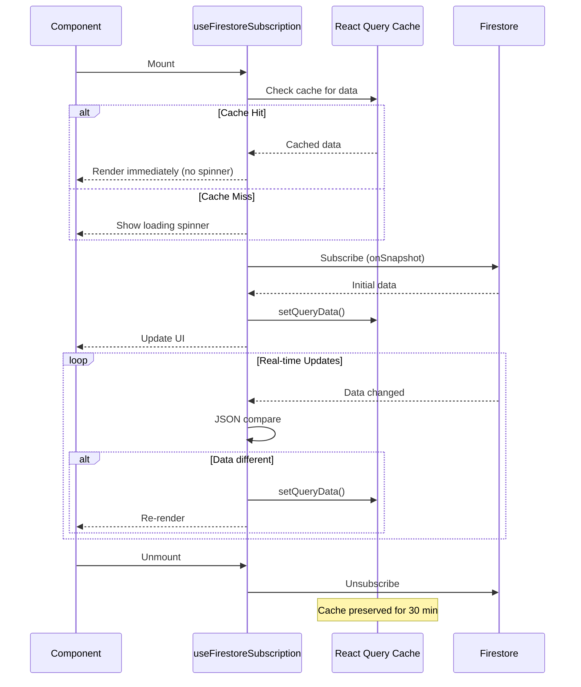

---

## Cache Configuration

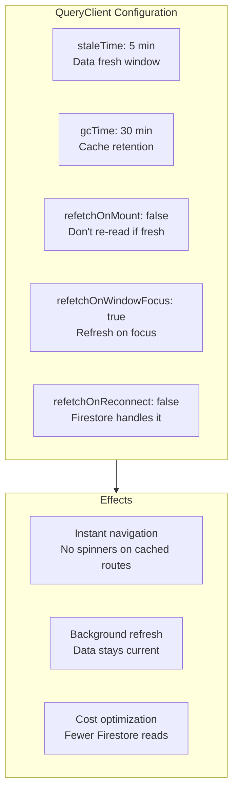

---

## Query Keys Structure

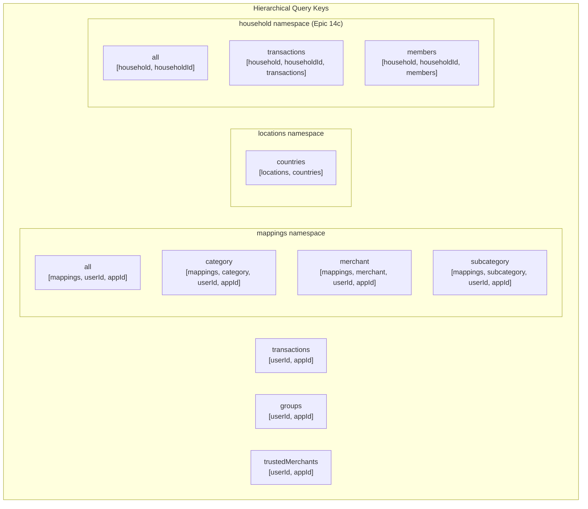

### Invalidation Patterns

```
Invalidate all mappings:
  queryClient.invalidateQueries(['mappings', userId, appId])

Invalidate only category mappings:
  queryClient.invalidateQueries(['mappings', 'category', userId, appId])
```

---

## Data Flow Patterns

### Pattern A: Cache-First (One-time Fetches)

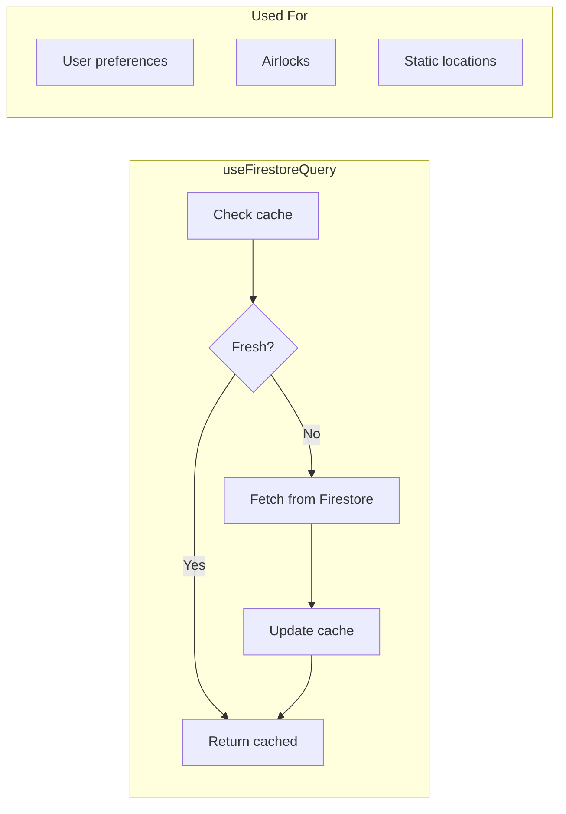

### Pattern B: Real-Time Subscription

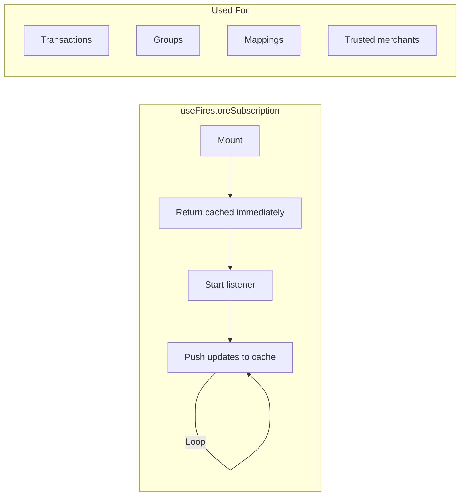

### Pattern C: Pagination Hybrid

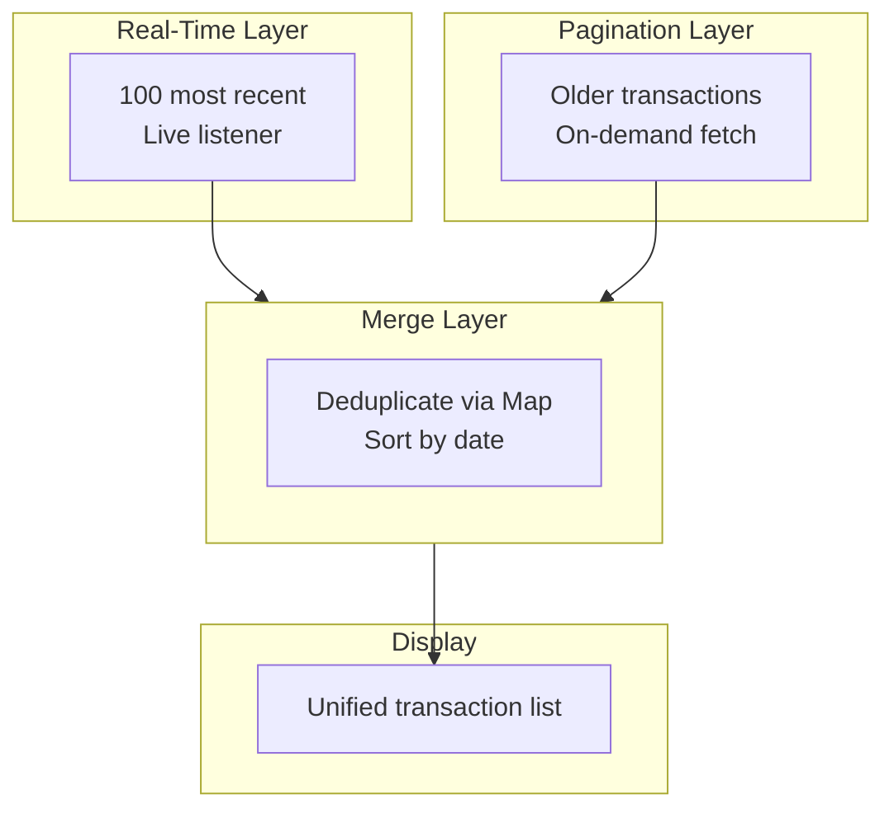

---

## Mutation Flow with Optimistic Updates

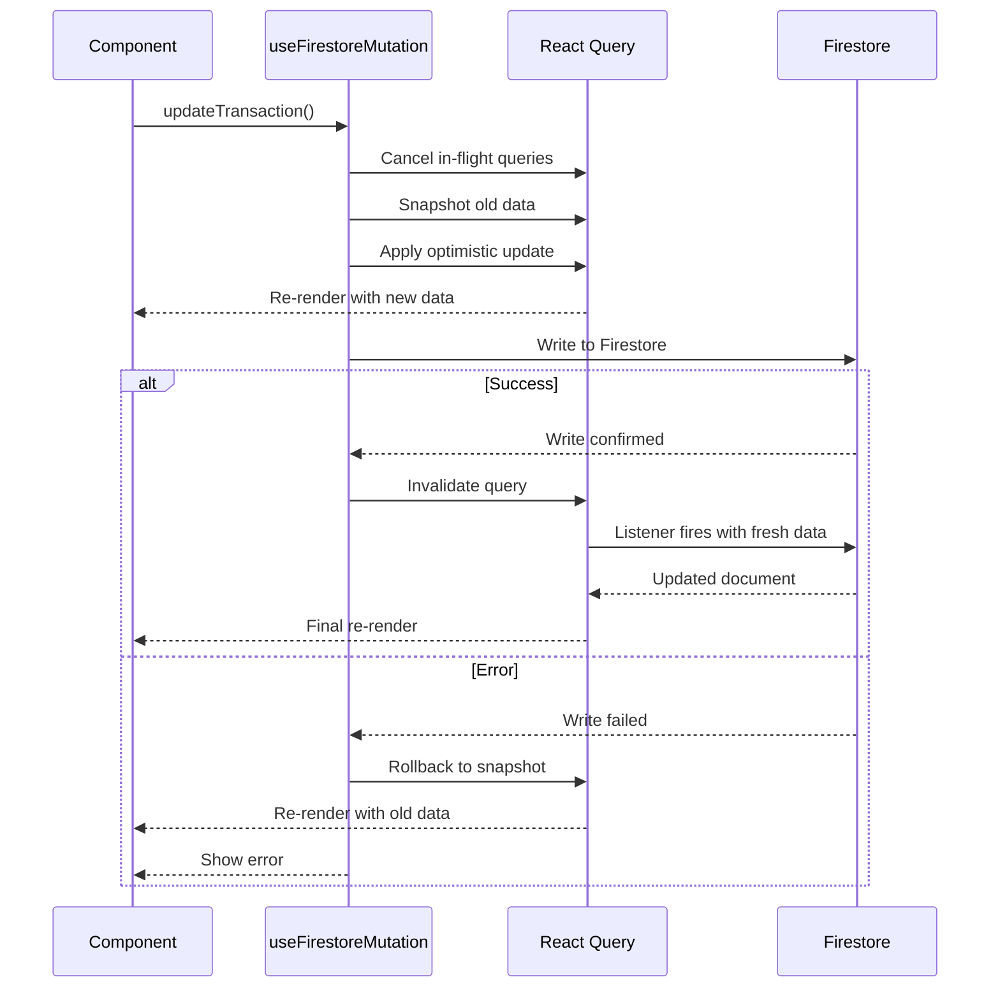

---

## Listener Limits (Cost Optimization)

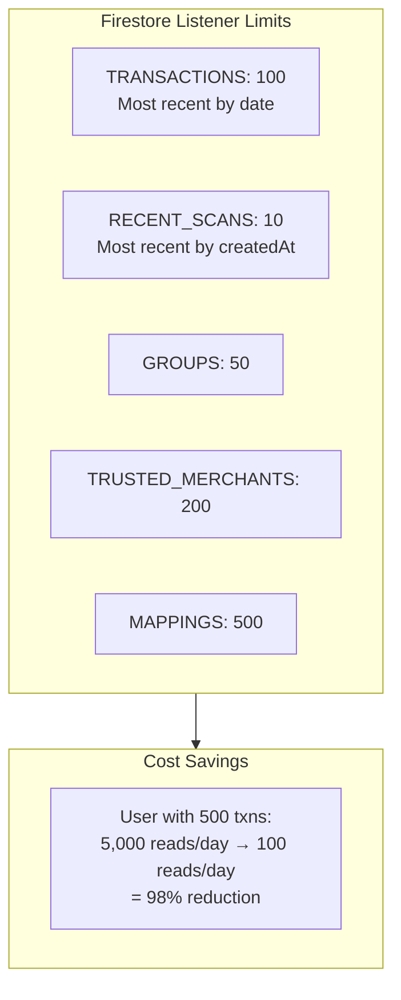

---

## Local Storage Persistence

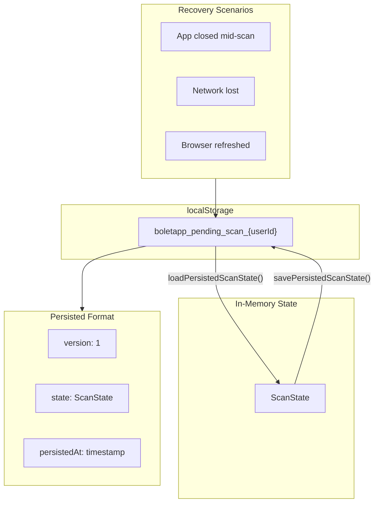

---

## Cache Lifecycle Example

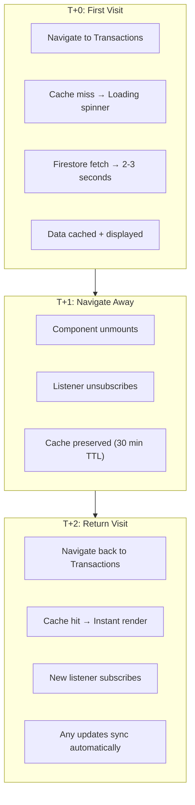

---

## Derived Data Caching

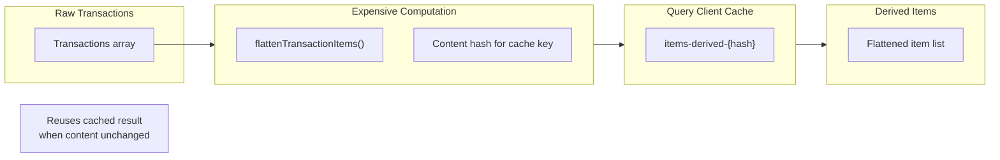

---

## Memory Management

| Strategy | Implementation | Benefit |
|----------|----------------|---------|
| **Listener Limits** | 100 txns, 200 merchants | Bounded memory |
| **GC Time** | 30 minute cache retention | Clears unused data |
| **JSON Comparison** | Skip redundant state updates | Fewer re-renders |
| **Pagination** | Load older on demand | Lazy loading |
| **URL Revocation** | Clean up blob URLs on unmount | Prevent leaks |

---

## App Lifecycle States

```mermaid
stateDiagram-v2
    [*] --> Active

    Active --> Background : App backgrounded
    Background --> Active : App foregrounded

    Active --> Offline : Network lost
    Offline --> Active : Network restored

    state Active {
        [*] --> Fresh
        Fresh --> Stale : 5 min elapsed
        Stale --> Refreshing : refetchOnWindowFocus
        Refreshing --> Fresh : Data fetched
    }

    state Background {
        note right: Listeners may miss updates
        note right: Cache becomes stale
    }

    state Offline {
        note right: Pending scans persist to localStorage
        note right: Firestore handles reconnection
    }
```

---

## Key Files

| File | Purpose |
|------|---------|
| `src/lib/queryClient.ts` | QueryClient configuration |
| `src/lib/queryKeys.ts` | Hierarchical query key factory |
| `src/hooks/useFirestoreSubscription.ts` | Core subscription hook |
| `src/hooks/useFirestoreQuery.ts` | One-time fetch hook |
| `src/hooks/useFirestoreMutation.ts` | Mutation with optimistic updates |
| `src/hooks/usePaginatedTransactions.ts` | Hybrid real-time + pagination |
| `src/services/pendingScanStorage.ts` | localStorage persistence |

---

## Performance Metrics

| Metric | Value | Impact |
|--------|-------|--------|
| Cache TTL | 30 minutes | Extended navigation benefit |
| Stale Time | 5 minutes | Reduced refetches |
| Listener Limit | 100 docs | 98% cost reduction |
| First Paint | < 100ms (cached) | Instant UX |
| First Paint | 2-3s (fresh) | Acceptable initial load |

---

*Diagram reflects React Query implementation from Story 14.29*
