# Filtering System

> Transaction filtering by temporal, category, and location
> **Last Updated:** 2026-01-15

---

## Overview

The filtering system uses **three independent filter dimensions** combined with AND logic. Filters are managed via React Context and composed at query time.

---

## Filter Architecture

```mermaid
flowchart TB
    subgraph Filters["Three Filter Dimensions"]
        TF[🕐 Temporal Filter]
        CF[🏷️ Category Filter]
        LF[📍 Location Filter]
    end

    subgraph Composition["Filter Composition"]
        AND["AND Logic<br/>All must match"]
    end

    subgraph Result["Filtered Transactions"]
        R[Matching Transactions]
    end

    TF --> AND
    CF --> AND
    LF --> AND
    AND --> R
```



---

## Filter State Structure

```typescript
interface HistoryFilterState {
  temporal: TemporalFilterState;     // Time-based
  category: CategoryFilterState;     // Store & item
  location: LocationFilterState;     // Country/city
}
```

---

## Temporal Filter (6 Levels)


### Temporal Matching Logic


---

## Category Filter (4 Levels + Multi-Dimension)


### Multi-Select Support

```
Categories can be comma-separated:
"Supermarket,Restaurant,Gas Station"

Auto-detects known groups:
"Supermarket,Restaurant" → "Food & Dining"
```

---

## Location Filter


---

## Complete Filter Flow


---

## Filter Independence Principle

```mermaid
flowchart LR
    subgraph Change["User Changes"]
        C1["Change temporal<br/>Year → Month"]
        C2["Change category<br/>All → Supermarket"]
    end

    subgraph Effect["State Effect"]
        E1["Temporal updated<br/>Category, Location PRESERVED"]
        E2["Category updated<br/>Temporal, Location PRESERVED"]
    end

    C1 --> E1
    C2 --> E2
```



---

## UI Components


---

## Available Filters Extraction


---

## Filter State Persistence


---

## Smart Label Detection


---

## Reducer Actions

| Action | Effect | Preserves |
|--------|--------|-----------|
| `SET_TEMPORAL_FILTER` | Update temporal state | Category, Location |
| `SET_CATEGORY_FILTER` | Update category state | Temporal, Location |
| `SET_LOCATION_FILTER` | Update location state | Temporal, Category |
| `CLEAR_TEMPORAL` | Reset to current month | Others |
| `CLEAR_CATEGORY` | Reset to 'all' | Others |
| `CLEAR_LOCATION` | Remove location filter | Others |
| `CLEAR_ALL_FILTERS` | Reset everything | None |

---

## Default State

```typescript
const DEFAULT_STATE: HistoryFilterState = {
  temporal: {
    level: 'month',
    year: currentYear,
    month: currentMonth,    // YYYY-MM format
    // Default: Current month (not 'all time')
  },
  category: {
    level: 'all',
  },
  location: {
    // No filter by default
  },
};
```

---

## Key Files

| File | Purpose |
|------|---------|
| `src/contexts/HistoryFiltersContext.tsx` | Filter state context |
| `src/hooks/useHistoryFilters.ts` | Filter access hook |
| `src/utils/historyFilterUtils.ts` | Filter matching functions |
| `src/components/history/HistoryFilterBar.tsx` | Filter UI container |
| `src/components/history/TemporalFilterDropdown.tsx` | Time period selector |
| `src/components/history/CategoryFilterDropdown.tsx` | Category selector |
| `src/views/HistoryView.tsx` | Main list view with filters |

---

*Diagram reflects filtering implementation as of Epic 14*
