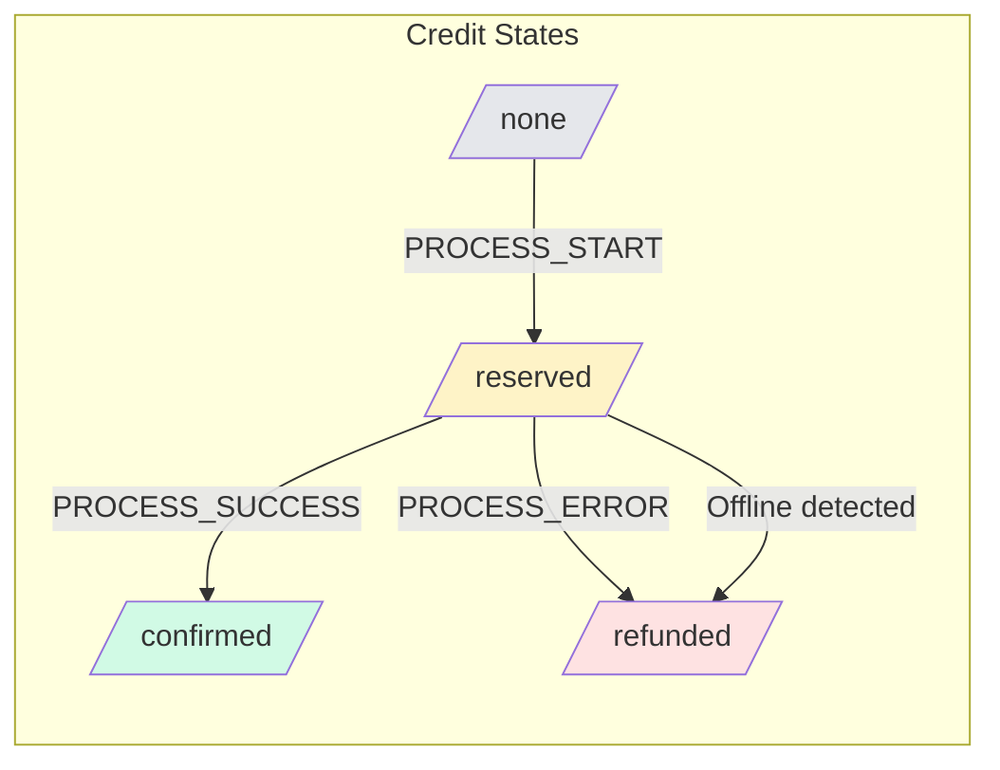
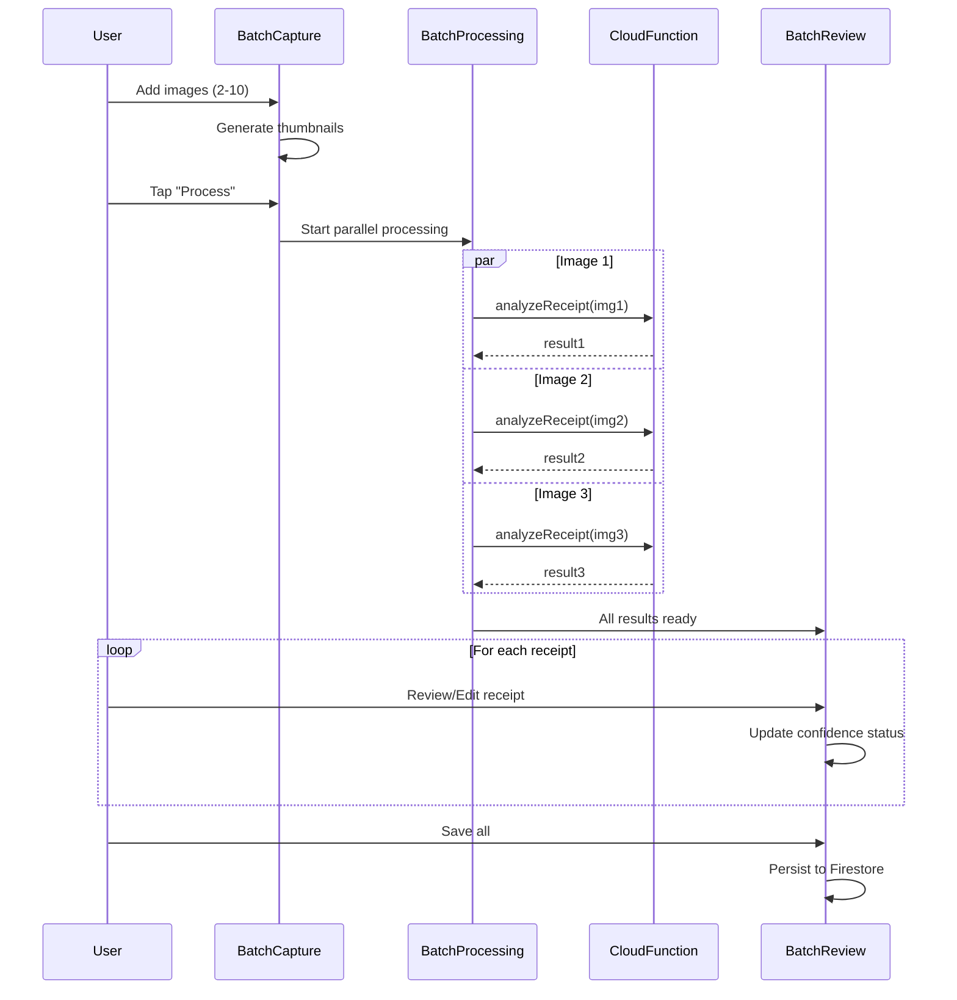
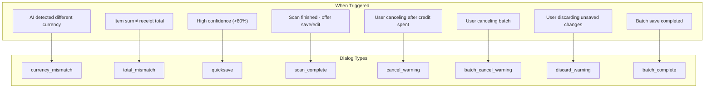
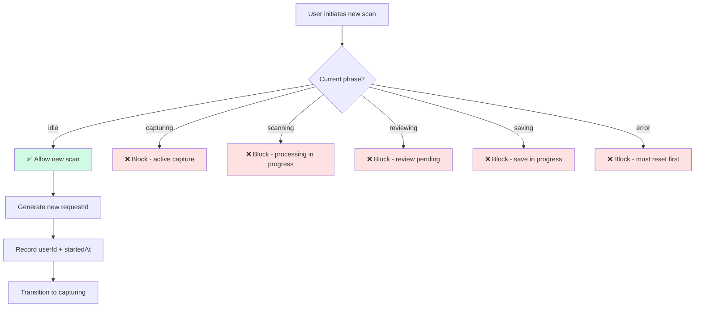
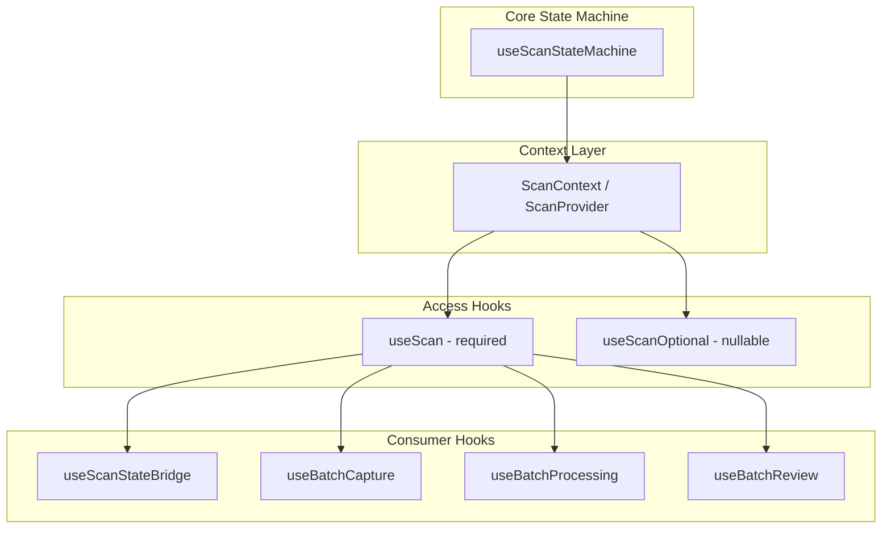
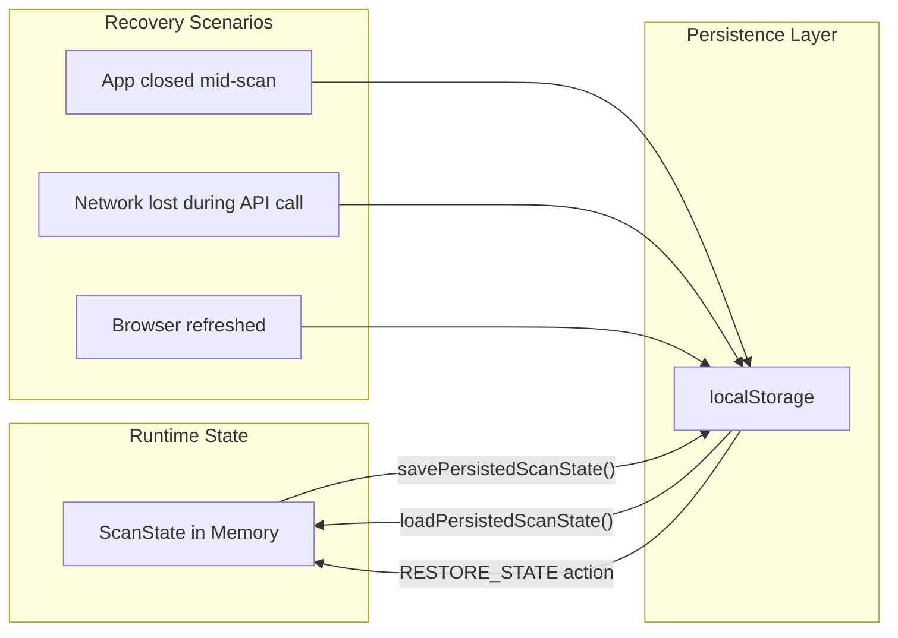

# Scan State Machine

> Receipt scanning workflow for single, batch, and statement modes
> **Last Updated:** 2026-01-15
> **Epic:** 14d (Scan Architecture Refactor)

---

## Overview

The scan state machine consolidates 31+ scattered state variables into a unified, predictable state management system using React's `useReducer`.

---

## State Machine Phases

```mermaid
stateDiagram-v2
    [*] --> idle

    idle --> capturing : START_SINGLE / START_BATCH / START_STATEMENT

    capturing --> scanning : PROCESS_START
    capturing --> idle : CANCEL

    scanning --> reviewing : PROCESS_SUCCESS
    scanning --> error : PROCESS_ERROR

    reviewing --> saving : SAVE_START
    reviewing --> idle : CANCEL (with warning)

    saving --> idle : SAVE_SUCCESS
    saving --> reviewing : SAVE_ERROR

    error --> idle : RESET / CANCEL

    note right of idle : No active scan\nCredit: none
    note right of capturing : Adding images\nPre-scan options\nCredit: none
    note right of scanning : API processing\nCredit: RESERVED
    note right of reviewing : Results ready\nCredit: CONFIRMED
    note right of saving : Writing to Firestore\nCredit: CONFIRMED
    note right of error : Error occurred\nCredit: REFUNDED
```

---

## Credit Lifecycle



---

## Scan Modes Comparison

```mermaid
flowchart TB
    subgraph Single["Single Scan Mode"]
        S1[Capture 1 image] --> S2[Process via Gemini]
        S2 --> S3[Review single result]
        S3 --> S4[Save transaction]
    end

    subgraph Batch["Batch Scan Mode"]
        B1[Capture 2-10 images] --> B2[Parallel processing]
        B2 --> B3[Review multiple results]
        B3 --> B4[Save all / Save one]
    end

    subgraph Statement["Statement Mode - Future"]
        ST1[Upload PDF/Image] --> ST2[Parse bank statement]
        ST2 --> ST3[Review multiple transactions]
        ST3 --> ST4[Bulk save]
    end
```



### Mode Specifications

| Aspect | Single | Batch | Statement |
|--------|--------|-------|-----------|
| **Credit Type** | 1 normal | 1 super per image | 1 super |
| **Image Count** | 1 | 2-10 | 1 (multi-page) |
| **Processing** | Sequential | Parallel (3 concurrent) | Sequential |
| **Results** | 1 transaction | N transactions | N transactions |
| **Review UI** | Simple editor | Thumbnail queue | List view |

---

## Batch Processing Flow



---

## Dialog System



---

## State Structure

```typescript
interface ScanState {
  // Core state
  phase: 'idle' | 'capturing' | 'scanning' | 'reviewing' | 'saving' | 'error';
  mode: 'single' | 'batch' | 'statement';

  // Request tracking (prevents concurrent scans)
  requestId: string | null;
  userId: string | null;
  startedAt: number | null;

  // Image data
  images: string[];           // Base64 or URLs

  // Processing results
  results: Transaction[];

  // Credit tracking
  creditStatus: 'none' | 'reserved' | 'confirmed' | 'refunded';

  // Batch-specific
  batchProgress: BatchProgress | null;
  batchReceipts: BatchReceipt[] | null;
  batchEditingIndex: number | null;

  // Dialog state
  dialog: { type: DialogType; data?: any } | null;

  // Error state
  error: string | null;
}
```

---

## Request Precedence Rule



---

## Context & Hooks Hierarchy



---

## Computed Values (Derived State)

| Value | Derivation | Usage |
|-------|------------|-------|
| `hasActiveRequest` | `phase !== 'idle'` | Block new scans |
| `isProcessing` | `phase === 'scanning' \|\| 'saving'` | Show loading UI |
| `isBlocking` | `hasActiveRequest && dialog` | Block navigation |
| `canSave` | `phase === 'reviewing' && hasResults && !dialog` | Enable save button |
| `currentView` | Derived from phase + mode | Determine which UI to render |
| `imageCount` | `images.length` | Badge display |
| `resultCount` | `results.length` | Progress tracking |

---

## Persistence & Recovery



**Recovery Logic:**
- If restored state was `scanning` → transition to `error` + refund credit
- Otherwise → restore state as-is
- Clear localStorage on successful save

---

## Key Files

| File | Purpose |
|------|---------|
| `src/hooks/useScanStateMachine.ts` | Core state machine with reducer |
| `src/contexts/ScanContext.tsx` | App-wide context provider |
| `src/hooks/useBatchCapture.ts` | Multi-image capture management |
| `src/hooks/useBatchProcessing.ts` | Parallel processing orchestration |
| `src/hooks/useBatchReview.ts` | Review workflow with confidence tracking |
| `src/services/pendingScanStorage.ts` | localStorage persistence |

---

*Diagram generated from Epic 14d implementation*
