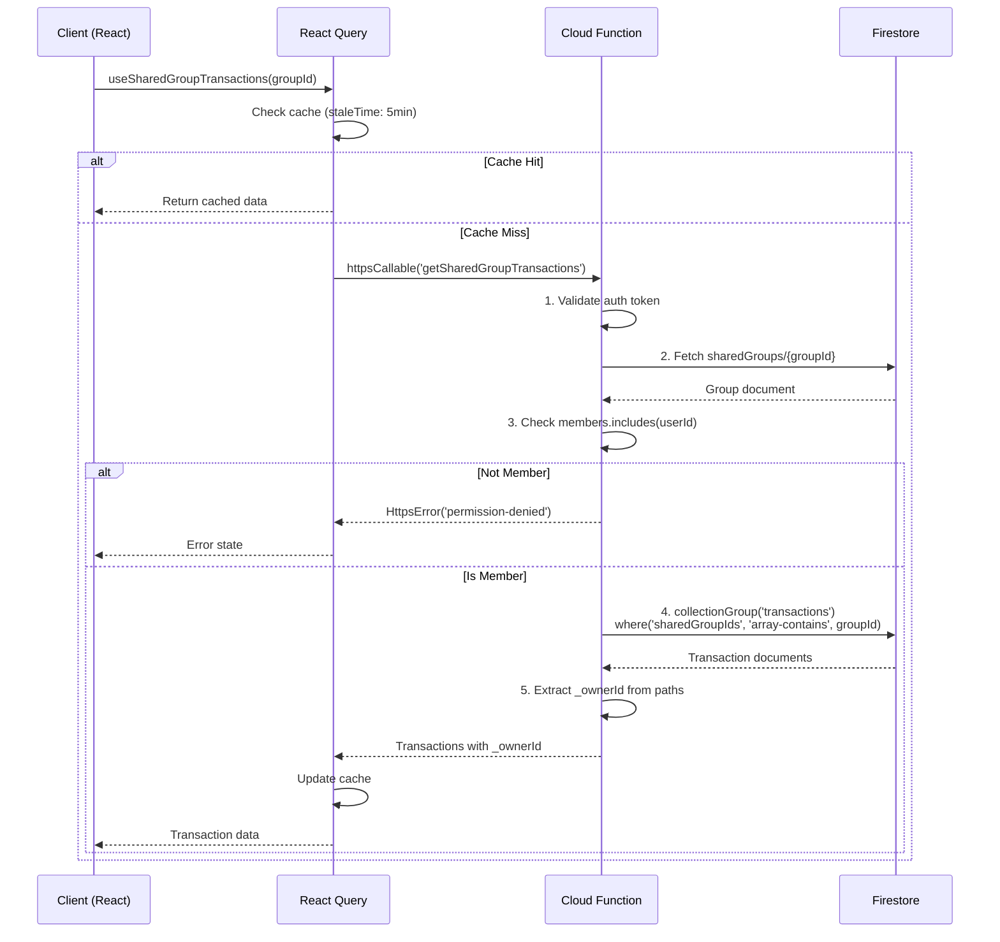
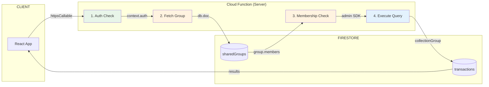
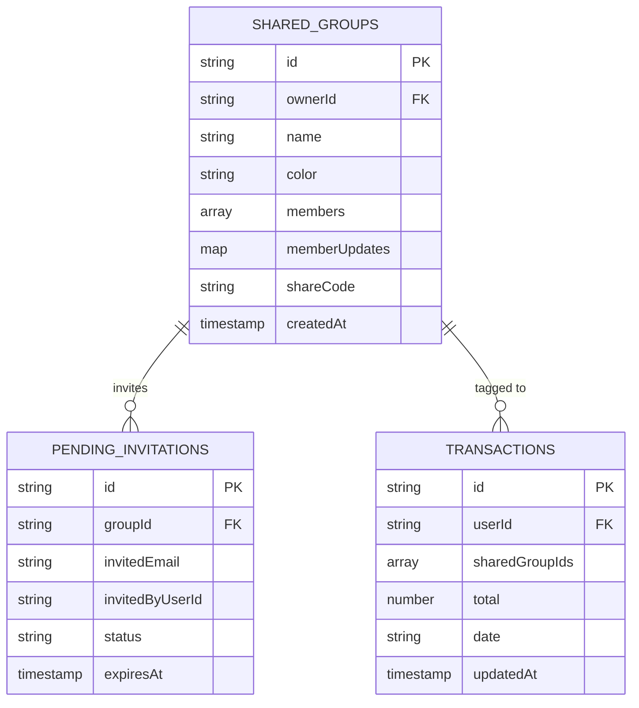
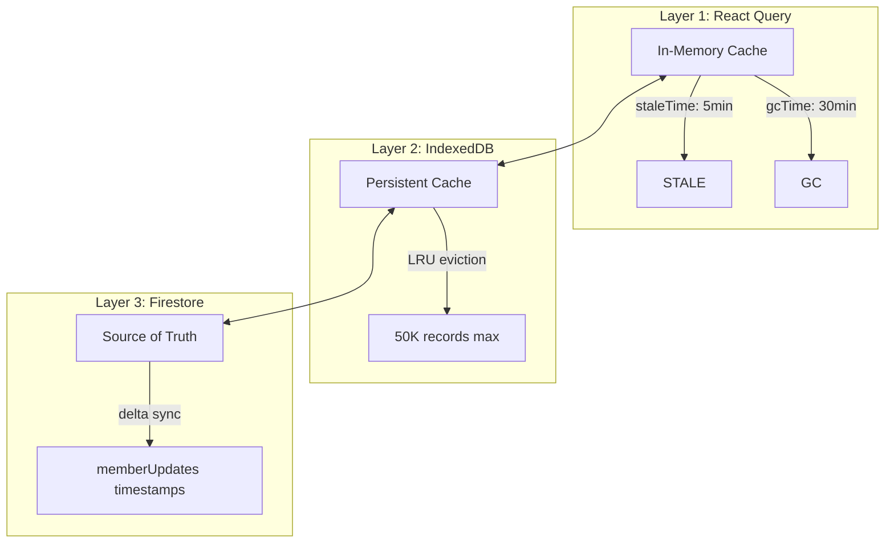

# Shared Groups Data Flow

> Epic 14c: Household Sharing - Cross-User Transaction Access
> **Last Updated:** 2026-01-17
> **Complexity:** High

---

## Overview

This diagram illustrates how shared group transactions are securely fetched across user boundaries using a Cloud Function with server-side membership validation.

**Key Insight:** Firestore collection group queries cannot evaluate `resource.data.*` conditions in security rules, requiring server-side validation.

---

## Data Flow



---

## Security Model



### Security Steps

| Step | Action | Failure Response |
|------|--------|------------------|
| 1. Auth | Validate Firebase Auth token | `HttpsError('unauthenticated')` |
| 2. Fetch | Get group document | `HttpsError('not-found')` |
| 3. Check | `members.includes(userId)` | `HttpsError('permission-denied')` |
| 4. Query | Admin SDK (bypasses rules) | Success |

---

## Data Collections



---

## Why Cloud Function?

### The Problem

```javascript
// THIS DOES NOT WORK for collection group queries:
match /{path=**}/transactions/{transactionId} {
  allow read: if request.auth != null
      && resource.data.sharedGroupIds != null  // ❌ Cannot evaluate
      && resource.data.sharedGroupIds.size() > 0;  // ❌ Cannot evaluate
}
```

**Firestore Limitation:** Collection group queries cannot access `resource.data.*` in security rules.

### Rejected Alternative: UUID Obscurity

```javascript
// INSECURE - relies on unguessable groupIds
match /{path=**}/transactions/{transactionId} {
  allow read: if request.auth != null
      && request.query.limit <= 1000;  // Only auth + limit
}
```

**Problem:** If attacker obtains a groupId (from network logs, localStorage, etc.), they can query all transactions in that group.

### The Solution: Server-Side Validation

```typescript
// Cloud Function validates BEFORE querying
const groupDoc = await db.doc(`sharedGroups/${groupId}`).get();
if (!groupDoc.data()?.members.includes(context.auth.uid)) {
  throw new HttpsError('permission-denied', 'Not a member');
}
// Now safe to query with admin SDK
```

---

## Caching Strategy



### Cache Invalidation

1. User A modifies transaction in group
2. Writes to `group.memberUpdates[userA].lastSyncAt`
3. User B's Firestore subscription detects change
4. React Query cache invalidated
5. Fresh fetch via Cloud Function

---

## Cost Analysis

### MVP Scale Assumptions

| Metric | Value |
|--------|-------|
| Active groups | 100 |
| Members per group | 4 |
| Views per user/day | 5 |
| Days per month | 30 |

### Monthly Cost

| Service | Usage | Cost |
|---------|-------|------|
| Cloud Functions | 60,000 invocations | **$0.00** (free tier) |
| Firestore Reads | ~120,000 | **~$0.07** |
| **Total** | | **~$0.08/month** |

---

## Files

| File | Purpose |
|------|---------|
| `functions/src/getSharedGroupTransactions.ts` | Cloud Function implementation |
| `src/services/sharedGroupTransactionService.ts` | Client service (calls CF) |
| `src/hooks/useSharedGroupTransactions.ts` | React Query hook |
| `firestore.rules` | Security rules (denies client collection group) |

---

## Related Diagrams

- [Data Caching](./data-caching.md) - React Query + Firestore integration
- [Tech Stack](./tech-stack.md) - Technology layers

## Related Documentation

- [Shared Groups Architecture](../shared-groups-architecture.md) - Full decision document
- [Architecture Overview](../architecture.md) - ADR-011
- [Epic 14c Stories](../../sprint-artifacts/epic14c/)

---

*Diagram by Atlas - Project Intelligence Guardian*
