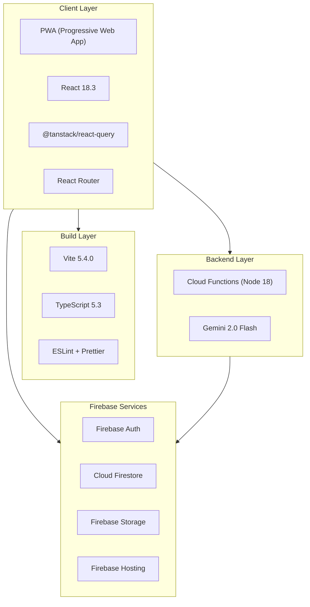
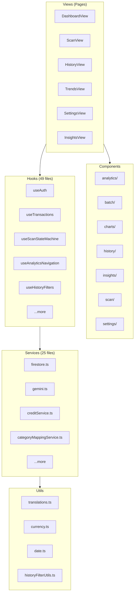
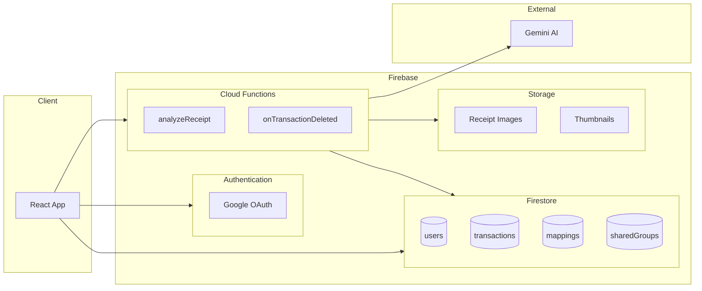
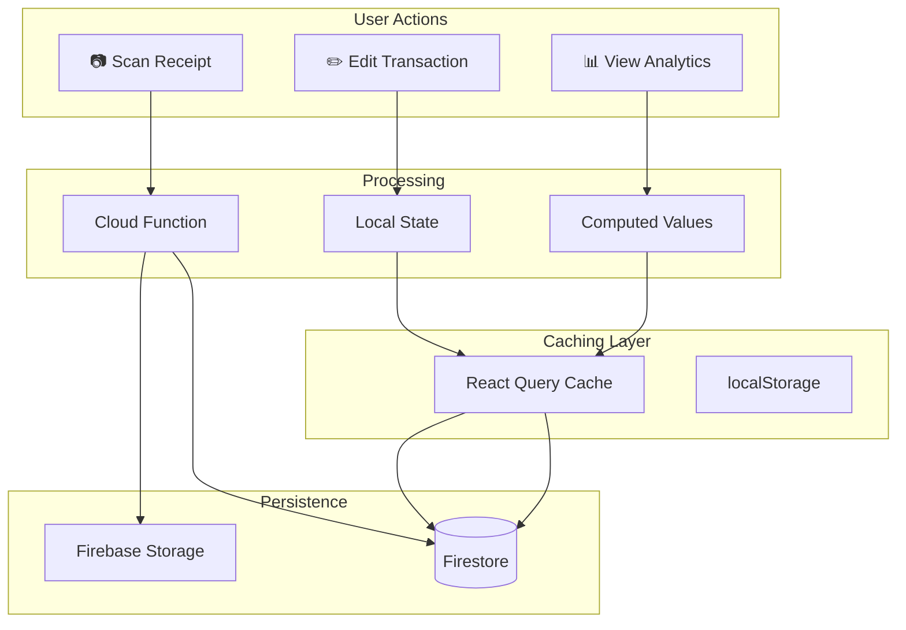
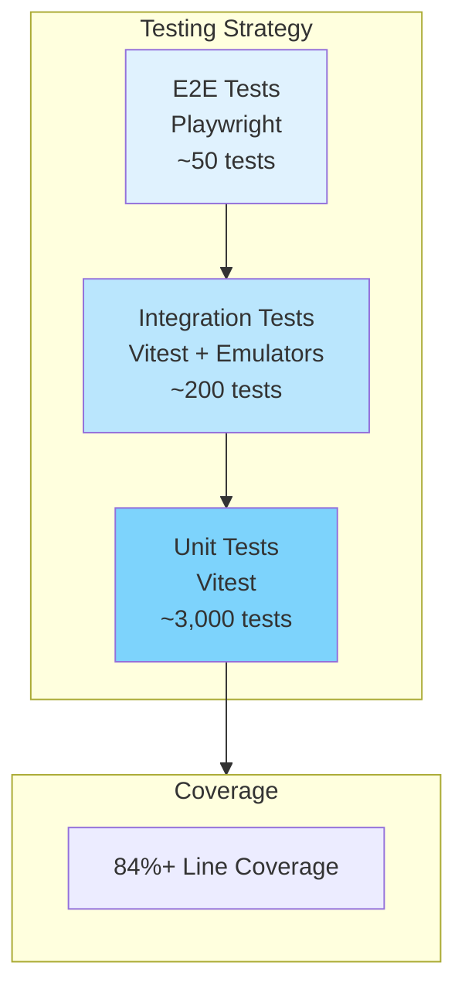
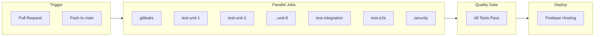
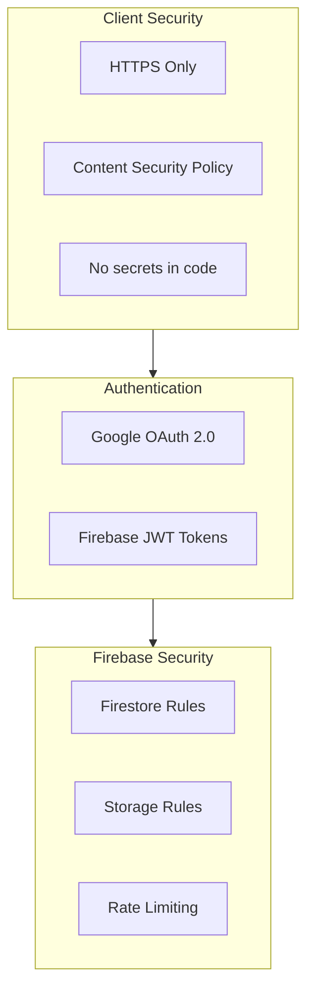
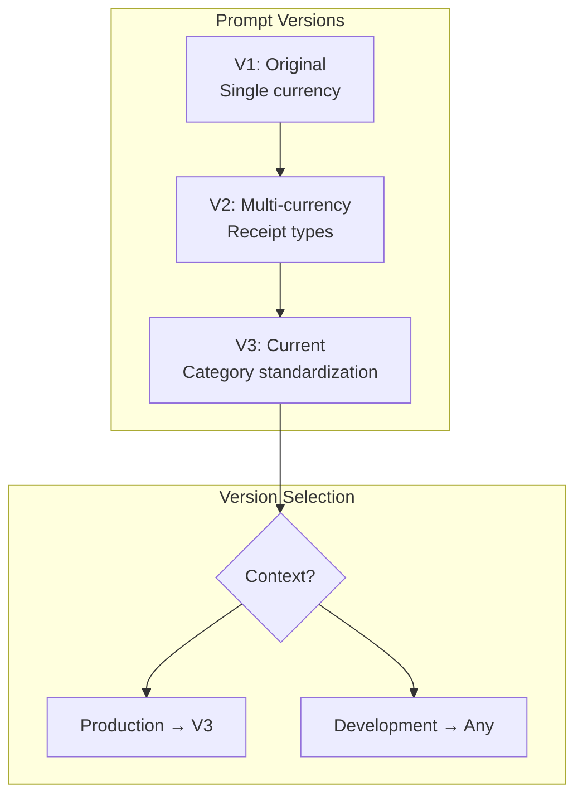
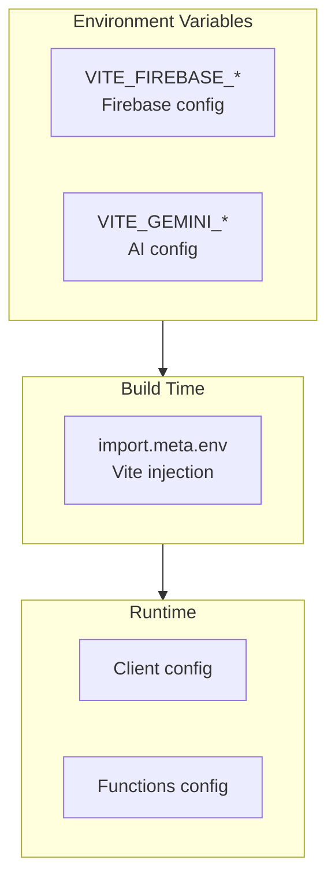
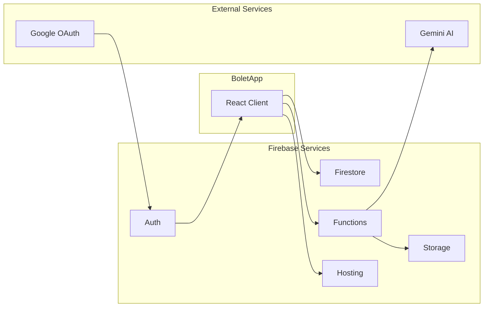

# Tech Stack Overview

> Technology layers and integrations in BoletApp
> **Last Updated:** 2026-01-15

---

## Architecture Layers



---

## Technology Stack

| Layer | Technology | Version | Purpose |
|-------|------------|---------|---------|
| **UI Framework** | React | 18.3 | Component-based UI |
| **Type System** | TypeScript | 5.3 | Static typing |
| **Build Tool** | Vite | 5.4.0 | Fast HMR, optimized builds |
| **State Management** | React Query | 5.x | Cache + async state |
| **Styling** | Tailwind CSS | 3.x | Utility-first CSS |
| **Animation** | Framer Motion | - | Page transitions |
| **Charts** | ECharts + Custom | - | Data visualization |
| **Backend** | Cloud Functions | Node 18 | Serverless compute |
| **AI** | Gemini | 2.0 Flash | Receipt OCR |
| **Database** | Firestore | - | Real-time NoSQL |
| **Storage** | Firebase Storage | - | Receipt images |
| **Auth** | Firebase Auth | - | Google OAuth |
| **Hosting** | Firebase Hosting | - | Global CDN |
| **Testing** | Vitest + Playwright | - | Unit + E2E |

---

## Client Architecture



---

## Firebase Architecture



---

## Data Flow Architecture



---

## Testing Pyramid



---

## CI/CD Pipeline



---

## Security Architecture



### Firestore Rules Summary

```
/artifacts/{appId}/users/{userId}/**
  → User can only access own data

/sharedGroups/{groupId}
  → Members can read
  → Owner can write
  → User can add self (accepting invite)

/pendingInvitations/{invitationId}
  → Invited user can read/update status
  → Creator can create
```

---

## Prompt System Architecture



---

## Environment Configuration



---

## Key Integration Points



---

## File Organization

```
boletapp/
├── src/                    # React application
│   ├── components/         # UI components
│   ├── contexts/          # React contexts
│   ├── hooks/             # Custom hooks (49)
│   ├── services/          # Business logic (25)
│   ├── utils/             # Pure functions
│   ├── views/             # Page components
│   ├── config/            # Configuration
│   ├── types/             # TypeScript types
│   └── lib/               # Query client
├── functions/             # Cloud Functions
│   └── src/
│       ├── prompts/       # AI prompts V1-V3
│       └── *.ts           # Function handlers
├── tests/                 # Test files
│   ├── unit/              # ~170 files
│   ├── integration/       # ~25 files
│   └── e2e/              # 7 specs
└── docs/                  # Documentation
    └── architecture/
        └── diagrams/      # This folder
```

---

## Performance Characteristics

| Aspect | Metric | Notes |
|--------|--------|-------|
| **Build Time** | ~30s | Vite production build |
| **Bundle Size** | 2.92 MB | Needs optimization |
| **First Load** | 2-3s | Fresh data fetch |
| **Navigation** | < 100ms | Cached routes |
| **Scan Latency** | 3-5s | Gemini processing |
| **CI Pipeline** | ~8 min | 8 parallel shards |

---

*Diagram provides tech stack overview as of Epic 14*
