# Transaction Lifecycle

> How transactions are created, processed, and persisted
> **Last Updated:** 2026-01-15

---

## Overview

Transactions in BoletApp can be created through three entry points, each following a distinct flow before converging at the persistence layer.

---

## Entry Points

```mermaid
flowchart TB
    subgraph Entry["Transaction Entry Points"]
        E1[📷 Receipt Scan]
        E2[✏️ Manual Entry]
        E3[📋 Quick Save]
    end

    subgraph Processing["Processing Layer"]
        P1[Cloud Function]
        P2[Local Form]
        P3[Auto-save]
    end

    subgraph Review["Review Phase"]
        R1[TransactionEditorView]
    end

    subgraph Persist["Persistence"]
        DB[(Firestore)]
    end

    E1 --> P1
    E2 --> P2
    E3 --> P3

    P1 --> R1
    P2 --> R1
    P3 -->|"High confidence"| DB
    P3 -->|"Low confidence"| R1

    R1 --> DB
```



---

## Receipt Scan Flow (Primary)


---

## Manual Entry Flow


---

## Quick Save Flow


---

## Transaction Data Structure


### Field Categories

| Category | Fields | Source |
|----------|--------|--------|
| **Core** | merchant, date, total, category, items | All entry points |
| **V3 Extended** | time, currency, country, city | Scan only (auto-detected) |
| **Storage** | imageUrls, thumbnailUrl | Scan only |
| **Tracking** | promptVersion, merchantSource | All (different values) |
| **Organization** | groupIds | User-assigned |
| **Metadata** | createdAt, updatedAt | Auto-generated |

---

## Category Learning Flow


---

## Cascade Delete Flow


---

## Storage Paths

```
Firebase Storage Structure:
├── users/
│   └── {userId}/
│       └── receipts/
│           └── {transactionId}/
│               ├── image-0.jpg      # Full-size (1200x1600)
│               ├── image-1.jpg      # Additional images
│               ├── image-2.jpg
│               └── thumbnail.jpg    # Preview (120x160)
```

```
Firestore Structure:
├── artifacts/
│   └── {appId}/
│       └── users/
│           └── {userId}/
│               ├── transactions/
│               │   └── {transactionId}
│               ├── categoryMappings/
│               ├── merchantMappings/
│               ├── subcategoryMappings/
│               ├── groups/
│               └── trustedMerchants/
```

---

## Validation Rules

```mermaid
flowchart TB
    subgraph Validation["Transaction Validation"]
        V1{Has merchant?}
        V2{Has date?}
        V3{Has total > 0?}
        V4{Has items with price > 0?}
    end

    V1 -->|"No"| Invalid[❌ Cannot Save]
    V1 -->|"Yes"| V2
    V2 -->|"No"| Invalid
    V2 -->|"Yes"| V3
    V3 -->|"No"| Invalid
    V3 -->|"Yes"| V4
    V4 -->|"No"| Invalid
    V4 -->|"Yes"| Valid[✅ Can Save]

    style Valid fill:#d1fae5
    style Invalid fill:#fee2e2
```



---

## Key Files

| File | Purpose |
|------|---------|
| `src/services/firestore.ts` | Transaction CRUD operations |
| `src/views/TransactionEditorView.tsx` | Edit/create form |
| `src/hooks/useTransactions.ts` | Real-time transaction subscription |
| `functions/src/analyzeReceipt.ts` | Receipt processing Cloud Function |
| `functions/src/deleteTransactionImages.ts` | Cascade delete trigger |

---

*Diagram illustrates core transaction flows as of Epic 14*
