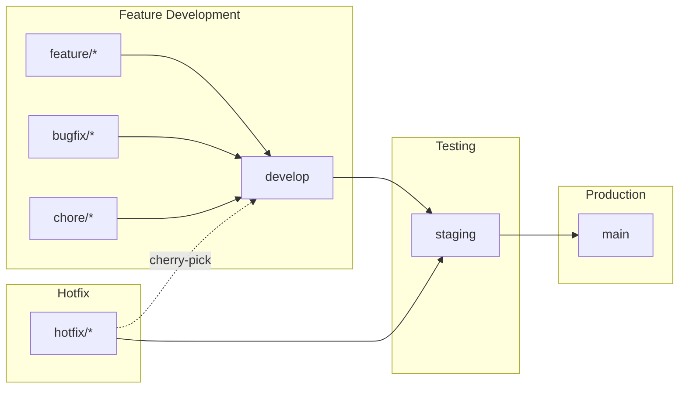

# Branching Strategy

This document describes the multi-branch Git workflow used in Boletapp for development, testing, and production releases.

## Branch Overview

```
┌─────────────────────────────────────────────────────────────────────────┐
│                         BRANCHING STRATEGY                               │
├─────────────────────────────────────────────────────────────────────────┤
│                                                                          │
│  feature/*  ──────┐                                                      │
│  bugfix/*   ──────┼──► develop ──► staging ──► main                     │
│  chore/*    ──────┘       │          │          │                       │
│                           │          │          │                       │
│                     Development   QA/UAT    Production                  │
│                      (active)    (testing)  (deployed)                  │
│                                                                          │
│  hotfix/*  ─────────────────────► staging ──► main                      │
│                                      │                                   │
│                            (cherry-pick back to develop)                 │
└─────────────────────────────────────────────────────────────────────────┘
```

## Branch Purposes

| Branch | Purpose | Deploys To | Protection Level |
|--------|---------|------------|------------------|
| `main` | Production releases | https://boletapp-d609f.web.app | **STRICT** (highest) |
| `staging` | QA/UAT testing | (future: staging URL) | **MODERATE** |
| `develop` | Active development | Local only | **STANDARD** |

### main (Production)

- **Purpose:** Contains production-ready code deployed to end users
- **URL:** https://boletapp-d609f.web.app
- **Protection:** Strictest - requires PR from staging, all status checks must pass
- **Merge Source:** Only `staging` branch via PR
- **Direct Push:** Blocked (enforced by branch protection)

### staging (QA/UAT)

- **Purpose:** Quality assurance and user acceptance testing environment
- **URL:** (future staging deployment)
- **Protection:** Moderate - requires PR, status checks must pass
- **Merge Sources:** `develop` branch or `hotfix/*` branches via PR
- **Direct Push:** Blocked (enforced by branch protection)

### develop (Development)

- **Purpose:** Integration branch for active development work
- **URL:** Local development only (`npm run dev`)
- **Protection:** Standard - requires PR, status checks must pass
- **Merge Sources:** Feature, bugfix, and chore branches via PR
- **Direct Push:** Blocked (enforced by branch protection)

## Merge Flow Diagram



## Branch Naming Conventions

| Prefix | Purpose | Example |
|--------|---------|---------|
| `feature/` | New features | `feature/add-receipt-scanner` |
| `bugfix/` | Bug fixes | `bugfix/fix-date-parsing` |
| `hotfix/` | Production hotfixes | `hotfix/critical-auth-fix` |
| `chore/` | Maintenance tasks | `chore/update-dependencies` |
| `docs/` | Documentation only | `docs/update-readme` |
| `refactor/` | Code refactoring | `refactor/extract-utils` |
| `test/` | Test additions/fixes | `test/add-e2e-coverage` |

### Naming Format

```
{type}/{short-description}

Examples:
- feature/user-analytics-dashboard
- bugfix/transaction-filter-reset
- hotfix/firebase-auth-error
- chore/upgrade-react-18
- docs/api-documentation
```

**Guidelines:**
- Use lowercase letters
- Use hyphens (-) to separate words
- Keep descriptions short but descriptive (2-5 words)
- Include ticket/issue number if applicable: `feature/123-add-export`

## Development Workflow

### Standard Feature Development

1. **Create Feature Branch**
   ```bash
   git checkout develop
   git pull origin develop
   git checkout -b feature/my-feature
   ```

2. **Develop & Commit**
   ```bash
   # Make changes
   git add .
   git commit -m "feat: add my feature"
   ```

3. **Push & Create PR**
   ```bash
   git push -u origin feature/my-feature
   # Create PR to develop on GitHub
   ```

4. **CI Validation**
   - GitHub Actions runs all tests
   - Must pass before merge is allowed

5. **Merge to Develop**
   - Squash merge recommended for clean history
   - Delete feature branch after merge

### Promoting to Staging

1. **Create PR from develop to staging**
   ```bash
   # On GitHub: New PR
   # Base: staging
   # Compare: develop
   ```

2. **QA Testing**
   - Test all features in staging environment
   - Verify integrations and edge cases

3. **Merge to Staging**
   - After QA approval

### Production Release

1. **Create PR from staging to main**
   ```bash
   # On GitHub: New PR
   # Base: main
   # Compare: staging
   ```

2. **Final Review**
   - Verify all changes are production-ready
   - Check no breaking changes

3. **Merge & Deploy**
   - Merge triggers production deployment
   - Monitor for issues

### Hotfix Workflow

For critical production bugs that can't wait for normal release cycle:

1. **Create Hotfix Branch**
   ```bash
   git checkout staging
   git pull origin staging
   git checkout -b hotfix/critical-bug
   ```

2. **Fix & Test**
   ```bash
   git add .
   git commit -m "fix: resolve critical bug"
   git push -u origin hotfix/critical-bug
   ```

3. **PR to Staging**
   - Create PR from hotfix to staging
   - Fast-track review and merge

4. **PR to Main**
   - Immediately create PR from staging to main
   - Deploy to production

5. **Sync Back to Develop**
   ```bash
   git checkout develop
   git pull origin develop
   git cherry-pick <hotfix-commit-sha>
   # Create PR if direct push blocked
   ```

## Branch Protection Rules

### main (Production)

| Setting | Value | Rationale |
|---------|-------|-----------|
| Require PR | Yes | Only staging can merge to main |
| Required approvals | 0 (solo dev) | Can increase for team |
| Dismiss stale approvals | Yes | New commits require re-approval |
| Require status checks | Yes (`test`) | All tests must pass |
| Require up-to-date branch | Yes | No stale merges |
| Require conversation resolution | Yes | All comments addressed |
| Enforce for admins | Yes | No bypassing |
| Allow force pushes | No | Never rewrite production |
| Allow deletions | No | Protect production branch |

### staging (QA/UAT)

| Setting | Value | Rationale |
|---------|-------|-----------|
| Require PR | Yes | Develop or hotfix only |
| Required approvals | 0 | Solo dev self-approve |
| Require status checks | Yes (`test`) | Tests must pass |
| Enforce for admins | Yes | Maintain QA integrity |
| Allow force pushes | No | Protect QA history |
| Allow deletions | No | Protect QA branch |

### develop (Development)

| Setting | Value | Rationale |
|---------|-------|-----------|
| Require PR | Yes | Feature branches only |
| Required approvals | 0 | Fast iteration |
| Require status checks | Yes (`test`) | Tests must pass |
| Enforce for admins | Yes | Maintain shared history |
| Allow force pushes | No | Protect shared work |
| Allow deletions | No | Protect development |

## CI/CD Integration

### GitHub Actions Workflow

The `test` job runs on every push and PR:

```yaml
on:
  push:
    branches: [ main, staging, develop ]
  pull_request:
    branches: [ main, staging, develop ]
```

**What runs:**
1. Checkout code
2. Setup Node.js 20
3. Install dependencies (`npm ci`)
4. Start Firebase emulators
5. Run unit tests
6. Run integration tests
7. Run E2E tests
8. Generate coverage report

**Must pass before merge on all protected branches.**

### Deployment Triggers

| Event | Action |
|-------|--------|
| PR merged to `main` | Deploy to production (Firebase Hosting) |
| PR merged to `staging` | (future: deploy to staging) |
| PR merged to `develop` | CI only (no deployment) |

## Team Scaling

When the team grows, consider these upgrades:

### Code Review Requirements

```bash
# Increase required approvals
gh api repos/Brownbull/gmni_boletapp/branches/main/protection \
  --method PUT \
  --input - <<'EOF'
{
  "required_pull_request_reviews": {
    "required_approving_review_count": 1
  }
}
EOF
```

### CODEOWNERS

Create `.github/CODEOWNERS`:

```
# Default owners for everything
*       @team-lead

# Specific ownership
/src/services/   @backend-team
/src/components/ @frontend-team
/docs/           @tech-writers
```

### Branch Policies Update

For larger teams:
- `main`: 2+ approvals required
- `staging`: 1+ approval required
- `develop`: 1+ approval required
- Add required reviewers per path

## Quick Reference

### Common Commands

```bash
# Start feature
git checkout develop && git pull && git checkout -b feature/name

# Update feature branch
git checkout feature/name && git fetch && git rebase origin/develop

# Push feature
git push -u origin feature/name

# Sync develop after merge
git checkout develop && git pull

# Create hotfix
git checkout staging && git pull && git checkout -b hotfix/critical
```

### PR Checklist

Before creating a PR:
- [ ] Branch is up to date with target
- [ ] All tests pass locally (`npm run test:all`)
- [ ] Code follows project conventions
- [ ] Documentation updated if needed
- [ ] Commit messages are clear

### Merge Strategy

| Target Branch | Merge Type | Reason |
|---------------|------------|--------|
| develop | Squash | Clean feature commits |
| staging | Merge commit | Preserve develop history |
| main | Merge commit | Preserve staging history |

---

## References

- [GitHub Branch Protection Docs](https://docs.github.com/en/repositories/configuring-branches-and-merges-in-your-repository/managing-protected-branches)
- [Git Flow Workflow](https://www.atlassian.com/git/tutorials/comparing-workflows/gitflow-workflow)
- [GitHub Actions CI/CD](docs/ci-cd/README.md)

---

**Document Version:** 1.0
**Created:** 2025-11-25
**Story:** 3.1 (Process & Governance Setup)
**Epic:** Production-Grade Quality & Testing Completion (Epic 3)
