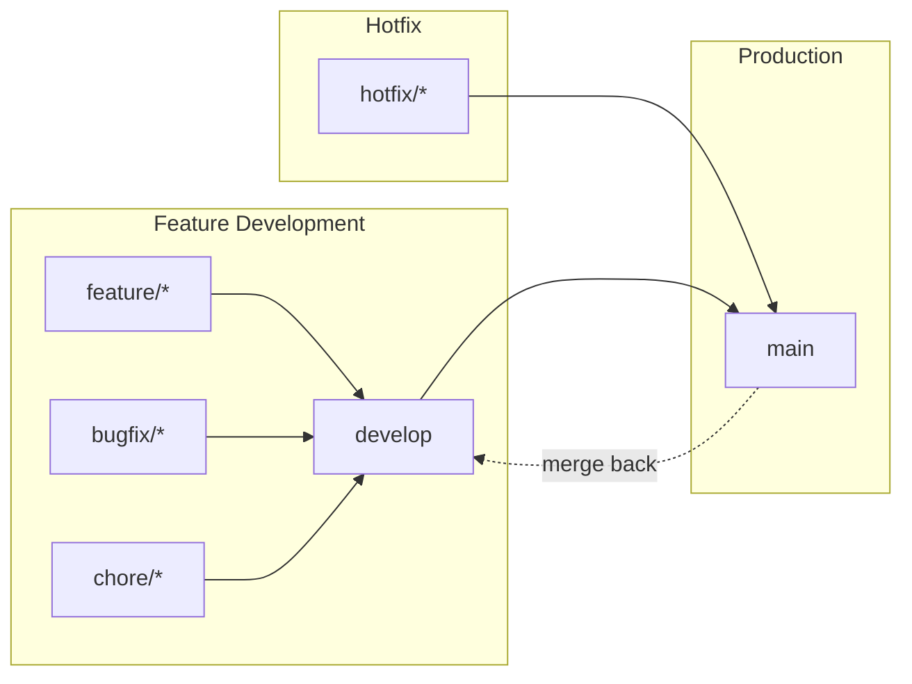

# Branching Strategy

This document describes the simplified Git workflow used in Boletapp. Optimized for small teams and solo development with minimal overhead.

## Branch Overview

```
┌─────────────────────────────────────────────────────────────────────────┐
│                         BRANCHING STRATEGY                               │
├─────────────────────────────────────────────────────────────────────────┤
│                                                                          │
│  feature/*  ──────┐                                                      │
│  bugfix/*   ──────┼──► develop ──► main                                 │
│  chore/*    ──────┘       │          │                                  │
│                           │          │                                  │
│                     Development   Production                            │
│                       (CI/CD)     (deployed)                            │
│                                                                          │
│  hotfix/*  ─────────────────────► main                                  │
│                                     │                                   │
│                            (merge back to develop)                      │
└─────────────────────────────────────────────────────────────────────────┘
```

## Why 2 Branches?

**Previous (3-branch) issues:**
- Sync branches accumulating (`sync/staging-to-main`, etc.)
- PRs getting stale and redundant
- Manual promotion overhead between environments
- Branches drifting out of sync

**Simplified approach benefits:**
- Less sync overhead
- Fewer stale branches
- Clear, linear promotion path
- Feature flags for staging-like testing

## Branch Purposes

| Branch | Purpose | Deploys To | Protection Level |
|--------|---------|------------|------------------|
| `main` | Production releases | https://boletapp-d609f.web.app | **STRICT** |
| `develop` | Active development & CI | Firebase Preview URLs | **STANDARD** |

### main (Production)

- **Purpose:** Contains production-ready code deployed to end users
- **URL:** https://boletapp-d609f.web.app
- **Protection:** Strictest - requires PR from develop, all status checks must pass
- **Merge Source:** Only `develop` branch (or `hotfix/*` for emergencies)
- **Direct Push:** Blocked

### develop (Development & Integration)

- **Purpose:** Integration branch for active development work
- **URL:** Firebase Preview URLs on PRs
- **Protection:** Standard - requires PR, status checks must pass
- **Merge Sources:** Feature, bugfix, and chore branches via PR
- **Direct Push:** Blocked

## Merge Flow



## Branch Naming Conventions

| Prefix | Purpose | Example |
|--------|---------|---------|
| `feature/` | New features | `feature/story-9.15-subcategory-learning` |
| `bugfix/` | Bug fixes | `bugfix/fix-date-parsing` |
| `hotfix/` | Production hotfixes | `hotfix/critical-auth-fix` |
| `chore/` | Maintenance tasks | `chore/update-dependencies` |
| `docs/` | Documentation only | `docs/update-readme` |

### Naming Format

```
{type}/{short-description}
# or with story reference:
{type}/story-{number}-{description}

Examples:
- feature/story-9.15-subcategory-learning
- bugfix/transaction-filter-reset
- hotfix/firebase-auth-error
- chore/upgrade-react-18
```

## Development Workflow

### Standard Feature Development

1. **Create Feature Branch**
   ```bash
   git checkout develop
   git pull origin develop
   git checkout -b feature/my-feature
   ```

2. **Develop & Commit**
   ```bash
   # Make changes
   git add .
   git commit -m "feat: add my feature"
   ```

3. **Push & Create PR to develop**
   ```bash
   git push -u origin feature/my-feature
   gh pr create --base develop --title "feat: My feature" --body "..."
   ```

4. **CI Validation**
   - GitHub Actions runs all tests
   - Firebase Preview URL generated for visual testing
   - Must pass before merge is allowed

5. **Merge to Develop**
   - Squash merge for clean history
   - **Delete feature branch immediately after merge**

### Production Release

When `develop` is ready for production:

1. **Create PR from develop to main**
   ```bash
   gh pr create --base main --head develop --title "Release: <description>"
   ```

2. **Review & Merge**
   - Verify all CI checks pass
   - Merge triggers production deployment

3. **No sync branches needed** - develop stays ahead of main naturally

### Hotfix Workflow

For critical production bugs:

1. **Create Hotfix Branch from main**
   ```bash
   git checkout main
   git pull origin main
   git checkout -b hotfix/critical-bug
   ```

2. **Fix, Test & Push**
   ```bash
   git add .
   git commit -m "fix: resolve critical bug"
   git push -u origin hotfix/critical-bug
   ```

3. **PR directly to main**
   ```bash
   gh pr create --base main --title "hotfix: Critical bug fix"
   ```

4. **Merge to main** (deploys immediately)

5. **Sync back to develop**
   ```bash
   git checkout develop
   git pull origin develop
   git merge main
   git push origin develop
   ```

## Branch Protection Rules

### main (Production)

| Setting | Value |
|---------|-------|
| Require PR | Yes |
| Required approvals | 0 (solo) / 1+ (team) |
| Require status checks | Yes (`test`, `security`) |
| Require up-to-date branch | Yes |
| Allow force pushes | No |
| Allow deletions | No |

### develop (Development)

| Setting | Value |
|---------|-------|
| Require PR | Yes |
| Required approvals | 0 (solo) / 1 (team) |
| Require status checks | Yes (`test`) |
| Allow force pushes | No |
| Allow deletions | No |

## CI/CD Integration

### GitHub Actions

```yaml
on:
  push:
    branches: [main, develop]
  pull_request:
    branches: [main, develop]
```

### Deployment Triggers

| Event | Action |
|-------|--------|
| PR to `develop` | Run tests + Firebase Preview URL |
| PR merged to `develop` | Tests only |
| PR merged to `main` | Deploy to production |

## Quick Reference

### Daily Commands

```bash
# Start feature
git checkout develop && git pull && git checkout -b feature/name

# Update feature branch with latest develop
git fetch origin && git rebase origin/develop

# Push feature
git push -u origin feature/name

# After PR merged - clean up
git checkout develop && git pull && git branch -d feature/name
```

### Release Commands

```bash
# Create release PR
gh pr create --base main --head develop --title "Release: vX.Y.Z"

# After hotfix merged to main, sync develop
git checkout develop && git merge main && git push
```

### Cleanup Commands

```bash
# Delete merged local branches
git branch --merged develop | grep -v "develop\|main" | xargs git branch -d

# Prune remote tracking branches
git fetch --prune
```

## PR Checklist

Before creating a PR:
- [ ] Branch is up to date with target (`git rebase origin/develop`)
- [ ] All tests pass locally (`npm run test:all`)
- [ ] TypeScript compiles (`npm run typecheck`)
- [ ] Build succeeds (`npm run build`)
- [ ] Delete branch after merge (enable auto-delete in GitHub)

## Merge Strategy

| Target | Merge Type | Reason |
|--------|------------|--------|
| develop | **Squash** | Clean feature commits |
| main | **Merge commit** | Preserve history trail |

## Feature Flags (Staging Alternative)

Instead of a separate staging branch, use feature flags for gradual rollouts:

```typescript
// src/config/features.ts
export const FEATURES = {
  NEW_ANALYTICS: process.env.NODE_ENV === 'development' ||
                 localStorage.getItem('ff_new_analytics') === 'true',
};
```

Enable in production for testing:
```javascript
localStorage.setItem('ff_new_analytics', 'true');
```

---

## Migration Notes

**Removed:** `staging` branch (archived, not deleted)

**Rationale:**
- Single developer / small team doesn't need separate QA environment
- Firebase Preview URLs provide per-PR testing
- Feature flags enable production testing without separate branch
- Reduces branch management overhead significantly

---

**Document Version:** 2.0
**Updated:** 2025-12-16
**Change:** Simplified from 3-branch to 2-branch strategy
