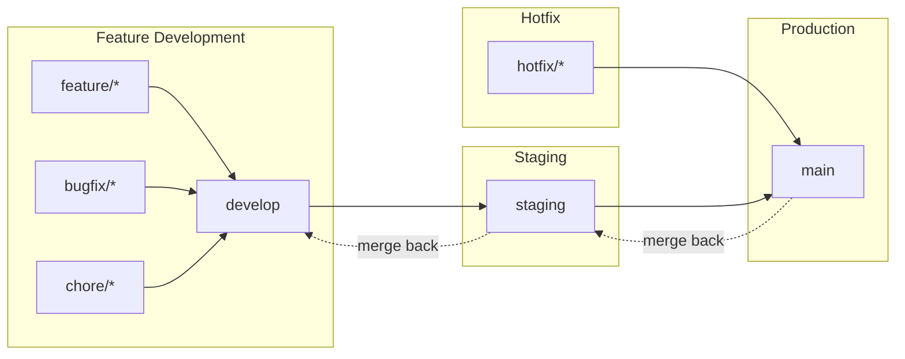

# Branching Strategy

This document describes the Git workflow used in Boletapp. Uses the conventional 3-branch strategy with develop, staging, and main.

## Branch Overview

```
┌─────────────────────────────────────────────────────────────────────────┐
│                         BRANCHING STRATEGY                               │
├─────────────────────────────────────────────────────────────────────────┤
│                                                                          │
│  feature/*  ──────┐                                                      │
│  bugfix/*   ──────┼──► develop ──► staging ──► main                     │
│  chore/*    ──────┘       │           │          │                      │
│                           │           │          │                      │
│                     Integration   Pre-Prod    Production                │
│                       (dev)      (staging)    (deployed)                │
│                                                                          │
│  hotfix/*  ─────────────────────────────────► main                      │
│                                                  │                       │
│                            (merge back to develop & staging)            │
└─────────────────────────────────────────────────────────────────────────┘
```

## Why 3 Branches?

**Benefits:**
- Clear separation between development, testing, and production
- Staging environment for pre-production validation
- Controlled deployment pipeline with manual promotion gates
- Compatible with BMAD deploy-story workflow automation

**Deployment pipeline:** `feature/* → develop → staging → main`

## Branch Purposes

| Branch | Purpose | Deploys To | Protection Level |
|--------|---------|------------|------------------|
| `main` | Production releases | https://boletapp-d609f.web.app | **STRICT** |
| `staging` | Pre-production testing | Firebase preview channel | **STANDARD** |
| `develop` | Active development & CI | Firebase preview channel | **STANDARD** |

### main (Production)

- **Purpose:** Contains production-ready code deployed to end users
- **URL:** https://boletapp-d609f.web.app
- **Protection:** Strictest - requires PR from staging, all status checks must pass
- **Merge Source:** Only `staging` branch (or `hotfix/*` for emergencies)
- **Direct Push:** Blocked

### staging (Pre-Production)

- **Purpose:** Pre-production testing environment for final validation
- **URL:** Firebase preview channel
- **Protection:** Standard - requires PR from develop, status checks must pass
- **Merge Source:** Only `develop` branch
- **Direct Push:** Blocked

### develop (Development & Integration)

- **Purpose:** Integration branch for active development work
- **URL:** Firebase preview channel
- **Protection:** Standard - requires PR, status checks must pass
- **Merge Sources:** Feature, bugfix, and chore branches via PR
- **Direct Push:** Blocked

## Merge Flow



## Branch Naming Conventions

| Prefix | Purpose | Example |
|--------|---------|---------|
| `feature/` | New features | `feature/epic10-insight-engine` |
| `bugfix/` | Bug fixes | `bugfix/fix-date-parsing` |
| `hotfix/` | Production hotfixes | `hotfix/critical-auth-fix` |
| `chore/` | Maintenance tasks | `chore/update-dependencies` |
| `docs/` | Documentation only | `docs/update-readme` |

### Naming Format

```
{type}/epic{N}-{short-description}
# or without epic reference:
{type}/{short-description}

Examples:
- feature/epic10-insight-engine
- feature/epic10-foundation-refactor
- bugfix/transaction-filter-reset
- hotfix/firebase-auth-error
- chore/upgrade-react-18
```

## Development Workflow

### Standard Feature Development

1. **Create Feature Branch from develop**
   ```bash
   git checkout develop
   git pull origin develop
   git checkout -b feature/epic10-my-feature
   ```

2. **Develop & Commit**
   ```bash
   # Make changes
   git add .
   git commit -m "feat: add my feature"
   ```

3. **Push & Create PR to develop**
   ```bash
   git push -u origin feature/epic10-my-feature
   gh pr create --base develop --title "feat: My feature" --body "..."
   ```

4. **CI Validation**
   - GitHub Actions runs all tests
   - Must pass before merge is allowed

5. **Merge to Develop**
   - Merge after review and CI passes
   - **Delete feature branch immediately after merge**

### Production Release (deploy-story workflow)

Use the BMAD deploy-story workflow for automated deployment:

```bash
/bmad:bmm:workflows:deploy-story
```

This workflow handles the full pipeline:
1. **develop → staging**: Promote to pre-production
2. **staging → main**: Deploy to production
3. **Cleanup**: Delete feature branch, update Atlas memory

### Manual Promotion

If not using the workflow:

1. **Promote develop to staging**
   ```bash
   git checkout staging
   git pull origin staging
   git merge develop --no-ff -m "Promote develop to staging: story-10.1"
   git push origin staging
   ```

2. **Promote staging to main**
   ```bash
   git checkout main
   git pull origin main
   git merge staging --no-ff -m "Release to production: story-10.1"
   git push origin main
   ```

### Hotfix Workflow

For critical production bugs:

1. **Create Hotfix Branch from main**
   ```bash
   git checkout main
   git pull origin main
   git checkout -b hotfix/critical-bug
   ```

2. **Fix, Test & Push**
   ```bash
   git add .
   git commit -m "fix: resolve critical bug"
   git push -u origin hotfix/critical-bug
   ```

3. **PR directly to main**
   ```bash
   gh pr create --base main --title "hotfix: Critical bug fix"
   ```

4. **Merge to main** (deploys immediately)

5. **Backport to staging and develop**
   ```bash
   git checkout staging
   git pull origin staging
   git merge main
   git push origin staging

   git checkout develop
   git pull origin develop
   git merge main
   git push origin develop
   ```

## Branch Protection Rules

### main (Production)

| Setting | Value |
|---------|-------|
| Require PR | Yes |
| Required approvals | 0 (solo) / 1+ (team) |
| Require status checks | Yes (`test`, `security`) |
| Require up-to-date branch | Yes |
| Allow force pushes | No |
| Allow deletions | No |

### staging (Pre-Production)

| Setting | Value |
|---------|-------|
| Require PR | Yes |
| Required approvals | 0 (solo) / 1 (team) |
| Require status checks | Yes (`test`) |
| Allow force pushes | No |
| Allow deletions | No |

### develop (Development)

| Setting | Value |
|---------|-------|
| Require PR | Yes |
| Required approvals | 0 (solo) / 1 (team) |
| Require status checks | Yes (`test`) |
| Allow force pushes | No |
| Allow deletions | No |

## CI/CD Integration

### GitHub Actions

```yaml
on:
  push:
    branches: [main, staging, develop]
  pull_request:
    branches: [main, staging, develop]
```

### Deployment Triggers

| Event | Action |
|-------|--------|
| PR to `develop` | Run tests |
| PR merged to `develop` | Deploy to develop preview |
| PR merged to `staging` | Deploy to staging preview |
| PR merged to `main` | Deploy to production |

## Quick Reference

### Daily Commands

```bash
# Start feature
git checkout develop && git pull && git checkout -b feature/epic10-name

# Update feature branch with latest develop
git fetch origin && git rebase origin/develop

# Push feature
git push -u origin feature/epic10-name

# After PR merged - clean up
git checkout develop && git pull && git branch -d feature/epic10-name
```

### Deployment Commands

```bash
# Promote to staging
git checkout staging && git pull && git merge develop --no-ff && git push

# Deploy to production
git checkout main && git pull && git merge staging --no-ff && git push
```

### Cleanup Commands

```bash
# Delete merged local branches
git branch --merged develop | grep -v "develop\|staging\|main" | xargs git branch -d

# Prune remote tracking branches
git fetch --prune
```

## PR Checklist

Before creating a PR:
- [ ] Branch is up to date with target (`git rebase origin/develop`)
- [ ] All tests pass locally (`npm run test:all`)
- [ ] TypeScript compiles (`npm run typecheck`)
- [ ] Build succeeds (`npm run build`)
- [ ] Delete branch after merge (enable auto-delete in GitHub)

## Merge Strategy

| Target | Merge Type | Reason |
|--------|------------|--------|
| develop | **Merge commit** | Preserve feature history |
| staging | **Merge commit** | Clear promotion record |
| main | **Merge commit** | Full release history |

**Important:** Use merge commits (not squash) for promotions between develop/staging/main to maintain clear history and avoid divergence.

---

**Document Version:** 3.0
**Updated:** 2025-12-18
**Change:** Restored 3-branch strategy (develop → staging → main)
