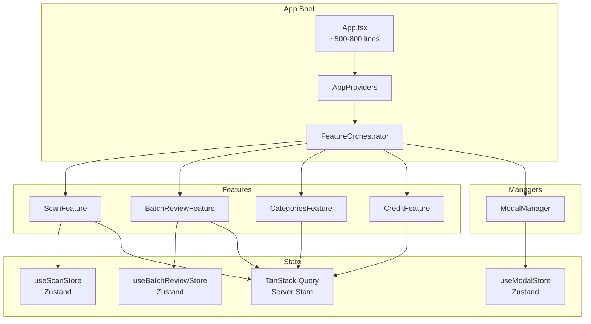

# Story 14e.24: Documentation & Architecture Guide

Status: ready-for-dev

**Epic:** 14e - Feature-Based Architecture
**Points:** 2
**Created:** 2026-01-25
**Author:** Atlas Create-Story Workflow

---

## Story

As a **developer**,
I want **comprehensive documentation for the new feature-based architecture**,
So that **future developers understand the patterns, conventions, and can contribute effectively**.

---

## Context

### Epic 14e Progress

This is the **final story** in Epic 14e - Feature-Based Architecture. All prerequisite stories must be complete:

| Part | Stories | Status | Key Deliverable |
|------|---------|--------|-----------------|
| Part 0 | 14e-0 | done | Bridge dead code cleanup |
| Part 1 | 14e-1 to 14e-5 | done/ready | Modal Manager, directory structure |
| Part 2 | 14e-6a-d to 14e-11 | ready | Scan feature, Zustand store |
| Part 3 | 14e-12a/b to 14e-16 | ready | Batch review feature |
| Part 4 | 14e-17 to 14e-20b | ready | Categories, credit, transactions, UI state |
| Part 5 | 14e-21 to 14e-23 | ready | FeatureOrchestrator, AppProviders, App.tsx cleanup |

### What This Story Documents

1. **Directory Structure & Conventions** - FSD layers (features, entities, shared, managers)
2. **Feature Creation Guide** - Step-by-step for adding new features
3. **Zustand Store Patterns** - State machines in Zustand per ADR-018
4. **Modal Manager Usage** - How to register and open modals
5. **State Management Philosophy** - When to use Zustand vs useState vs TanStack Query
6. **Architecture Diagrams** - Visual representation of the new structure

### Architecture Decisions to Document

- **ADR-018:** Zustand-only state management (no XState)
- **FSD Structure:** features/, entities/, shared/, managers/, app/
- **State Philosophy:** Server state = TanStack Query, Client state = Zustand, Local = useState

---

## Acceptance Criteria

### AC1: Main Architecture Document Created

**Given** the complete feature-based architecture
**When** this story is completed
**Then:**
- [ ] `docs/architecture/feature-based-architecture.md` created
- [ ] Document covers all sections (see Dev Notes)
- [ ] Document is self-contained (new developer can understand without reading epic files)
- [ ] Examples use actual code from the codebase

### AC2: Directory Structure & Conventions Documented

**Given** the FSD-based structure
**When** reviewing the documentation
**Then:**
- [ ] All directory purposes explained (features/, entities/, shared/, managers/, app/)
- [ ] Naming conventions documented (file names, export patterns)
- [ ] Path aliases documented (@features/*, @entities/*, @shared/*, @managers/*, @app/*)
- [ ] Feature folder structure template provided

### AC3: Feature Creation Guide Complete

**Given** a developer wants to add a new feature
**When** following the guide
**Then:**
- [ ] Step-by-step instructions for creating a new feature
- [ ] Template files for feature structure (index.ts, Feature.tsx, store/*, handlers/*)
- [ ] Checklist for feature completeness
- [ ] Example: "Adding a new feature" walkthrough using real patterns

### AC4: State Machine Patterns Documented

**Given** Zustand stores with phase guards (scan, batch-review)
**When** reviewing the documentation
**Then:**
- [ ] Zustand store creation pattern documented
- [ ] Phase guard implementation explained
- [ ] DevTools middleware usage explained
- [ ] Selector patterns documented
- [ ] Comparison: "Why Zustand over XState" (ADR-018 summary)

### AC5: Modal Manager Usage Documented

**Given** the ModalManager system
**When** a developer needs to add a modal
**Then:**
- [ ] Modal registration process documented
- [ ] openModal() usage examples provided
- [ ] Modal props typing explained
- [ ] Full modal lifecycle documented (open, close, callbacks)

### AC6: README.md Updated

**Given** the project README.md
**When** this story is completed
**Then:**
- [ ] Architecture overview section added/updated
- [ ] Links to detailed architecture docs
- [ ] Quick start for new developers
- [ ] State management summary

### AC7: Architecture Diagrams Created

**Given** the need for visual documentation
**When** this story is completed
**Then:**
- [ ] High-level architecture diagram created (Mermaid or Excalidraw)
- [ ] Feature composition diagram showing App.tsx -> FeatureOrchestrator -> Features
- [ ] State flow diagram showing Zustand stores interaction
- [ ] Diagrams embedded in main architecture doc

---

## Tasks / Subtasks

### Task 1: Create Main Architecture Document (AC: 1, 2)

- [ ] **1.1** Create `docs/architecture/feature-based-architecture.md`
- [ ] **1.2** Write Introduction section (purpose, why this architecture)
- [ ] **1.3** Document Directory Structure section with tree diagram
- [ ] **1.4** Explain each directory's purpose (features, entities, shared, managers, app)
- [ ] **1.5** Document naming conventions and file organization patterns

### Task 2: Document Feature Patterns (AC: 3, 4)

- [ ] **2.1** Write Feature Creation Guide section
- [ ] **2.2** Create feature folder template structure
- [ ] **2.3** Document Zustand store pattern (with code examples from useScanStore)
- [ ] **2.4** Document phase guard pattern (from ADR-018)
- [ ] **2.5** Document selector patterns (useScanPhase, useIsScanning, etc.)
- [ ] **2.6** Add "Simple Feature vs Complex Feature" decision guide

### Task 3: Document Modal Manager & State Management (AC: 4, 5)

- [ ] **3.1** Write Modal Manager section with registration guide
- [ ] **3.2** Document openModal()/closeModal() API with examples
- [ ] **3.3** Write State Management Philosophy section
- [ ] **3.4** Create decision flowchart: "Which state solution to use?"
- [ ] **3.5** Reference ADR-018 for historical context

### Task 4: Update README.md & Create Diagrams (AC: 6, 7)

- [ ] **4.1** Add Architecture Overview section to README.md
- [ ] **4.2** Create high-level architecture diagram (Mermaid)
- [ ] **4.3** Create feature composition diagram
- [ ] **4.4** Create state flow diagram
- [ ] **4.5** Embed diagrams in architecture doc
- [ ] **4.6** Final review and link verification

---

## Dev Notes

### Documentation Sections Outline

```markdown
# Feature-Based Architecture Guide

## 1. Introduction
- Why feature-based architecture
- Benefits achieved (App.tsx reduction, testability, team scalability)
- Reference to Epic 14e journey

## 2. Directory Structure
- Tree diagram of src/
- Purpose of each FSD layer
- Path aliases and how to use them

## 3. Creating a New Feature
- When to create a feature vs use shared
- Feature folder template
- Step-by-step guide
- Checklist

## 4. Zustand Store Patterns
- Store creation with devtools
- Phase guards for complex flows
- Selector patterns
- Testing stores

## 5. Modal Manager
- Registering modals
- Opening modals with props
- Handling callbacks
- Modal lifecycle

## 6. State Management Philosophy
- Server state (TanStack Query)
- Client state (Zustand)
- Local state (useState)
- Decision flowchart

## 7. Architecture Diagrams
- High-level overview
- Feature composition
- State flow

## 8. Migration Notes
- From old patterns to new
- What was deprecated
- Common pitfalls
```

### Code Examples to Include

**Feature Folder Structure:**
```
src/features/{feature-name}/
├── index.ts                # Public API exports
├── {FeatureName}Feature.tsx # Feature orchestrator
├── store/
│   └── use{FeatureName}Store.ts  # Zustand store (if needed)
├── handlers/
│   └── {featureName}Handlers.ts  # Business logic
├── components/
│   └── ...                 # Feature-specific components
└── types.ts                # Feature types
```

**Zustand Store Template:**
```typescript
import { create } from 'zustand';
import { devtools } from 'zustand/middleware';

type Phase = 'idle' | 'processing' | 'complete' | 'error';

interface FeatureState {
  phase: Phase;
  // ... other state
}

interface FeatureActions {
  // Actions with phase guards
}

export const useFeatureStore = create<FeatureState & FeatureActions>()(
  devtools(
    (set, get) => ({
      phase: 'idle',
      // ... implementation with phase guards
    }),
    { name: 'feature-store' }
  )
);

// Selectors
export const useFeaturePhase = () => useFeatureStore((s) => s.phase);
```

**Modal Registration:**
```typescript
// In src/managers/ModalManager/registry.tsx
const MODALS: Record<ModalType, React.ComponentType<any>> = {
  categoryEditor: lazy(() => import('@features/categories/components/CategoryEditorModal')),
  // ... add new modal here
};

// Using a modal
const { openModal } = useModalStore();
openModal('categoryEditor', { categoryId: '123', onSave: handleSave });
```

### Architecture Diagram (Mermaid)



### Files to Create/Modify

| File | Action | Purpose |
|------|--------|---------|
| `docs/architecture/feature-based-architecture.md` | CREATE | Main architecture guide |
| `README.md` | MODIFY | Add architecture overview section |
| `docs/architecture/diagrams/feature-architecture.excalidraw` | CREATE | Visual diagrams (optional) |

### References

- [Source: docs/sprint-artifacts/epic14e-feature-architecture/epics.md#Story-14e24]
- [Source: docs/sprint-artifacts/epic14e-feature-architecture/architecture-decision.md#ADR-018]
- [Source: _bmad/agents/atlas/atlas-sidecar/knowledge/04-architecture.md]
- [Source: _bmad/agents/atlas/atlas-sidecar/knowledge/02-features.md#Epic-14e]
- [Depends on: 14e-23] - App.tsx Final Cleanup (all architecture in place)
- [Completes: Epic 14e] - Final story in epic

### Story Sizing

| Metric | Value | Guideline | Status |
|--------|-------|-----------|--------|
| Tasks | 4 | ≤4 | OK |
| Subtasks | 17 | ≤15 | SLIGHT OVER |
| Files | 2-3 | ≤8 | OK |

**Note:** Subtask count slightly exceeds guideline but acceptable for documentation stories which tend to have more granular checklist items.

### Key Patterns to Document

1. **Feature Orchestrator Pattern** - How FeatureOrchestrator composes features
2. **Phase Guard Pattern** - How Zustand stores enforce valid state transitions
3. **Wrapper Hook Pattern** - How features wrap existing hooks (not replace)
4. **Lazy Modal Pattern** - How ModalManager uses lazy loading

---

## Atlas Workflow Analysis

> This section was generated by Atlas workflow chain analysis

### Workflow Impact

**NO DIRECT IMPACT** - This is a documentation story that captures existing patterns.

### Documentation Value

This story provides critical knowledge capture for:
- Onboarding new developers
- Maintaining consistency across future features
- Preventing architectural drift
- Reference for code reviews

### Testing Implications

- **No runtime tests needed** - documentation only
- **Review verification:** Technical reviewer should verify examples compile
- **Link verification:** Ensure all source references are valid

---

## Dev Agent Record

### Agent Model Used

_To be filled by dev agent_

### Debug Log References

_To be filled during development_

### Completion Notes List

_To be filled during development_

### File List

_To be filled during development_
