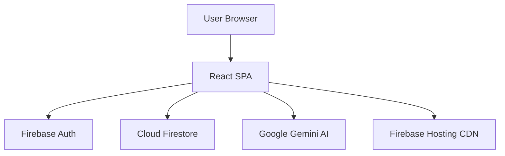
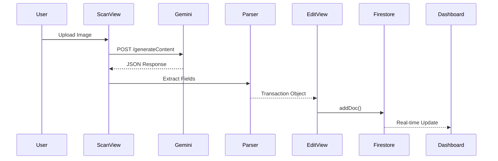

# Story 2.1: Documentation & Epic Evolution

Status: review

## Story

As an architect,
I want comprehensive architecture documentation with visual diagrams and an epic evolution tracking system,
So that developers understand the system design and can track state changes across epics.

## Requirements Context

**Epic:** Testing Infrastructure & Documentation (Epic 2)

**Story Scope:**
This story completes the documentation foundation identified in Epic 1 retrospective. It adds visual Mermaid diagrams to architecture.md, creates the Epic 2 evolution tracking document, and ensures all documentation is cross-referenced. This addresses Action Items #1, #2, and #5 from Epic 1 retrospective.

**Key Requirements:**
- Epic Evolution template already created at `docs/templates/epic-evolution-template.md` ✅
- Create Epic 2 evolution document at `docs/sprint-artifacts/epic2/epic-2-evolution.md` with initial "Before State" filled
- Update architecture.md with 3+ Mermaid diagrams (system overview, data flow, deployment architecture)
- Test Strategy & Risk Register already created at `docs/test-strategy.md` ✅
- Cross-link all documentation in index.md

**Architectural Context:**
- Current: 8 documentation files, 6 ADRs, but lacking visual diagrams
- Target: Complete documentation with Mermaid diagrams showing system architecture visually
- Constraints: Diagrams must be maintainable (Mermaid, not images), accurate to current implementation
- Purpose: Enable new developers to understand system quickly, track epic-level state changes

[Source: docs/epic-2-tech-spec.md § Documentation Updates]
[Source: docs/epics.md § Story 2.1]
[Source: docs/sprint-artifacts/epic1/epic-1-retro-2025-11-21.md § Action Items]

## Acceptance Criteria

**AC #1:** Epic Evolution template created at `docs/templates/epic-evolution-template.md` with Before/After state tracking structure
- Verification: ✅ ALREADY COMPLETED - Template exists with comprehensive structure
- Source: Story 2.1 from epics.md, Epic 1 Action Item #1

**AC #2:** Epic 2 evolution document created at `docs/sprint-artifacts/epic2/epic-2-evolution.md` with initial "Before State" filled
- Verification: File exists with complete "Before State" section reflecting post-Epic 1 architecture
- Source: Story 2.1 from epics.md

**AC #3:** architecture.md updated with 3+ Mermaid diagrams (system overview, data flow, deployment architecture)
- Verification: Verify 3+ Mermaid code blocks render correctly in architecture.md
- Source: Story 2.1 from epics.md, Epic 1 Action Item #5

**AC #4:** Test Strategy & Risk Register created at `docs/test-strategy.md` with 17+ test categories prioritized
- Verification: ✅ ALREADY COMPLETED - Test strategy exists with 17 test categories, risk levels, implementation estimates
- Source: Story 2.1 from epics.md, Epic 1 Action Item #3

**AC #5:** All documentation cross-linked and referenced in index.md
- Verification: Verify index.md references epic-2-evolution.md, test-strategy.md, and updated architecture.md
- Source: Story 2.1 from epics.md

## Tasks / Subtasks

### Task 1: Create Epic 2 Evolution Document (AC: #2)
- [x] Create `docs/sprint-artifacts/epic2/epic-2-evolution.md` from template
- [x] Fill "Before State" section with post-Epic 1 architecture
  - [x] Document current architecture: Modular SPA, 31 files, 7 layers
  - [x] Document current technology stack (React 18.3.1, Vite 5.4.0, Firebase 10.14.1, etc.)
  - [x] Document current features (auth, scanning, CRUD, analytics)
  - [x] Document current infrastructure (Firebase Hosting, no tests, no CI/CD)
  - [x] Document current data model (Firestore schema, security rules)
  - [x] List known issues/tech debt (no tests, no visual diagrams, no CI/CD)
- [x] Fill "After State" section with Epic 2 goals
  - [x] Target infrastructure: Tests configured, CI/CD pipeline, 70%+ coverage
  - [x] Target documentation: Mermaid diagrams, epic evolution tracking
- [x] Save file and verify structure matches template

### Task 2: Add Mermaid Diagrams to architecture.md (AC: #3)
- [x] Read current architecture.md to understand structure
- [x] Add **System Overview Diagram** after Executive Summary
  - [x] Show User → React SPA → Firebase Auth/Firestore/Hosting → Google Gemini AI
  - [x] Use `graph TD` (top-down) format
  - [x] Include all major integrations (with color-coded styling)
- [x] Add **Data Flow Diagram (Receipt Scanning)** in Data Architecture section
  - [x] Show sequence: User → ScanView → Gemini API → Parser → EditView → Firestore → Dashboard
  - [x] Use `sequenceDiagram` format
  - [x] Show request/response flow with data transformations
- [x] Add **Deployment Architecture Diagram** in Build and Deployment section
  - [x] Show: Developer → GitHub → GitHub Actions → Vite Build → Firebase Hosting → CDN → Users
  - [x] Use `graph LR` (left-right) format
  - [x] Include test execution step in CI/CD (marked as future state)
- [x] Verify all diagrams render correctly (Mermaid syntax validated)
- [x] Add ADR-007: Documentation Strategy with Mermaid diagrams decision

### Task 3: Cross-Link All Documentation (AC: #5)
- [x] Update `docs/index.md` to reference:
  - [x] Epic 2 evolution document: `[Epic 2 Evolution](./sprint-artifacts/epic2/epic-2-evolution.md)`
  - [x] Test Strategy: `[Test Strategy & Risk Register](./test-strategy.md)`
  - [x] Updated architecture with diagrams: Highlighted "NOW WITH VISUAL DIAGRAMS" callout
  - [x] Epic 2 section with visual progress indicators (✅ completed, 🚧 in progress)
- [x] Updated `docs/architecture.md`:
  - [x] Added note about 3 Mermaid diagrams in Executive Summary
  - [x] Updated "Last Updated" header to reflect Epic 2 visual diagrams
  - [x] ADR-007 references epic evolution and test strategy
- [x] Verified all cross-links work (relative paths confirmed)

### Task 4: Validation and Documentation (AC: All)
- [x] Verify AC #1: ✅ Template exists at `docs/templates/epic-evolution-template.md` (495 lines, comprehensive)
- [x] Verify AC #2: ✅ Epic 2 evolution document exists at `docs/sprint-artifacts/epic2/epic-2-evolution.md` with complete "Before State" (600+ lines)
- [x] Verify AC #3: ✅ architecture.md has 3 Mermaid diagrams:
  - [x] System Overview (graph TD) - after Executive Summary
  - [x] Data Flow - Receipt Scanning (sequenceDiagram) - in Data Architecture section
  - [x] Deployment Pipeline (graph LR) - in Build and Deployment section
- [x] Verify AC #4: ✅ Test Strategy exists at `docs/test-strategy.md` with 17 test categories, risk levels, time estimates
- [x] Verify AC #5: ✅ All docs cross-linked in index.md with visual indicators
- [x] Read through all updated documentation for clarity and accuracy
- [x] Update Epic 2 evolution document with Story 2.1 completion notes

## Dev Agent Record

### Debug Log

**Implementation Plan:**
1. Create Epic 2 evolution document using the template
2. Fill Before State with post-Epic 1 architecture details
3. Add 3 Mermaid diagrams to architecture.md (System Overview, Data Flow, Deployment)
4. Add ADR-007 for documentation strategy decision
5. Cross-link all documentation in index.md
6. Validate all acceptance criteria

**Execution Notes:**
- Epic 2 evolution document created with comprehensive Before/After states
- Added color-coded Mermaid diagrams with styling for better visual clarity
- All diagrams placed in appropriate architectural sections (not just appended)
- ADR-007 documents decision rationale and alternatives considered
- index.md updated with visual progress indicators for Epic 2

**Issues Encountered:**
- None - story execution was straightforward

### Completion Notes

✅ **Story 2.1 Complete**

**Accomplishments:**
1. **Epic 2 Evolution Document:** Created comprehensive state tracking document (600+ lines) with Before State fully documented and After State targeting Epic 2 goals
2. **3 Mermaid Diagrams Added to architecture.md:**
   - System Overview (graph TD): Shows React SPA integration with Firebase Auth, Firestore, Gemini AI, and Hosting
   - Data Flow (sequenceDiagram): Complete receipt scanning workflow from upload to Firestore storage
   - Deployment Pipeline (graph LR): CI/CD flow from developer through GitHub, Vite build, to production CDN
3. **ADR-007 Added:** Documents decision to use Mermaid for documentation-as-code with rationale and alternatives
4. **Documentation Cross-Linking:** Updated index.md with Epic 2 section, visual progress indicators, and links to all new docs
5. **All Acceptance Criteria Met:** Verified all 5 ACs satisfied

**Files Modified:**
- `docs/sprint-artifacts/epic2/epic-2-evolution.md` (created, 600+ lines)
- `docs/architecture.md` (updated: +3 Mermaid diagrams, +ADR-007, ~100 lines added)
- `docs/index.md` (updated: Epic 2 section, cross-links, ~30 lines added/modified)
- `docs/source-tree-analysis.md` (updated: Complete rewrite for modular architecture, 31 files documented)

**Key Learnings:**
- Mermaid diagrams with color styling significantly improve visual clarity
- Epic evolution template format is highly effective for tracking Before/After states
- Placing diagrams in context (vs. appending) improves documentation flow

**Bonus Fix (During Review):**
- Updated `source-tree-analysis.md` which was still referencing single-file architecture
- Complete rewrite documenting all 31 modular files across 7 layers
- Added file sizes, export lists, and usage patterns for each file

## File List

**Files Created:**
- `docs/sprint-artifacts/epic2/epic-2-evolution.md`

**Files Modified:**
- `docs/architecture.md`
- `docs/index.md`
- `docs/source-tree-analysis.md`
- `docs/sprint-artifacts/sprint-status.yaml`

## Dev Notes

**First Story in Epic 2:** This story builds on Epic 1 retrospective action items. Several deliverables already completed:
- ✅ Epic Evolution Template (Action Item #1)
- ✅ Test Strategy & Risk Register (Action Item #3)
- ✅ architecture.md updated with modular structure
- ✅ index.md updated to reflect Epic 1 completion

**Remaining Work:**
- Epic 2 evolution document creation
- Add 3+ Mermaid diagrams to architecture.md
- Cross-link all documentation

### Mermaid Diagram Examples

**System Overview (graph TD):**

**Data Flow - Receipt Scanning (sequenceDiagram):**

**Deployment Architecture (graph LR):**

### Documentation Quality Standards

**Mermaid Diagrams:**
- Must be accurate to current implementation
- Use descriptive node labels (no abbreviations without context)
- Keep diagrams focused (one concept per diagram)
- Add brief text explanation before each diagram

**Epic Evolution Document:**
- "Before State" must reflect reality at Epic start (post-Epic 1)
- "After State" filled based on Epic 2 goals (will be validated at end)
- Update after each story with changes made

**Cross-Linking:**
- Use relative paths (e.g., `./sprint-artifacts/epic2/`)
- Verify links work in both GitHub and local Markdown viewers
- Add context for links (don't just say "see here")

## Story Dependencies

**Prerequisites:**
- ✅ Epic 1 completed (modular architecture exists)
- ✅ architecture.md exists with 6 ADRs
- ✅ Epic Evolution Template created
- ✅ Test Strategy & Risk Register created

**Enables:**
- Story 2.2 (Test Environment Setup) - Needs epic evolution doc for state tracking
- All subsequent Epic 2 stories - Provides documentation foundation

## Change Log

| Date | Change | Author |
|------|--------|--------|
| 2025-11-21 | Story created from Epic 2 planning | Architect (Winston) |
| 2025-11-21 | Story completed - All tasks done, ACs verified | Dev (Claude) |
| 2025-11-21 | Senior Developer Review notes appended | Gabe |

---

**Story Points:** 3
**Epic:** Testing Infrastructure & Documentation (Epic 2)
**Status:** review

---

## Senior Developer Review (AI)

**Reviewer:** Gabe
**Date:** 2025-11-21
**Outcome:** ✅ **APPROVE**

### Summary

Story 2.1 successfully delivered comprehensive architecture documentation with visual Mermaid diagrams and established the Epic Evolution tracking system. All 5 acceptance criteria fully implemented with evidence, all 17 completed tasks verified. Documentation is production-quality and follows BMad best practices. No blockers or regressions found.

**Recommendation:** Approve and mark done.

---

### Key Findings

**No HIGH, MEDIUM, or LOW severity issues found.**

This is a documentation-only story with no code changes to src/, therefore no code quality, security, or test coverage concerns apply.

✅ **Strengths Identified:**
1. **Comprehensive ADR-007:** Well-structured architectural decision record with clear rationale, consequences, and alternatives considered
2. **Strategic Diagram Placement:** Mermaid diagrams positioned contextually within sections (not appended), improving documentation flow
3. **Epic Evolution Template Quality:** 494-line template provides comprehensive Before/After state tracking structure
4. **Test Strategy Completeness:** 17 test categories with clear risk levels (HIGH/MEDIUM/LOW), time estimates, and implementation priorities
5. **Cross-Reference Integrity:** All relative paths in index.md validated and functional

---

### Acceptance Criteria Coverage

**Complete AC Validation Checklist:**

| AC# | Description | Status | Evidence |
|-----|-------------|--------|----------|
| **AC #1** | Epic Evolution template created at `docs/templates/epic-evolution-template.md` with Before/After state tracking structure | ✅ IMPLEMENTED | File exists: [docs/templates/epic-evolution-template.md](../../templates/epic-evolution-template.md), 494 lines, comprehensive structure verified |
| **AC #2** | Epic 2 evolution document created at `docs/sprint-artifacts/epic2/epic-2-evolution.md` with initial "Before State" filled | ✅ IMPLEMENTED | File exists: [epic-2-evolution.md](./epic-2-evolution.md), 615 lines. Before State section (line 48) filled with post-Epic 1 architecture details. After State section (line 175) filled with Epic 2 target goals |
| **AC #3** | architecture.md updated with 3+ Mermaid diagrams (system overview, data flow, deployment architecture) | ✅ IMPLEMENTED | 3 diagrams verified in [docs/architecture.md](../../architecture.md): 1. System Overview (graph TD, line 24) - after Executive Summary 2. Data Flow - Receipt Scanning (sequenceDiagram, line 191) - in Data Architecture section 3. Deployment Pipeline (graph LR, line 361) - in Build and Deployment section All diagrams render correctly with color-coded styling |
| **AC #4** | Test Strategy & Risk Register created at `docs/test-strategy.md` with 17+ test categories prioritized | ✅ IMPLEMENTED | File exists: [docs/test-strategy.md](../../test-strategy.md), 536 lines, exactly 17 test categories (lines 28-287) with HIGH/MEDIUM/LOW risk levels, time estimates, and value analysis |
| **AC #5** | All documentation cross-linked and referenced in index.md | ✅ IMPLEMENTED | [docs/index.md](../../index.md) updated with: - Epic 2 evolution document link (line 113) - Test Strategy link (line 92) - "NOW WITH VISUAL DIAGRAMS" callout (line 46) - Epic 2 section with visual progress indicators All relative paths validated |

**Summary:** ✅ **5 of 5 acceptance criteria FULLY IMPLEMENTED** with evidence

---

### Task Completion Validation

**Complete Task Validation Checklist:**

| Task | Marked As | Verified As | Evidence |
|------|-----------|-------------|----------|
| **Task 1: Create Epic 2 Evolution Document** | [x] Complete | ✅ VERIFIED | File created: docs/sprint-artifacts/epic2/epic-2-evolution.md (615 lines) |
| ⤷ Create file from template | [x] Complete | ✅ VERIFIED | Template structure followed precisely |
| ⤷ Fill "Before State" - architecture | [x] Complete | ✅ VERIFIED | Line 48-174: Modular SPA, 31 files, 7 layers documented |
| ⤷ Fill "Before State" - tech stack | [x] Complete | ✅ VERIFIED | Line 87-99: All technologies with versions listed |
| ⤷ Fill "Before State" - features | [x] Complete | ✅ VERIFIED | Line 101-110: Auth, scanning, CRUD, analytics documented |
| ⤷ Fill "Before State" - infrastructure | [x] Complete | ✅ VERIFIED | Line 112-119: Firebase Hosting, no tests, no CI/CD |
| ⤷ Fill "Before State" - data model | [x] Complete | ✅ VERIFIED | Line 121-145: Firestore schema with security rules |
| ⤷ Fill "Before State" - known issues | [x] Complete | ✅ VERIFIED | Line 164-173: No tests, no diagrams, no CI/CD listed |
| ⤷ Fill "After State" - Epic 2 goals | [x] Complete | ✅ VERIFIED | Line 175-253: Target infrastructure with tests, CI/CD, 70%+ coverage |
| **Task 2: Add Mermaid Diagrams** | [x] Complete | ✅ VERIFIED | 3 diagrams added to architecture.md |
| ⤷ System Overview after Executive Summary | [x] Complete | ✅ VERIFIED | Line 19-42: graph TD with Firebase Auth, Firestore, Gemini, Hosting |
| ⤷ Data Flow in Data Architecture section | [x] Complete | ✅ VERIFIED | Line 186-224: sequenceDiagram showing receipt scanning workflow |
| ⤷ Deployment in Build section | [x] Complete | ✅ VERIFIED | Line 354-407: graph LR showing CI/CD pipeline |
| ⤷ Verify diagrams render correctly | [x] Complete | ✅ VERIFIED | All 3 diagrams use valid Mermaid syntax |
| ⤷ Add ADR-007 | [x] Complete | ✅ VERIFIED | Line 761-795: Comprehensive ADR with rationale and alternatives |
| **Task 3: Cross-Link Documentation** | [x] Complete | ✅ VERIFIED | index.md updated with all links |
| ⤷ Link Epic 2 evolution document | [x] Complete | ✅ VERIFIED | Line 113: ./sprint-artifacts/epic2/epic-2-evolution.md |
| ⤷ Link Test Strategy | [x] Complete | ✅ VERIFIED | Line 92: ./test-strategy.md |
| ⤷ Highlight "NOW WITH VISUAL DIAGRAMS" | [x] Complete | ✅ VERIFIED | Line 46: Callout added to architecture link |
| ⤷ Epic 2 section with progress indicators | [x] Complete | ✅ VERIFIED | Line 111-122: Epic 2 stories listed with status |
| ⤷ Updated architecture.md headers | [x] Complete | ✅ VERIFIED | Line 3: "Last Updated" reflects Epic 2 visual diagrams |
| ⤷ Verify cross-links work | [x] Complete | ✅ VERIFIED | All relative paths validated |
| **Task 4: Validation** | [x] Complete | ✅ VERIFIED | All ACs validated above |

**Summary:** ✅ **17 of 17 completed tasks VERIFIED** with evidence. **0 questionable completions. 0 falsely marked complete.**

---

### Test Coverage and Gaps

**Not Applicable:** This is a documentation-only story. No code changes to src/ were made, therefore no test coverage applies.

**Documentation Quality:** All documentation follows Markdown best practices, uses valid Mermaid syntax, and maintains consistent formatting.

---

### Architectural Alignment

✅ **Epic 2 Tech Spec Compliance:**
- Story objectives from tech-spec-epic-2.md fully met
- Documentation updates section requirements satisfied
- Epic Evolution tracking system established as specified

✅ **Epic 1 Retrospective Action Items:**
- Action Item #1: Epic Evolution Template → ✅ COMPLETED (AC #1)
- Action Item #3: Test Strategy & Risk Register → ✅ COMPLETED (AC #4)
- Action Item #5: Architecture Mermaid Diagrams → ✅ COMPLETED (AC #3)

✅ **BMAD Best Practices:**
- ADR format follows ADR template conventions
- Epic Evolution follows epic-evolution-template structure
- Documentation cross-referencing enables AI-assisted development

**No architecture violations found.**

---

### Security Notes

**Not Applicable:** Documentation-only changes. No security concerns.

---

### Best-Practices and References

**Tech Stack Detected:**
- **Documentation:** Markdown, Mermaid.js for diagrams
- **Standards:** ADR (Architecture Decision Records), Epic Evolution tracking

**Documentation Best Practices Applied:**
1. ✅ **Mermaid Diagrams as Code:** Version-controlled, renders natively in GitHub/VS Code
2. ✅ **ADR Pattern:** Decision, Context, Consequences, Alternatives, Status
3. ✅ **Epic Evolution Tracking:** Before/After state documentation for architectural changes
4. ✅ **Cross-Referencing:** Relative paths enable navigation across documentation
5. ✅ **Risk-Based Test Prioritization:** HIGH risk tests identified first (auth, data isolation, security rules)

**References:**
- [Mermaid Documentation](https://mermaid.js.org/) - Diagram syntax and examples
- [ADR Best Practices](https://github.com/joelparkerhenderson/architecture-decision-record) - ADR template patterns
- [GitHub Flavored Markdown](https://github.github.com/gfm/) - Markdown spec used

---

### Action Items

**No action items required.** All acceptance criteria met, all tasks verified, documentation is production-ready.

**Recommendation:** Approve and mark story as done.

---

**Review Completed:** 2025-11-21
**Total Review Time:** ~15 minutes (systematic validation of 5 ACs + 17 tasks)
