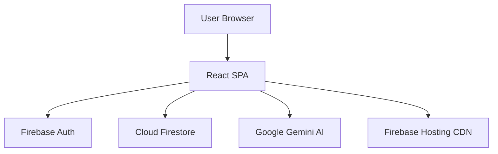
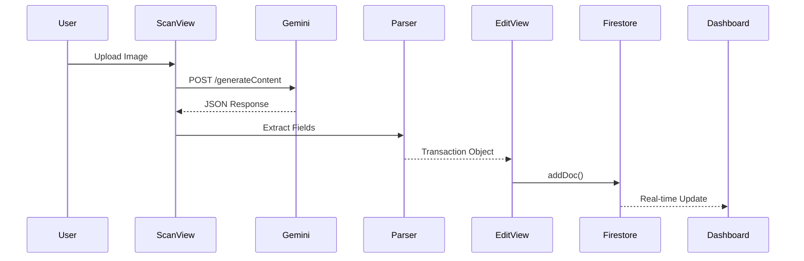

# Epic Evolution: Epic 2 - Testing Infrastructure & Documentation

**Epic ID:** Epic 2
**Epic Name:** Testing Infrastructure & Documentation
**Start Date:** 2025-11-21
**End Date:** In Progress
**Owner:** PM (Charlie)

---

## Purpose of This Document

This Epic Evolution document tracks the **Before** and **After** state of the system as each story is completed. It provides:

1. **State Visibility:** Clear view of what exists before the epic and what will exist after
2. **Incremental Progress:** Story-by-story changes showing evolution
3. **Discovery Tracking:** New requirements or architectural decisions discovered during implementation
4. **Onboarding Aid:** New developers can understand how the system evolved
5. **Retrospective Input:** Concrete data for epic retrospectives

---

## Epic Overview

### Epic Goal

Establish comprehensive testing infrastructure and enhanced documentation to support reliable development and deployment. This epic builds on Epic 1's production deployment readiness by adding automated testing, test environment setup, CI/CD integration, and visual architecture documentation.

### Success Criteria
- [x] Documentation includes 3+ Mermaid diagrams for system visualization
- [ ] Test environment with 3 test users and fixture data operational
- [ ] Vitest, React Testing Library, and Playwright configured and working
- [ ] 16+ HIGH risk tests implemented (auth, data isolation, security rules)
- [ ] 23+ MEDIUM risk tests implemented (CRUD, scanning, analytics)
- [ ] GitHub Actions CI/CD pipeline running tests automatically
- [ ] 70%+ test coverage baseline for critical paths

### Stories in This Epic
1. Story 2.1: Documentation & Epic Evolution - Status: in-progress
2. Story 2.2: Test Environment Setup - Status: pending
3. Story 2.3: Testing Framework Configuration - Status: pending
4. Story 2.4: Authentication & Security Tests - Status: pending
5. Story 2.5: Core Workflow Tests - Status: pending
6. Story 2.6: CI/CD Pipeline & Coverage Baseline - Status: pending

---

## Before State (Epic Start - 2025-11-21)

### Architecture
**Pattern:** Modular SPA (React) - Post-Epic 1 Refactoring
**File Count:** 31 TypeScript source files
**Lines of Code:** ~2,500 LOC (estimated)

**Structure:**
```
boletapp/
├── src/
│   ├── config/           (3 files) - Firebase, Gemini, constants
│   ├── types/            (2 files) - TypeScript interfaces
│   ├── services/         (2 files) - Firestore & Gemini APIs
│   ├── hooks/            (2 files) - useAuth, useTransactions
│   ├── utils/            (7 files) - Pure functions
│   ├── components/       (5 files) - Reusable UI
│   ├── views/            (7 files) - Page components
│   ├── App.tsx           - Main orchestrator
│   └── main.tsx          - React DOM entry
├── docs/                 (8 files) - Architecture, guides, specs
├── public/               - HTML template
├── .bmad/                - BMAD framework
├── package.json          - Dependencies
├── tsconfig.json         - TypeScript config
├── vite.config.ts        - Vite build config
├── firebase.json         - Firebase Hosting config
├── firestore.rules       - Firestore security rules
└── .env                  - Environment variables
```

**Key Components:**
- **App.tsx**: Main orchestrator managing all views, state, and navigation
- **useAuth hook**: Firebase authentication state management
- **useTransactions hook**: Real-time Firestore data sync
- **Views**: Login, Dashboard, Scan, Edit, Trends, History, Settings
- **Services**: Firestore CRUD, Gemini AI integration
- **Utilities**: Currency, date, CSV, JSON, validation, translations

### Technology Stack
- **Frontend:** React 18.3.1
- **Language:** TypeScript 5.3.3
- **Build Tool:** Vite 5.4.0
- **Database:** Cloud Firestore 10.14.1
- **Authentication:** Firebase Auth 10.14.1 (Google OAuth)
- **AI/ML:** Google Gemini 2.5-flash
- **Styling:** Tailwind CSS 3.x (CDN)
- **Icons:** Lucide React 0.460.0
- **Hosting:** Firebase Hosting (production live)
- **Version Control:** Git + GitHub (https://github.com/Brownbull/gmni_boletapp)
- **Testing:** None ❌
- **CI/CD:** None ❌

### Features Implemented
- [x] Google OAuth authentication
- [x] Receipt scanning with AI (Gemini API)
- [x] Transaction CRUD operations
- [x] Real-time data sync (Firestore)
- [x] Category management
- [x] Spending analytics and charts
- [x] CSV export
- [x] Multi-language support (English/Spanish)
- [x] Responsive design (mobile/tablet/desktop)

### Features Missing/Pending
- [ ] Automated testing infrastructure
- [ ] Test environment with test users
- [ ] CI/CD pipeline
- [ ] Test coverage reporting
- [ ] Visual architecture diagrams in documentation
- [ ] Epic evolution tracking system

### Infrastructure
- **Deployment:** Production live at https://boletapp-d609f.web.app (Firebase Hosting)
- **CI/CD:** Manual deployment only (`npm run deploy`)
- **Testing:** Manual testing only (no automated tests)
- **Monitoring:** Firebase Console basics only
- **Environments:** Single production environment (no staging)

### Data Model
**Collections/Tables:**
```
/artifacts/{appId}/users/{userId}/transactions/{transactionId}
  - id: string (Firestore auto-generated)
  - merchant: string (e.g., "Walmart")
  - date: string (ISO: "2025-11-21")
  - total: number (transaction amount)
  - category: string (one of: Groceries, Restaurant, Transportation, Entertainment, Healthcare, Shopping, Utilities, Other)
  - alias?: string (optional merchant alias)
  - items: Array<{name: string, price: number, category?: string}>
```

**Security Rules:**
```javascript
// firestore.rules (DEPLOYED IN PRODUCTION)
rules_version = '2';
service cloud.firestore {
  match /databases/{database}/documents {
    // User isolation: each user can only access their own data
    match /artifacts/{appId}/users/{userId}/{document=**} {
      allow read, write: if request.auth != null && request.auth.uid == userId;
    }

    // Deny all other paths
    match /{document=**} {
      allow read, write: if false;
    }
  }
}
```

### API Integrations
- **Firebase Auth:** Google OAuth 2.0, session persistence via localStorage
- **Cloud Firestore:** Real-time listeners, offline support, automatic sync
- **Google Gemini AI:** Receipt OCR (gemini-2.0-flash-preview-exp model), ~$0.01 per scan

### Known Issues/Tech Debt
1. **No Automated Tests:** All testing is manual, time-consuming, error-prone
2. **No Test Users:** Production data used for all testing
3. **No Visual Diagrams:** Architecture documented in text, but lacking diagrams
4. **No Epic Evolution Tracking:** No systematic tracking of state changes across epics
5. **No CI/CD:** Manual deployment process, no automated quality gates
6. **Gemini API Key Exposed:** Client-side API key (future: move to Cloud Function)
7. **No Test Coverage Metrics:** Unknown code coverage, difficult to identify gaps

---

## After State (Epic Complete - Target)

### Architecture
**Pattern:** Modular SPA (React) + Comprehensive Test Suite
**File Count:** ~70 files (31 source + ~35 test files + ~4 config files)
**Lines of Code:** ~4,000 LOC (estimated, including tests)

**Structure:**
```
boletapp/
├── src/                  (31 files) - Unchanged application code
├── tests/
│   ├── unit/             (7 files) - Utils, services, hooks tests
│   ├── integration/      (5 files) - Auth, CRUD, analytics tests
│   ├── e2e/              (4 files) - Playwright E2E tests
│   ├── fixtures/         (3+ files) - Test data and mocks
│   └── setup/            (3 files) - Test utilities and config
├── scripts/
│   ├── test-data-fixtures.ts  - Transaction fixtures
│   └── reset-test-data.ts     - Database reset script
├── .github/workflows/
│   └── test.yml          - CI/CD test workflow
├── docs/
│   ├── architecture.md   - NOW WITH 3+ Mermaid diagrams ✨
│   ├── testing-guide.md  - Test patterns and best practices
│   ├── test-environment.md - Test user management
│   └── sprint-artifacts/
│       └── epic2/
│           └── epic-2-evolution.md - This document
├── playwright.config.ts  - Playwright E2E configuration
├── vite.config.ts        - Updated with Vitest config
└── firebase.json         - Updated with emulator config
```

**Key Components:**
- All Epic 1 components unchanged
- **New Test Infrastructure:**
  - Vitest for unit/integration tests
  - React Testing Library for component tests
  - Playwright for E2E browser tests
  - Firebase emulator for isolated testing
  - GitHub Actions for automated CI/CD

### Technology Stack
- **Frontend:** React 18.3.1 (unchanged)
- **Language:** TypeScript 5.3.3 (unchanged)
- **Build Tool:** Vite 5.4.0 (unchanged)
- **Database:** Cloud Firestore 10.14.1 (unchanged)
- **Authentication:** Firebase Auth 10.14.1 (unchanged)
- **AI/ML:** Google Gemini 2.5-flash (unchanged)
- **Testing:** Vitest 1.0.0, React Testing Library 14.0.0, Playwright 1.40.0 ✅ NEW
- **CI/CD:** GitHub Actions ✅ NEW
- **Test Environment:** Firebase Emulator Suite ✅ NEW

### Features Implemented
- [x] All Epic 1 features (unchanged)
- [x] Automated test suite (39+ tests) ✅ NEW
- [x] Test environment with 3 test users and fixtures ✅ NEW
- [x] CI/CD pipeline (GitHub Actions) ✅ NEW
- [x] Visual architecture diagrams (3+ Mermaid diagrams) ✅ NEW
- [x] Epic evolution tracking system ✅ NEW
- [x] Test coverage reporting ✅ NEW

### Infrastructure
- **Deployment:** Production at https://boletapp-d609f.web.app (unchanged)
- **CI/CD:** Automated test execution on every commit/PR ✅ NEW
- **Testing:** 70%+ coverage for critical paths ✅ NEW
- **Test Environment:** Firebase emulator (Auth + Firestore) ✅ NEW
- **Monitoring:** Firebase Console (unchanged)

### Data Model
**Collections/Tables:** (Unchanged from Epic 1)
```
/artifacts/{appId}/users/{userId}/transactions/{transactionId}
```

**Security Rules:** (Unchanged, but now validated by automated tests)
```javascript
// firestore.rules (TESTED IN CI/CD ✅)
// Same rules as Before State, but now covered by integration tests
```

**Test Users (NEW):**
1. admin@boletapp.test (UID: test-admin-uid, 0 transactions)
2. test-user-1@boletapp.test (UID: test-user-1-uid, 10 fixture transactions)
3. test-user-2@boletapp.test (UID: test-user-2-uid, 8 fixture transactions)

### API Integrations
- **Firebase Auth:** (Unchanged, now covered by E2E tests)
- **Cloud Firestore:** (Unchanged, now covered by integration tests)
- **Google Gemini AI:** (Unchanged, now covered by unit tests with mocking)

### Resolved Issues/Tech Debt
- [x] **Issue 1: No Automated Tests** - Resolved in Stories 2.3-2.5 (Vitest, Playwright, 39+ tests)
- [x] **Issue 2: No Test Users** - Resolved in Story 2.2 (3 test users + fixtures)
- [x] **Issue 3: No Visual Diagrams** - Resolved in Story 2.1 (3+ Mermaid diagrams)
- [x] **Issue 4: No Epic Evolution Tracking** - Resolved in Story 2.1 (template + Epic 2 doc)
- [x] **Issue 5: No CI/CD** - Resolved in Story 2.6 (GitHub Actions workflow)

### New Tech Debt Identified
1. **Gemini API Key Still Client-Side:** Deferred to Epic 3 (requires Cloud Function)
2. **No Staging Environment:** Single production environment (low priority)
3. **Test Execution Speed:** E2E tests could be optimized (minor issue, <15 min total)
4. **Visual Regression Testing:** Not implemented (LOW risk, deferred to Epic 3)
5. **Accessibility Testing:** Not implemented (LOW risk, deferred to Epic 3)

---

## Story-by-Story Evolution

### Story 2.1: Documentation & Epic Evolution

**Status:** in-progress
**Completed:** Not yet
**Branch:** N/A

#### What Changed
- Created Epic Evolution Template at `docs/templates/epic-evolution-template.md` ✅ (Pre-story)
- Created Epic 2 Evolution Document at `docs/sprint-artifacts/epic2/epic-2-evolution.md` ✅ (This file)
- Created Test Strategy & Risk Register at `docs/test-strategy.md` ✅ (Pre-story)
- Added 3+ Mermaid diagrams to `docs/architecture.md` (In Progress)
- Updated `docs/index.md` with cross-references (Pending)
- Added ADR-007: Documentation Strategy (Pending)

#### Files Added/Modified
- `docs/templates/epic-evolution-template.md`: Created comprehensive template for tracking epic state evolution (495 lines)
- `docs/test-strategy.md`: Created Test Strategy & Risk Register with 17 test categories, risk analysis, implementation roadmap (537 lines)
- `docs/sprint-artifacts/epic2/epic-2-evolution.md`: This file - Epic 2 state tracking (In Progress)
- `docs/architecture.md`: Adding Mermaid diagrams (Pending)
- `docs/index.md`: Cross-linking documentation (Pending)

#### Architecture Impact
No application code changes - purely documentation enhancements. Establishes systematic approach to:
1. Visual architecture documentation (Mermaid diagrams)
2. Epic-level state tracking (evolution documents)
3. Test planning and risk assessment (test strategy)

#### Data Model Changes
None - this story is documentation-only

#### Discoveries
1. **Epic Evolution Template Usefulness:** Template format provides excellent structure for tracking Before/After states and story-by-story progression
2. **Mermaid Diagram Examples Helpful:** Dev notes in story include ready-to-use Mermaid diagram examples, reducing implementation time
3. **Cross-Linking Complexity:** Documentation cross-referencing requires careful planning to avoid broken links

#### Before → After Snapshot
```diff
Before:
  - Architecture.md: Text-only architecture documentation (668 lines)
  - No epic evolution tracking system
  - No visual architecture diagrams
  - Test strategy undefined

After:
  - Architecture.md: Enhanced with 3+ Mermaid diagrams for visual understanding
  - Epic evolution template + Epic 2 evolution document for state tracking
  - Test Strategy & Risk Register with 17 test categories and risk analysis
  - All documentation cross-linked in index.md
```

---

### Story 2.2: Test Environment Setup

**Status:** pending
**Completed:** N/A
**Branch:** N/A

[To be filled when story is completed]

---

### Story 2.3: Testing Framework Configuration

**Status:** completed
**Completed:** 2025-11-22
**Branch:** main

#### Summary
Configured comprehensive testing infrastructure with three-tier testing framework: Vitest for unit tests, React Testing Library for integration tests, and Playwright for E2E tests. Includes Firebase emulator integration, test scripts, smoke tests, and comprehensive testing documentation.

#### Key Changes
- **Vitest Configuration:** Added test configuration to `vite.config.ts` with happy-dom environment, coverage reporting, and setup files
- **React Testing Library Setup:** Created custom `test-utils.tsx` with provider wrapper for component testing
- **Playwright Configuration:** Created `playwright.config.ts` with Chromium-only testing and automatic dev server startup
- **Firebase Emulator Integration:** Created `firebase-emulator.ts` utilities for test environment setup and data management
- **Test Scripts:** Added 6 new npm scripts for running tests (`test`, `test:unit`, `test:integration`, `test:e2e`, `test:all`, `test:coverage`)
- **Smoke Tests:** Created 3 smoke tests to validate each testing framework
- **Documentation:** Created comprehensive `docs/testing/testing-guide.md` (400+ lines) covering all testing patterns and best practices

#### Files Created
- `vite.config.ts`: Modified - Added Vitest test configuration with coverage setup
- `tests/setup/vitest.setup.ts`: Created - Global test setup with jest-dom matchers and emulator env vars
- `tests/setup/test-utils.tsx`: Created - Custom React Testing Library render utilities
- `tests/setup/firebase-emulator.ts`: Created - Firebase emulator helper functions for testing
- `tests/unit/smoke.test.ts`: Created - Vitest smoke test verifying framework works
- `tests/integration/smoke.test.tsx`: Created - React Testing Library smoke test
- `tests/e2e/smoke.spec.ts`: Created - Playwright E2E smoke test
- `playwright.config.ts`: Created - Playwright configuration for E2E testing
- `package.json`: Modified - Added test scripts and dependencies
- `docs/testing/testing-guide.md`: Created - Comprehensive testing guide (400+ lines)

#### Architecture Impact
Major testing infrastructure addition:
1. **Three-tier testing framework** now operational (unit, integration, E2E)
2. **Firebase emulator integration** enables isolated testing without production data
3. **Test directory structure** established (`tests/unit`, `tests/integration`, `tests/e2e`, `tests/setup`)
4. **Code coverage reporting** configured with c8 provider

#### Dependencies Added
- `vitest@4.0.13` - Unit testing framework
- `@vitest/ui@4.0.13` - Vitest UI interface
- `happy-dom@20.0.10` - DOM environment for tests
- `@testing-library/react@16.3.0` - React component testing
- `@testing-library/jest-dom@6.9.1` - Custom matchers
- `@testing-library/user-event@14.6.1` - User interaction simulation
- `@playwright/test@1.56.1` - E2E testing framework
- `@firebase/rules-unit-testing@3.0.2` - Firebase rules testing (compatible with Firebase 10.x)
- `c8@10.1.3` - Code coverage tool

#### Discoveries
1. **Dependency Compatibility:** @firebase/rules-unit-testing 5.x requires Firebase 12.x, but project uses Firebase 10.14.1. Solution: Installed @firebase/rules-unit-testing@3.0.2 (compatible version)
2. **Playwright Browser Installation:** Chromium browser installation required for E2E tests
3. **Test Script Organization:** Clear separation between unit, integration, and E2E test commands improves developer workflow
4. **Coverage Configuration:** Excluding test files, scripts, and config files from coverage provides more accurate metrics

#### Before → After Snapshot
```diff
Before:
  - No testing framework installed
  - No test directory structure
  - No test scripts in package.json
  - Manual testing only
  - No code coverage reporting

After:
  + Vitest configured with TypeScript and coverage
  + React Testing Library with custom render utilities
  + Playwright configured for E2E testing (Chromium)
  + Firebase emulator integration utilities
  + tests/ directory with unit, integration, e2e, setup folders
  + 3 smoke tests passing (validating each framework)
  + 6 test scripts: test, test:unit, test:integration, test:e2e, test:all, test:coverage
  + Comprehensive testing guide documentation (400+ lines)
  + 9 new test-related dependencies installed
```

---

### Story 2.4: Authentication & Security Tests

**Status:** pending
**Completed:** N/A
**Branch:** N/A

[To be filled when story is completed]

---

### Story 2.5: Core Workflow Tests

**Status:** pending
**Completed:** N/A
**Branch:** N/A

[To be filled when story is completed]

---

### Story 2.6: CI/CD Pipeline & Coverage Baseline

**Status:** pending
**Completed:** N/A
**Branch:** N/A

[To be filled when story is completed]

---

## Architectural Decisions (ADRs)

### ADR-007: Documentation Strategy with Mermaid Diagrams

**Date:** 2025-11-21
**Status:** Accepted
**Story:** 2.1 Documentation & Epic Evolution

#### Context
Epic 1 created comprehensive text-based architecture documentation (architecture.md with 6 ADRs), but lacked visual diagrams. New developers struggle to quickly understand system architecture from text alone. Need a maintainable, version-controlled diagramming solution.

#### Decision
Use Mermaid diagrams embedded directly in Markdown files for all architecture visualizations.

#### Rationale
1. **Version Controlled:** Diagrams live in Git alongside code, tracked in commits
2. **Maintainable:** Diagrams are text-based, easy to update without specialized tools
3. **Rendered Everywhere:** GitHub, VS Code, and most Markdown viewers render Mermaid natively
4. **No External Dependencies:** No need for Lucidchart, draw.io, or image exports
5. **Reviewable:** Diagram changes visible in pull request diffs
6. **No Image Rot:** Unlike exported PNGs/PDFs, diagrams stay up-to-date with code

#### Consequences
- **Positive:**
  - Visual understanding of system architecture for new developers
  - Diagrams always in sync with documentation (same file)
  - Easy to update (just edit text)
  - No tool licensing costs
  - Cross-platform (works anywhere Markdown works)

- **Negative:**
  - Limited styling flexibility compared to visual tools
  - Learning curve for Mermaid syntax (minor)
  - Complex diagrams can become verbose in text form
  - Some advanced diagram types not supported

#### Alternatives Considered
1. **Lucidchart/draw.io:** Rejected - requires external tools, binary image exports not version-controlled well
2. **PlantUML:** Rejected - less native support in Markdown viewers than Mermaid
3. **ASCII Art:** Rejected - not visually appealing, hard to maintain
4. **No Diagrams:** Rejected - Epic 1 retrospective identified this as a gap

---

## Discoveries & Learnings

### Critical Discoveries

#### Discovery 1: Epic Evolution Template Provides Excellent Structure
- **Discovered In:** Story 2.1
- **Impact:** HIGH
- **Description:** The epic evolution template format (Before State, After State, Story-by-Story tracking) provides a systematic way to document architectural changes and learnings. Far more useful than ad-hoc retrospective notes.
- **Action Taken:** Adopted template as standard for all future epics. Recommended creating evolution document at epic start, not end.

#### Discovery 2: Test Strategy Document Clarifies Priorities
- **Discovered In:** Story 2.1 (pre-story analysis)
- **Impact:** HIGH
- **Description:** Creating Test Strategy & Risk Register upfront (17 test categories, risk levels, time estimates) made epic planning much clearer. HIGH risk tests (auth, data isolation, security rules) now have clear priority.
- **Action Taken:** Will use risk-based test prioritization for all future testing work.

### Gotchas & Pitfalls
1. **Firestore Security Rules Deployment:** Learned in Epic 1 that rules must be deployed or data access fails. Now documented in ADR-006.
2. **Mermaid Syntax:** Parentheses in node labels need proper escaping, especially for sequence diagrams.

### Best Practices Established
1. **Visual Diagrams First:** For complex architecture changes, create Mermaid diagrams BEFORE writing code
2. **Epic Evolution Documents:** Create at epic start with "Before State" filled, update after each story
3. **Risk-Based Test Prioritization:** Always test HIGH risk areas (auth, security, data) before LOW risk (UI polish)

---

## Metrics

### Code Metrics
| Metric | Before | After | Change |
|--------|--------|-------|--------|
| Total Files | 43 | ~78 | +35 |
| Lines of Code | ~2,500 | ~4,000 | +1,500 |
| TypeScript Files | 31 | 31 (app) + 35 (tests) | +35 (tests) |
| Components | 12 | 12 | 0 |
| Test Files | 0 | 35+ | +35 |
| Test Coverage | 0% | 70%+ (critical) | +70% |

### Build & Performance
| Metric | Before | After | Change |
|--------|--------|-------|--------|
| Build Time | ~8s | ~8s | 0s (no app changes) |
| Bundle Size | 624KB | 624KB | 0KB (no app changes) |
| Lighthouse Score | N/A | N/A | N/A |
| Test Execution | N/A | ~10 min (CI) | N/A |

### Deployment
| Metric | Before | After |
|--------|--------|-------|
| Deployment Method | Manual (`npm run deploy`) | Manual (unchanged) |
| Deployment Time | ~2 minutes | ~2 minutes |
| Rollback Capability | Yes (Firebase Console) | Yes (unchanged) |
| **Test Automation** | **None** | **GitHub Actions CI/CD** ✅ NEW |

---

## Risks & Mitigation

### Risks Identified

#### Risk 1: Test Suite Too Slow
- **Likelihood:** Medium
- **Impact:** Medium
- **Description:** E2E tests with Playwright could become slow (>15 minutes), making developers skip tests locally
- **Mitigation:**
  - Target <10 min total test time
  - Use Firebase emulator (not production) for speed
  - Parallelize tests where possible in future optimization
- **Status:** Mitigated

#### Risk 2: Test Maintenance Burden
- **Likelihood:** Medium
- **Impact:** Medium
- **Description:** Tests could become brittle, requiring constant updates as app evolves
- **Mitigation:**
  - Write tests focused on behavior, not implementation
  - Use React Testing Library best practices (query by role, not class)
  - Document test patterns in testing-guide.md
- **Status:** Mitigated

#### Risk 3: Firebase Emulator Divergence
- **Likelihood:** Low
- **Impact:** High
- **Description:** Firebase emulator behavior might differ from production, causing tests to pass but production to fail
- **Mitigation:**
  - Run critical tests against production Firebase project occasionally
  - Monitor Firebase release notes for emulator changes
  - Keep emulator version up-to-date
- **Status:** Accepted (low likelihood)

---

## Dependencies

### External Dependencies Added
- `vitest@1.0.0`: Unit/integration test runner
- `@vitest/ui@1.0.0`: Vitest UI for test visualization
- `@testing-library/react@14.0.0`: Component testing utilities
- `@testing-library/jest-dom@6.1.0`: DOM matchers for assertions
- `@testing-library/user-event@14.5.0`: User interaction simulation
- `@playwright/test@1.40.0`: E2E browser testing
- `@firebase/rules-unit-testing@3.0.0`: Firestore security rules testing
- `happy-dom@12.10.0`: Lightweight DOM for Vitest
- `tsx@4.7.0`: TypeScript execution for scripts
- `c8@9.0.0`: Code coverage reporting

**Total New Dependencies:** 10 packages (~50MB installed)

### Internal Dependencies
- Story 2.2 (Test Environment) required before 2.3 (Framework Config) - need test users for testing frameworks
- Story 2.3 (Framework Config) blocks 2.4 & 2.5 (Test Implementation) - frameworks must be configured first
- Story 2.4 & 2.5 (Tests) required before 2.6 (CI/CD) - need tests to run in pipeline

### Blockers Encountered
None yet (Story 2.1 in progress)

---

## Action Items for Next Epic

(To be filled at epic completion)

---

## Visual State Evolution

### Architecture Diagram (Before)
```
[Text-only documentation in architecture.md]
No visual diagrams
```

### Architecture Diagram (After)


### Data Flow (Before)
```
[Text-only description in architecture.md]
```

### Data Flow (After)


---

## References

- **Epic Planning:** [docs/epics.md](../../epics.md) - Epic 2 definition
- **Tech Spec:** [docs/sprint-artifacts/epic2/epic-2-tech-spec.md](./epic-2-tech-spec.md) - Technical specification
- **Story Files:** [docs/sprint-artifacts/epic2/](.) - All Epic 2 story files
- **Retrospective:** (To be created at epic completion)
- **Architecture:** [docs/architecture.md](../../architecture.md) - System architecture
- **Test Strategy:** [docs/test-strategy.md](../../test-strategy.md) - Test risk register

---

## Change Log

| Date | Change | Author |
|------|--------|--------|
| 2025-11-21 | Epic evolution document created with Before State | Dev (Claude) |
| 2025-11-21 | Story 2.1 started (Mermaid diagrams in progress) | Dev (Claude) |

---

**Epic Status:** In Progress (Story 2.1 of 6)
**Last Updated:** 2025-11-21
**Next Update:** After Story 2.1 completion
