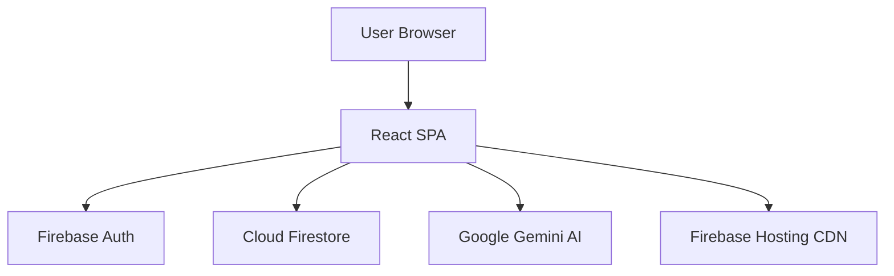
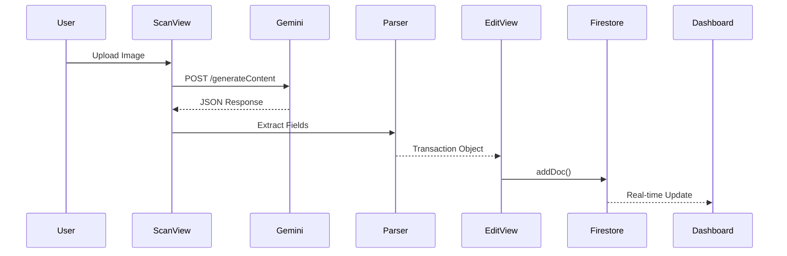
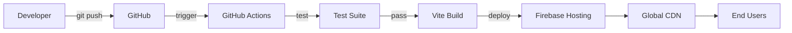

# boletapp - Epic 2 Technical Specification

**Author:** Winston (Architect) + Murat (TEA) + Charlie (Senior Dev)
**Date:** 2025-11-21
**Epic:** Epic 2 - Testing Infrastructure & Documentation
**Project Level:** Quick Flow
**Change Type:** Infrastructure Setup + Testing + Documentation
**Development Context:** Brownfield (post-Epic 1 modular architecture)

---

## Context

### Epic 1 Outcomes

**Completed (2025-11-20 to 2025-11-21):**
- ✅ Modular architecture (31 TypeScript files across 7 logical layers)
- ✅ Vite build pipeline with TypeScript
- ✅ Git version control on GitHub
- ✅ Firebase Hosting production deployment
- ✅ Production URL: https://boletapp-d609f.web.app
- ✅ Firestore security rules implemented
- ✅ Zero feature regressions

**Current State:**
- **Architecture:** Modular SPA with src/config, types, services, hooks, utils, components, views
- **Testing:** None (manual testing only during Epic 1)
- **Documentation:** 8 docs files, 6 ADRs, but lacking visual diagrams and epic evolution tracking
- **CI/CD:** None (manual deployment via `npm run deploy`)

### Available Documents

**Epic 1 Documentation:**
- [Project Overview](./project-overview.md) - Executive summary, tech stack, features
- [Architecture Document](./architecture.md) - Modular SPA architecture, 6 ADRs
- [Development Guide](./development-guide.md) - Setup instructions, development workflow
- [Component Inventory](./component-inventory.md) - React component catalog
- [Data Models](./data-models.md) - Firestore schema
- [API Contracts](./api-contracts.md) - Firebase Auth, Firestore, Gemini AI integration
- [Deployment Guide](./deployment-guide.md) - Firebase Hosting deployment
- [Source Tree Analysis](./source-tree-analysis.md) - Annotated directory structure

**Epic 1 Retrospective:**
- [Epic 1 Retrospective](./sprint-artifacts/epic-1-retro-2025-11-21.md) - Lessons learned, action items

**Action Items from Epic 1:**
1. ✅ Create Epic Evolution Document Template → COMPLETED
2. ✅ Update Application Documentation → IN PROGRESS (architecture.md + index.md done)
3. ✅ Create Test Strategy & Risk Register → COMPLETED
4. ⏳ Set Up Test Environment → PENDING (Story 2.2)
5. ⏳ Update Architecture with Mermaid Diagrams → PENDING (Story 2.1)

### Project Stack

**Current Implementation (Post-Epic 1):**

| Layer | Technology | Version | Purpose |
|-------|-----------|---------|---------|
| **Frontend** | React | 18.3.1 | UI framework |
| | TypeScript | 5.3.3 | Type-safe JavaScript |
| | Lucide React | 0.460.0 | Icon library |
| **Styling** | Tailwind CSS | 3.x | Utility-first CSS (via CDN) |
| **State Management** | React Hooks | Built-in | useState, useEffect, custom hooks |
| **Authentication** | Firebase Auth | 10.14.1 | Google OAuth 2.0 |
| **Database** | Cloud Firestore | 10.14.1 | NoSQL real-time document store |
| **AI/ML** | Google Gemini | 2.5-flash | Multimodal vision API |
| **Build Tool** | Vite | 5.4.0 | Frontend tooling, HMR, production builds |
| **Deployment** | Firebase Hosting | Latest | Global CDN with HTTPS |
| **Testing** | None | N/A | **TO BE ADDED IN EPIC 2** |
| **CI/CD** | None | N/A | **TO BE ADDED IN EPIC 2** |

**Key Characteristics:**
- **Modular Architecture:** 31 TypeScript files organized into 7 logical layers
- **Production-Ready:** Live at https://boletapp-d609f.web.app
- **Version Controlled:** Git repository at https://github.com/Brownbull/gmni_boletapp
- **Serverless Backend:** Firebase handles all backend operations
- **AI-Powered:** Google Gemini API for receipt OCR

### Existing Codebase Structure

**Current File Structure (Post-Epic 1):**
```
boletapp/
├── src/
│   ├── config/           (3 files) - Firebase, Gemini, constants
│   ├── types/            (2 files) - TypeScript interfaces
│   ├── services/         (2 files) - Firestore & Gemini APIs
│   ├── hooks/            (2 files) - useAuth, useTransactions
│   ├── utils/            (7 files) - Pure functions
│   ├── components/       (5 files) - Reusable UI
│   ├── views/            (7 files) - Page components
│   ├── App.tsx           - Main orchestrator
│   └── main.tsx          - React DOM entry
├── public/
│   └── index.html        - HTML template
├── docs/                 (8 files) - Comprehensive documentation
├── .bmad/                - BMAD framework
├── scripts/              - **TO BE CREATED** (test data, reset scripts)
├── tests/                - **TO BE CREATED** (unit, integration, E2E tests)
├── package.json          - Dependencies and scripts
├── tsconfig.json         - TypeScript configuration
├── vite.config.ts        - Vite build configuration
├── firebase.json         - Firebase Hosting configuration
├── firestore.rules       - Firestore security rules
└── .env                  - Environment variables (git-ignored)
```

---

## The Change

### Problem Statement

Epic 1 successfully delivered a production-ready application, but identified critical gaps:

1. **No Automated Testing** - All testing was manual, time-consuming, and error-prone
2. **No Test Infrastructure** - No test users, no fixture data, no reset scripts
3. **Late Discovery Issues** - Firestore security rules gap discovered in Story 1.5 (should have been caught by tests)
4. **Documentation Gaps** - Excellent story-level docs, but lacking visual diagrams and epic-level state tracking
5. **No CI/CD** - Manual deployment, no automated quality gates
6. **No Test Strategy** - No prioritization of which tests to implement first

**Risks of Inaction:**
- **Regression Bugs:** New features could break existing functionality without detection
- **Security Vulnerabilities:** Auth/data isolation bugs could expose user data
- **Deployment Fear:** Developers hesitant to deploy without confidence in code quality
- **Knowledge Transfer:** New developers struggle to understand system architecture
- **Technical Debt:** Testing becomes "we'll add it later" (and never do)

### Proposed Solution

Establish comprehensive testing infrastructure and documentation in Epic 2:

1. **Documentation & Visual Diagrams:** Update architecture.md with Mermaid diagrams showing system overview, data flow, and deployment architecture
2. **Epic Evolution Tracking:** Create template and Epic 2 evolution document for tracking state changes story-by-story
3. **Test Environment:** Create 3 Firebase Auth test users with repeatable fixture data and reset scripts
4. **Testing Frameworks:** Configure Vitest (unit), React Testing Library (integration), and Playwright (E2E)
5. **HIGH Risk Tests First:** Implement authentication, data isolation, security rules, data persistence, and receipt scanning tests
6. **CI/CD Pipeline:** Set up GitHub Actions to run tests on every commit
7. **Test Coverage Baseline:** Establish 70%+ coverage for critical paths

**Phased Approach:**
- **Phase 1 (Stories 2.1-2.2):** Documentation + Test Environment
- **Phase 2 (Story 2.3):** Testing Frameworks
- **Phase 3 (Stories 2.4-2.5):** Test Implementation (HIGH risk first)
- **Phase 4 (Story 2.6):** CI/CD Integration

### Scope

**In Scope:**

- Automated testing framework setup (Vitest + React Testing Library + Playwright)
- Firebase emulator configuration (Auth + Firestore)
- Test users (3) and transaction fixtures (18 total)
- Database reset script (`npm run test:reset-data`)
- Unit tests for HIGH risk areas (authentication, data isolation, security rules)
- Integration tests for core workflows (transaction CRUD, receipt scanning)
- E2E tests for critical user paths
- Test coverage baseline (target: 70%+ for critical paths)
- Architecture documentation with 3+ Mermaid diagrams
- Epic evolution template and Epic 2 evolution document
- Test Strategy & Risk Register (already created)
- GitHub Actions CI/CD pipeline
- Testing documentation (`docs/testing-guide.md`, `docs/test-environment.md`)

**Out of Scope:**

- LOW risk tests (responsive design, chart rendering, navigation) - deferred to Epic 3
- Performance/load testing - deferred to Epic 3
- Accessibility testing (WCAG compliance) - deferred to Epic 3
- Visual regression testing - deferred to Epic 3
- Production monitoring/alerting beyond Firebase Console basics
- Multi-environment setup (staging/production Firebase projects)
- Advanced CI/CD features (automated rollbacks, blue-green deployments)
- Code coverage enforcement (will establish baseline, not enforce gates yet)
- Test parallelization optimization

---

## Implementation Details

### Source Tree Changes

**New Directories:**
```
boletapp/
├── scripts/
│   ├── test-data-fixtures.ts      # CREATE - Transaction fixtures for test users
│   └── reset-test-data.ts         # CREATE - Database reset script
├── tests/
│   ├── unit/
│   │   ├── utils/
│   │   │   ├── currency.test.ts   # CREATE - Currency formatting tests
│   │   │   ├── date.test.ts       # CREATE - Date utilities tests
│   │   │   └── validation.test.ts # CREATE - Validation tests
│   │   ├── services/
│   │   │   ├── gemini.test.ts     # CREATE - Gemini API tests (mocked)
│   │   │   └── firestore.test.ts  # CREATE - Firestore CRUD tests
│   │   └── hooks/
│   │       ├── useAuth.test.ts    # CREATE - Auth hook tests
│   │       └── useTransactions.test.ts # CREATE - Transactions hook tests
│   ├── integration/
│   │   ├── auth-flow.test.tsx     # CREATE - Authentication flow tests
│   │   ├── data-isolation.test.ts # CREATE - Tenant isolation tests
│   │   ├── firestore-rules.test.ts # CREATE - Security rules tests
│   │   ├── crud-operations.test.tsx # CREATE - Transaction CRUD tests
│   │   └── analytics.test.tsx     # CREATE - Analytics calculations tests
│   ├── e2e/
│   │   ├── login.spec.ts          # CREATE - E2E login/logout tests
│   │   ├── receipt-scanning.spec.ts # CREATE - E2E scanning workflow
│   │   ├── transaction-management.spec.ts # CREATE - E2E CRUD workflow
│   │   └── analytics.spec.ts      # CREATE - E2E analytics workflow
│   ├── fixtures/
│   │   ├── transactions.json      # CREATE - Sample transaction data
│   │   ├── receipt-images/        # CREATE - Test receipt images
│   │   └── gemini-responses.json  # CREATE - Mocked Gemini responses
│   └── setup/
│       ├── test-utils.tsx         # CREATE - Custom React Testing Library utilities
│       ├── firebase-emulator.ts   # CREATE - Emulator setup
│       └── vitest.setup.ts        # CREATE - Vitest global setup
├── .github/
│   └── workflows/
│       └── test.yml               # CREATE - CI/CD workflow
├── docs/
│   ├── testing-guide.md           # CREATE - Testing patterns and best practices
│   ├── test-environment.md        # CREATE - Test user management guide
│   └── sprint-artifacts/
│       └── epic-2-evolution.md    # CREATE - Epic 2 state tracking
```

**Modified Files:**
```
boletapp/
├── package.json                   # MODIFY - Add test dependencies and scripts
├── tsconfig.json                  # MODIFY - Add test paths
├── vite.config.ts                 # MODIFY - Add Vitest configuration
├── firebase.json                  # MODIFY - Add emulator configuration
├── docs/
│   ├── architecture.md            # MODIFY - Add Mermaid diagrams
│   └── index.md                   # MODIFY - Reference new test docs
└── README.md                      # MODIFY - Add testing section
```

**Files to Create:** ~35 new files
**Files to Modify:** ~6 existing files

### Technical Approach

**1. Testing Framework Stack**

**Vitest for Unit Tests:**
- **Why:** Fast, native ESM support, Vite integration, modern API
- **Usage:** Pure functions (utils), services (mocked), hooks (with React Testing Library)
- **Configuration:** `vite.config.ts` with Vitest plugin
- **Advantages:** Same config as build tool, instant HMR for tests

**React Testing Library for Component/Integration Tests:**
- **Why:** Tests components as users interact with them, accessibility-focused
- **Usage:** View components, form validation, user interactions
- **Configuration:** Custom `render()` utility with providers (Auth, Firestore)
- **Advantages:** Encourages best practices, no implementation details

**Playwright for E2E Tests:**
- **Why:** Cross-browser support, reliable, great DX, automatic waiting
- **Usage:** Critical user workflows (login, scanning, CRUD, analytics)
- **Configuration:** `playwright.config.ts` targeting localhost:5173 and Firebase emulator
- **Advantages:** Reliable selectors, built-in test retry, screenshots on failure

**@firebase/rules-unit-testing for Security Rules:**
- **Why:** Official Firebase emulator testing library
- **Usage:** Validate Firestore security rules
- **Configuration:** Firebase emulator suite
- **Advantages:** Isolated test environment, no production data risk

**2. Test Environment Strategy**

**Firebase Emulator Suite:**
```bash
firebase emulators:start --only auth,firestore
```
- **Auth Emulator:** Port 9099 - Test authentication without real accounts
- **Firestore Emulator:** Port 8080 - Test database operations without cloud access
- **Emulator UI:** Port 4000 - Visual debugging
- **Advantages:** Fast, offline, no quota limits, perfect isolation

**Test Users (3):**
1. **admin@boletapp.test**
   - UID: `test-admin-uid`
   - Role: Admin (future use)
   - Transactions: 0

2. **test-user-1@boletapp.test**
   - UID: `test-user-1-uid`
   - Role: Standard User
   - Transactions: 10 (fixture data)

3. **test-user-2@boletapp.test**
   - UID: `test-user-2-uid`
   - Role: Standard User
   - Transactions: 8 (fixture data)

**Reset Script Pattern:**
```typescript
// scripts/reset-test-data.ts
import { fixtures } from './test-data-fixtures';
import { db } from '../src/config/firebase';

async function resetTestData() {
  // 1. Clear all test user transactions
  // 2. Recreate from fixtures
  // 3. Verify data integrity
  // 4. Idempotent (can run multiple times)
}
```

**3. Test Prioritization (Murat's Risk Register)**

**Implementation Order (HIGH → MEDIUM → LOW):**

**Phase 1 - HIGH Risk Tests (Story 2.4):**
1. Authentication Flow (5 tests) - Login, logout, session persistence
2. Data Isolation (3 tests) - User 1 cannot access User 2 data
3. Firestore Security Rules (5 tests) - Rules enforce user isolation
4. Data Persistence (3 tests) - Transactions persist across sessions

**Phase 2 - MEDIUM/HIGH Risk Tests (Story 2.5):**
5. Receipt Scanning (6 tests) - Image upload, Gemini API, data extraction
6. Transaction CRUD (8 tests) - Create, read, update, delete
7. Trend Analytics (5 tests) - Monthly totals, category breakdown
8. Form Validation (4 tests) - Required fields, numeric validation

**Phase 3 - LOW Risk Tests (Deferred to Epic 3):**
9. Responsive Design (4 tests)
10. Chart Rendering (4 tests)
11. Navigation Flow (3 tests)
12. Loading States (3 tests)

**4. CI/CD Pipeline Design**

**GitHub Actions Workflow (.github/workflows/test.yml):**
```yaml
name: Test Suite
on: [push, pull_request]
jobs:
  test:
    runs-on: ubuntu-latest
    steps:
      - Checkout code
      - Setup Node.js 18
      - Install dependencies (with cache)
      - Start Firebase emulators (background)
      - Run unit tests (Vitest)
      - Run integration tests (Vitest + RTL)
      - Run E2E tests (Playwright)
      - Upload coverage reports
      - Require all tests passing to merge
```

**Execution Time Target:** < 10 minutes total
- Unit tests: ~2 minutes
- Integration tests: ~3 minutes
- E2E tests: ~4 minutes
- Setup/teardown: ~1 minute

**5. Test Data Management**

**Fixtures Structure:**
```typescript
// scripts/test-data-fixtures.ts
export const fixtures = {
  'test-user-1-uid': [
    { date: '2024-11-01', category: 'Groceries', total: 87.43, /* ... */ },
    // ... 9 more transactions
  ],
  'test-user-2-uid': [
    { date: '2024-11-02', category: 'Dining', total: 95.00, /* ... */ },
    // ... 7 more transactions
  ]
};
```

**Reset Script Guarantees:**
- Idempotent: Can run multiple times safely
- Isolated: Only touches test user data
- Validated: Checks data integrity after reset
- Fast: Completes in < 5 seconds

**6. Documentation Updates**

**Mermaid Diagrams to Add (architecture.md):**

1. **System Overview:**


2. **Data Flow (Receipt Scanning):**


3. **Deployment Architecture:**


### Integration Points

**1. Firebase Emulator Integration:**
- **Interface:** Firebase Admin SDK + `@firebase/rules-unit-testing`
- **Integration:** Tests connect to emulator instead of production
- **Data Flow:** Test → Emulator → Security Rules → Emulated Data
- **Configuration:** `firebase.json` emulator settings, `FIRESTORE_EMULATOR_HOST` env var

**2. GitHub Actions Integration:**
- **Interface:** `.github/workflows/test.yml`
- **Trigger:** Push to main, all pull requests
- **Execution:** Sequential (unit → integration → E2E)
- **Artifacts:** Code coverage reports, test results, screenshots on failure

**3. Vitest + Vite Integration:**
- **Interface:** `vite.config.ts` with `vitest` plugin
- **Configuration:** Shared between build and test
- **Benefits:** Same TypeScript config, same path aliases, same transformations

**4. Playwright + Firebase Emulator:**
- **Interface:** Playwright browser → http://localhost:5173 → Firebase emulator
- **Configuration:** `playwright.config.ts` base URL, emulator env vars
- **Benefits:** Isolated E2E tests without production dependencies

---

## Development Context

### Test Risk Register (from docs/test-strategy.md)

**HIGH Risk Tests (16 tests total):**
1. Authentication Flow - 5 tests
2. Data Isolation - 3 tests
3. Firestore Security Rules - 5 tests
4. Data Persistence - 3 tests

**MEDIUM Risk Tests (23 tests total):**
5. Receipt Scanning - 6 tests
6. Transaction CRUD - 8 tests
7. Trend Analytics - 5 tests
8. Form Validation - 4 tests

**Total Tests in Epic 2:** 39 tests

### Dependencies

**NPM Dependencies to Add:**

**Testing Frameworks:**
```json
{
  "devDependencies": {
    "vitest": "^1.0.0",
    "@vitest/ui": "^1.0.0",
    "@testing-library/react": "^14.0.0",
    "@testing-library/jest-dom": "^6.1.0",
    "@testing-library/user-event": "^14.5.0",
    "@playwright/test": "^1.40.0",
    "@firebase/rules-unit-testing": "^3.0.0",
    "happy-dom": "^12.10.0"
  }
}
```

**Test Utilities:**
```json
{
  "devDependencies": {
    "@types/testing-library__jest-dom": "^6.0.0",
    "tsx": "^4.7.0",
    "c8": "^9.0.0"
  }
}
```

**Total New Dependencies:** 11 packages (~50MB)

### Configuration Changes

**New Configuration Files:**

1. **playwright.config.ts** - Playwright E2E test configuration
2. **tests/setup/vitest.setup.ts** - Vitest global setup
3. **.github/workflows/test.yml** - CI/CD workflow
4. **scripts/test-data-fixtures.ts** - Test data definitions
5. **scripts/reset-test-data.ts** - Database reset script

**Modified Configuration Files:**

1. **package.json** - Add test scripts:
```json
{
  "scripts": {
    "test": "vitest",
    "test:unit": "vitest run tests/unit",
    "test:integration": "vitest run tests/integration",
    "test:e2e": "playwright test",
    "test:all": "npm run test:unit && npm run test:integration && npm run test:e2e",
    "test:coverage": "vitest run --coverage",
    "test:reset-data": "tsx scripts/reset-test-data.ts",
    "emulators": "firebase emulators:start --only auth,firestore"
  }
}
```

2. **vite.config.ts** - Add Vitest configuration:
```typescript
import { defineConfig } from 'vite';
import react from '@vitejs/plugin-react';

export default defineConfig({
  plugins: [react()],
  test: {
    globals: true,
    environment: 'happy-dom',
    setupFiles: './tests/setup/vitest.setup.ts',
    coverage: {
      provider: 'c8',
      reporter: ['text', 'html', 'lcov'],
      exclude: ['tests/**', 'scripts/**']
    }
  }
});
```

3. **firebase.json** - Add emulator configuration:
```json
{
  "emulators": {
    "auth": {
      "port": 9099
    },
    "firestore": {
      "port": 8080
    },
    "ui": {
      "enabled": true,
      "port": 4000
    }
  }
}
```

4. **tsconfig.json** - Add test paths:
```json
{
  "include": ["src", "tests"]
}
```

### Existing Conventions (Brownfield)

**Code Style (from Epic 1):**
- **Language:** TypeScript with strict type checking
- **Semicolons:** Yes
- **Quotes:** Single quotes for strings
- **Indentation:** 4 spaces
- **Import Order:** External libraries first, then local imports

**Test Naming Conventions (NEW):**
- **Test Files:** `*.test.ts` for unit tests, `*.spec.ts` for E2E tests
- **Test Suites:** `describe('ComponentName', () => { ... })`
- **Test Cases:** `it('should do something', () => { ... })` or `test('does something', () => { ... })`
- **File Naming:** Match source file name (e.g., `currency.ts` → `currency.test.ts`)

**Assertion Patterns:**
```typescript
// Vitest/Jest style
expect(result).toBe(expected);
expect(result).toEqual(expected); // Deep equality
expect(fn).toThrow(Error);

// React Testing Library
expect(screen.getByText('Login')).toBeInTheDocument();
expect(screen.getByRole('button')).toHaveAttribute('disabled');

// Playwright
await expect(page).toHaveTitle('Boletapp');
await expect(page.locator('#transaction-list')).toContainText('Groceries');
```

### Test Framework & Standards

**Test Coverage Targets:**
- **Critical Paths (auth, CRUD, AI):** 80%+
- **Business Logic (utils, services):** 70%+
- **UI Components:** 60%+
- **Overall Project:** 70%+ (baseline)

**Test Types:**

1. **Unit Tests** (Vitest)
   - Pure functions (utils)
   - Services with mocked dependencies
   - Custom hooks (with React Testing Library hooks utilities)

2. **Integration Tests** (Vitest + React Testing Library)
   - Components with Firebase emulator
   - Workflows spanning multiple modules
   - Security rules validation

3. **E2E Tests** (Playwright)
   - Critical user paths
   - Multi-step workflows
   - Cross-page interactions

**Test Structure Pattern:**
```typescript
describe('FeatureName', () => {
  // Setup
  beforeEach(() => { /* ... */ });
  afterEach(() => { /* ... */ });

  // Happy path
  it('should handle success case', () => { /* ... */ });

  // Error cases
  it('should handle validation error', () => { /* ... */ });
  it('should handle network error', () => { /* ... */ });

  // Edge cases
  it('should handle empty input', () => { /* ... */ });
  it('should handle boundary conditions', () => { /* ... */ });
});
```

---

## Implementation Stack

**Complete Technology Stack with Versions:**

**Testing Infrastructure (NEW):**
- Vitest 1.0.0 - Unit/integration test runner
- React Testing Library 14.0.0 - Component testing utilities
- Playwright 1.40.0 - E2E browser testing
- @firebase/rules-unit-testing 3.0.0 - Security rules testing
- Happy-DOM 12.10.0 - Lightweight DOM for Vitest
- c8 9.0.0 - Code coverage reporting
- tsx 4.7.0 - TypeScript execution for scripts

**CI/CD (NEW):**
- GitHub Actions - Automated test execution
- Firebase Emulator Suite - Local test environment

**Existing Stack (from Epic 1):**
- React 18.3.1 - UI framework
- TypeScript 5.3.3 - Type-safe JavaScript
- Vite 5.4.0 - Build tool
- Firebase 10.14.1 - Auth + Firestore + Hosting
- Google Gemini AI 2.5-flash - Receipt OCR
- Lucide React 0.460.0 - Icons
- Tailwind CSS 3.x - Utility-first CSS

---

## Technical Details

**Testing Architecture:**

**From:** No automated testing (manual QA only)
**To:** Comprehensive test suite with 39+ tests across 3 layers (unit, integration, E2E)

**Key Technical Decisions:**

1. **Vitest over Jest**
   - **Why:** Native ESM, Vite integration, faster, modern API
   - **Trade-off:** Smaller ecosystem than Jest
   - **Alternative Considered:** Jest (too slow, requires extra config)

2. **Playwright over Cypress**
   - **Why:** Better performance, cross-browser support, great DX, automatic waiting
   - **Trade-off:** Slightly steeper learning curve
   - **Alternative Considered:** Cypress (more opinionated, slower)

3. **Firebase Emulator for All Tests**
   - **Why:** Isolated, fast, no quota limits, offline-capable
   - **Trade-off:** Emulator behavior might differ slightly from production
   - **Alternative Considered:** Test Firebase project (cost, slower, quota limits)

4. **Test Fixtures over Snapshot Testing**
   - **Why:** More explicit, easier to debug, less brittle
   - **Trade-off:** More upfront work to create fixtures
   - **Alternative Considered:** Snapshot tests (fragile, hard to review)

5. **Sequential CI/CD over Parallel**
   - **Why:** Simpler setup, avoid Firebase emulator port conflicts, easier debugging
   - **Trade-off:** Slower total execution time
   - **Alternative Considered:** Parallel execution (complex, port management issues)

**Test Environment Architecture:**

```
Developer Machine:
│
├── npm run test → Vitest (unit tests)
│   └── Happy-DOM (lightweight browser simulation)
│
├── npm run test:integration → Vitest + Firebase Emulator
│   ├── Auth Emulator (port 9099)
│   ├── Firestore Emulator (port 8080)
│   └── Emulator UI (port 4000)
│
├── npm run test:e2e → Playwright + Vite Dev Server + Firebase Emulator
│   ├── Chromium Browser
│   ├── http://localhost:5173 (Vite dev server)
│   └── Firebase Emulator Suite
│
└── npm run test:reset-data → Reset test users to fixtures
    └── tsx scripts/reset-test-data.ts
```

**CI/CD Execution Flow:**

```
GitHub Push/PR
    ↓
GitHub Actions Trigger
    ↓
Checkout Code + Setup Node.js 18
    ↓
Install Dependencies (cached)
    ↓
Start Firebase Emulators (background)
    ↓
Run Unit Tests (Vitest)
    ├── PASS → Continue
    └── FAIL → Block PR, exit
    ↓
Run Integration Tests (Vitest + Firebase Emulator)
    ├── PASS → Continue
    └── FAIL → Block PR, exit
    ↓
Run E2E Tests (Playwright + Vite + Emulator)
    ├── PASS → Continue
    └── FAIL → Block PR, exit
    ↓
Generate Coverage Report
    ↓
Upload Artifacts (coverage, screenshots)
    ↓
Allow PR Merge ✅
```

**Mocking Strategy:**

**What to Mock:**
- Gemini API calls (expensive, rate-limited)
- External HTTP requests
- Time-dependent functions (`Date.now()`, `setTimeout`)
- Browser APIs not in test environment (`FileReader`, `Image`)

**What NOT to Mock:**
- Firebase emulator (use real emulator instead)
- React hooks (test with real hooks via React Testing Library)
- Utilities/pure functions (test real implementation)
- Firestore security rules (test real rules in emulator)

**Mock Patterns:**
```typescript
// Vitest mock
import { vi } from 'vitest';
vi.mock('../services/gemini', () => ({
  analyzeWithGemini: vi.fn().mockResolvedValue(mockResponse)
}));

// Playwright mock (intercept network requests)
await page.route('**/generateContent', route => {
  route.fulfill({ json: mockGeminiResponse });
});
```

---

## Development Setup

**Prerequisites:**
- Node.js 18+ (existing)
- npm 9+ (existing)
- Git (existing)
- Firebase CLI (existing)
- GitHub account (existing)
- **NEW:** Playwright browsers (`npx playwright install chromium`)

**Setup Steps for Testing:**

1. **Install test dependencies:**
   ```bash
   npm install --save-dev vitest @vitest/ui @testing-library/react @testing-library/jest-dom @testing-library/user-event @playwright/test @firebase/rules-unit-testing happy-dom tsx c8
   ```

2. **Install Playwright browsers:**
   ```bash
   npx playwright install chromium
   ```

3. **Start Firebase emulators:**
   ```bash
   npm run emulators
   # Opens Firebase Emulator UI at http://localhost:4000
   ```

4. **Run tests:**
   ```bash
   # Unit tests (fast, no dependencies)
   npm run test:unit

   # Integration tests (requires Firebase emulator running)
   npm run test:integration

   # E2E tests (requires dev server + emulator)
   npm run dev # Terminal 1
   npm run emulators # Terminal 2
   npm run test:e2e # Terminal 3

   # All tests in CI mode
   npm run test:all
   ```

5. **Reset test data:**
   ```bash
   npm run test:reset-data
   ```

6. **View coverage report:**
   ```bash
   npm run test:coverage
   open coverage/index.html
   ```

---

## Implementation Guide

### Setup Steps

**Pre-Implementation Checklist:**

1. ✅ **Verify Epic 1 Complete:**
   - Production URL accessible: https://boletapp-d609f.web.app
   - All features working in production
   - Architecture documentation exists

2. ✅ **Create Epic 2 Planning Documents:**
   - Epic 2 stories in docs/epics.md
   - Epic 2 tech spec (this document)
   - Test Strategy & Risk Register (docs/test-strategy.md)

3. ✅ **Prepare Development Environment:**
   - Firebase emulator installed
   - GitHub Actions access confirmed
   - Test documentation template ready

### Implementation Steps

**Story 2.1: Documentation & Epic Evolution (3 points)**

1. ✅ Create Epic Evolution template → COMPLETED
2. Create Epic 2 evolution document with "Before State"
3. Update architecture.md with 3+ Mermaid diagrams
4. ✅ Create Test Strategy & Risk Register → COMPLETED
5. Update index.md with cross-references

**Story 2.2: Test Environment Setup (4 points)**

1. Create 3 Firebase Auth test users in production Firebase project
2. Configure Firebase emulator suite in firebase.json
3. Create `scripts/test-data-fixtures.ts` with 18 transaction fixtures
4. Create `scripts/reset-test-data.ts` with reset logic
5. Add `npm run test:reset-data` script
6. Test reset script (run 3x to verify idempotence)
7. Document test environment in `docs/test-environment.md`

**Story 2.3: Testing Framework Configuration (3 points)**

1. Install Vitest + React Testing Library + Playwright
2. Configure Vitest in vite.config.ts
3. Create `tests/setup/vitest.setup.ts`
4. Create `playwright.config.ts`
5. Create custom React Testing Library utilities in `tests/setup/test-utils.tsx`
6. Write 1 sample test for each framework (smoke tests)
7. Verify all 3 test types run successfully

**Story 2.4: Authentication & Security Tests (5 points)**

1. Write authentication flow tests (5 tests)
2. Write data isolation tests (3 tests)
3. Write Firestore security rules tests (5 tests)
4. Write data persistence tests (3 tests)
5. Verify 16+ tests passing
6. Verify test coverage at 80%+ for auth/security modules

**Story 2.5: Core Workflow Tests (5 points)**

1. Write transaction CRUD tests (8 tests)
2. Write receipt scanning tests with mocked Gemini API (6 tests)
3. Write trend analytics tests (5 tests)
4. Write form validation tests (4 tests)
5. Verify 23+ tests passing
6. Verify test coverage at 70%+ for services/hooks

**Story 2.6: CI/CD Pipeline & Coverage Baseline (2 points)**

1. Create `.github/workflows/test.yml`
2. Configure workflow to run on push/PR
3. Test workflow execution in feature branch PR
4. Add coverage reporting
5. Document test coverage baseline
6. Add test status badge to README.md (optional)

### Testing Strategy

**Manual Testing During Epic 2:**

**After Each Story:**
1. Verify story acceptance criteria met
2. Run all tests (`npm run test:all`)
3. Verify no regressions in production app
4. Update Epic 2 evolution document with story changes

**Regression Testing:**
- Ensure existing app features still work
- Verify production deployment unaffected by test infrastructure

### Acceptance Criteria

**Story 2.1 - Documentation & Epic Evolution:**
- ✅ Epic Evolution template created
- ✅ Epic 2 evolution document created with "Before State"
- ✅ architecture.md updated with 3+ Mermaid diagrams
- ✅ Test Strategy & Risk Register created
- ✅ All docs cross-linked in index.md

**Story 2.2 - Test Environment Setup:**
- ✅ 3 test users created (admin, test-user-1, test-user-2)
- ✅ Firebase emulator configured
- ✅ Transaction fixtures defined (18 total)
- ✅ Reset script created and validated
- ✅ Documentation created

**Story 2.3 - Testing Framework Configuration:**
- ✅ Vitest, RTL, Playwright installed and configured
- ✅ Firebase emulator integration working
- ✅ Test scripts in package.json
- ✅ Sample smoke tests passing (1 unit, 1 integration, 1 E2E)
- ✅ Code coverage reporting configured

**Story 2.4 - Authentication & Security Tests:**
- ✅ 16+ auth/security tests passing
- ✅ 80%+ coverage for auth/security modules
- ✅ All HIGH risk tests implemented

**Story 2.5 - Core Workflow Tests:**
- ✅ 23+ workflow tests passing
- ✅ 70%+ coverage for services/hooks
- ✅ Gemini API calls mocked properly

**Story 2.6 - CI/CD Pipeline & Coverage Baseline:**
- ✅ GitHub Actions workflow created
- ✅ Workflow runs on push/PR
- ✅ All tests execute in CI
- ✅ Coverage baseline documented
- ✅ Failed tests block PR merges
- ✅ Execution time < 10 minutes

---

## Developer Resources

### File Paths Reference

**Complete List of All Test Files After Epic 2:**

**Test Infrastructure:**
- `/tests/setup/vitest.setup.ts` - Vitest global setup
- `/tests/setup/test-utils.tsx` - Custom React Testing Library utilities
- `/tests/setup/firebase-emulator.ts` - Emulator connection setup
- `/playwright.config.ts` - Playwright E2E configuration

**Unit Tests:**
- `/tests/unit/utils/currency.test.ts` - Currency formatting tests
- `/tests/unit/utils/date.test.ts` - Date utilities tests
- `/tests/unit/utils/validation.test.ts` - Validation tests
- `/tests/unit/services/gemini.test.ts` - Gemini API tests (mocked)
- `/tests/unit/services/firestore.test.ts` - Firestore service tests
- `/tests/unit/hooks/useAuth.test.ts` - Auth hook tests
- `/tests/unit/hooks/useTransactions.test.ts` - Transactions hook tests

**Integration Tests:**
- `/tests/integration/auth-flow.test.tsx` - Authentication flow
- `/tests/integration/data-isolation.test.ts` - Tenant isolation
- `/tests/integration/firestore-rules.test.ts` - Security rules validation
- `/tests/integration/crud-operations.test.tsx` - Transaction CRUD
- `/tests/integration/analytics.test.tsx` - Analytics calculations

**E2E Tests:**
- `/tests/e2e/login.spec.ts` - Login/logout workflows
- `/tests/e2e/receipt-scanning.spec.ts` - Receipt scanning workflow
- `/tests/e2e/transaction-management.spec.ts` - Transaction CRUD workflow
- `/tests/e2e/analytics.spec.ts` - Analytics/trends workflow

**Test Data:**
- `/scripts/test-data-fixtures.ts` - Transaction fixtures
- `/scripts/reset-test-data.ts` - Database reset script
- `/tests/fixtures/transactions.json` - Sample transaction JSON
- `/tests/fixtures/gemini-responses.json` - Mocked Gemini responses
- `/tests/fixtures/receipt-images/` - Test receipt images

**CI/CD:**
- `/.github/workflows/test.yml` - GitHub Actions workflow

**Documentation:**
- `/docs/testing-guide.md` - Testing patterns and best practices
- `/docs/test-environment.md` - Test user management guide
- `/docs/sprint-artifacts/epic-2-evolution.md` - Epic 2 state tracking

### Key Test Locations

**Authentication Tests:**
- Unit: `tests/unit/hooks/useAuth.test.ts`
- Integration: `tests/integration/auth-flow.test.tsx`
- E2E: `tests/e2e/login.spec.ts`

**Data Isolation Tests:**
- Integration: `tests/integration/data-isolation.test.ts`
- Security Rules: `tests/integration/firestore-rules.test.ts`

**Receipt Scanning Tests:**
- Unit: `tests/unit/services/gemini.test.ts`
- E2E: `tests/e2e/receipt-scanning.spec.ts`

**Transaction Management Tests:**
- Unit: `tests/unit/services/firestore.test.ts`
- Integration: `tests/integration/crud-operations.test.tsx`
- E2E: `tests/e2e/transaction-management.spec.ts`

**Analytics Tests:**
- Integration: `tests/integration/analytics.test.tsx`
- E2E: `tests/e2e/analytics.spec.ts`

### Documentation to Update

**Files to Update During Epic 2:**

1. **docs/architecture.md** (Story 2.1)
   - Add 3+ Mermaid diagrams
   - Document test architecture
   - Add ADR-007 (Testing Strategy Decision)

2. **docs/index.md** (Story 2.1)
   - Reference new test docs
   - Update quick reference with testing section

3. **README.md** (Story 2.6)
   - Add testing section with script usage
   - Add test status badge (optional)

4. **docs/development-guide.md** (Story 2.3)
   - Add testing workflow section
   - Document Firebase emulator usage

**New Documentation to Create:**

1. **docs/testing-guide.md** (Story 2.3)
   - Test writing patterns
   - Mock strategies
   - Best practices

2. **docs/test-environment.md** (Story 2.2)
   - Test user management
   - Fixture data structure
   - Reset script usage

3. **docs/sprint-artifacts/epic-2-evolution.md** (Story 2.1)
   - Before/After state tracking
   - Story-by-story changes

---

## UX/UI Considerations

**No User-Facing Changes:**

This epic is **purely infrastructure** - no UI/UX changes for end users.

**User Experience Impact:**
- **Visual:** Zero changes
- **Functionality:** Zero changes
- **Performance:** Zero impact (tests run in development only)

**Developer Experience Improvements:**
- Confidence in deployments (tests catch regressions)
- Faster debugging (tests isolate issues)
- Better onboarding (tests document expected behavior)
- Safer refactoring (tests prevent breakage)

---

## Testing Approach

**Meta-Testing (Testing the Tests):**

How do we ensure our tests are reliable?

1. **Test Flakiness Detection:**
   - Run tests 3x in CI to detect intermittent failures
   - Use Playwright's built-in retry mechanism
   - Avoid time-dependent assertions (`waitFor` instead of `setTimeout`)

2. **Test Coverage Quality:**
   - Focus on critical paths, not 100% line coverage
   - Test behavior, not implementation
   - Ensure tests fail when they should

3. **Mock Validation:**
   - Verify mocks match real API responses
   - Update mocks when real APIs change
   - Document mock assumptions

---

## Deployment Strategy

**No Deployment for Epic 2:**

This epic adds testing infrastructure only - no production code changes requiring deployment.

**Git Strategy:**
- All test code committed to `main` branch
- Tests run on every commit via GitHub Actions
- No deployment to Firebase Hosting required

---

**Document Version:** 1.0
**Last Updated:** 2025-11-21
**Next Update:** After Epic 2 completion
