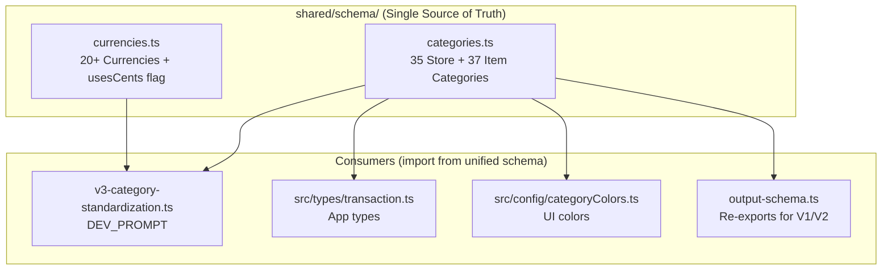
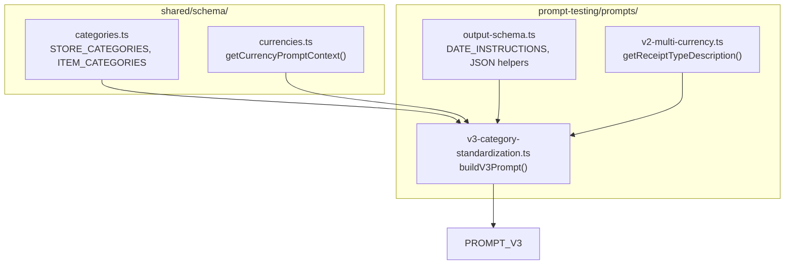
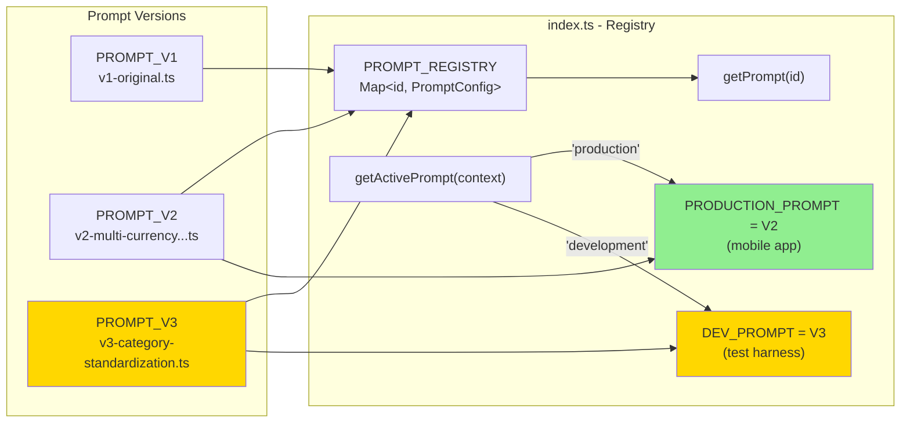
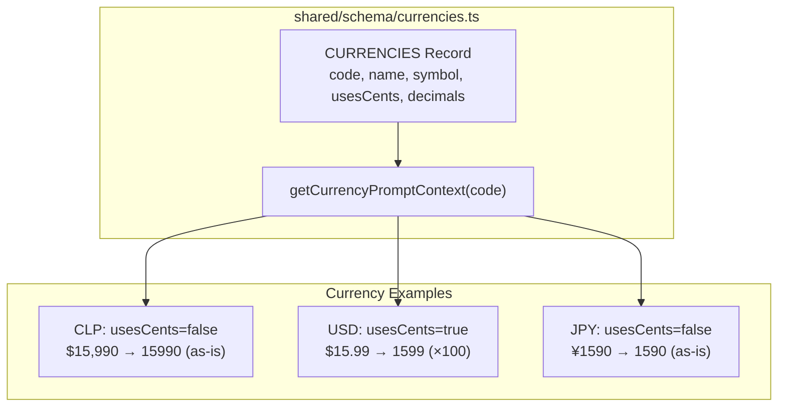
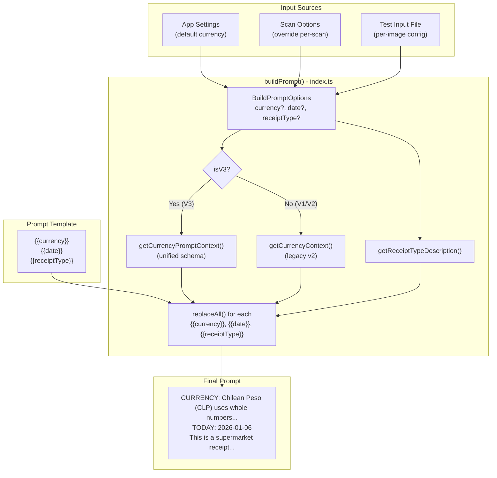
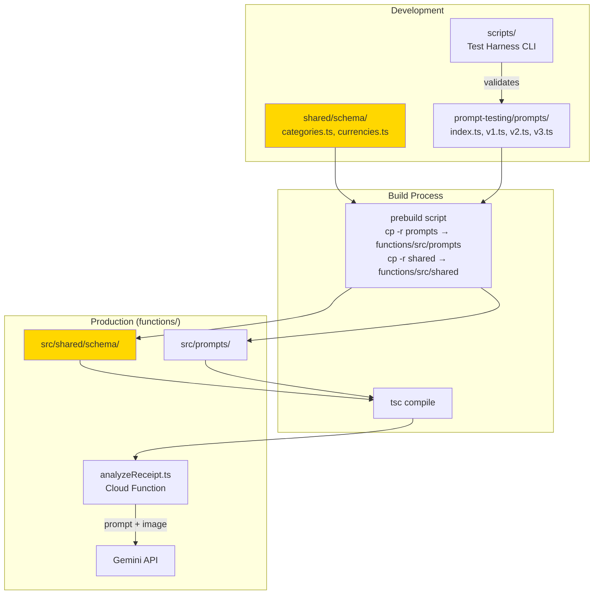
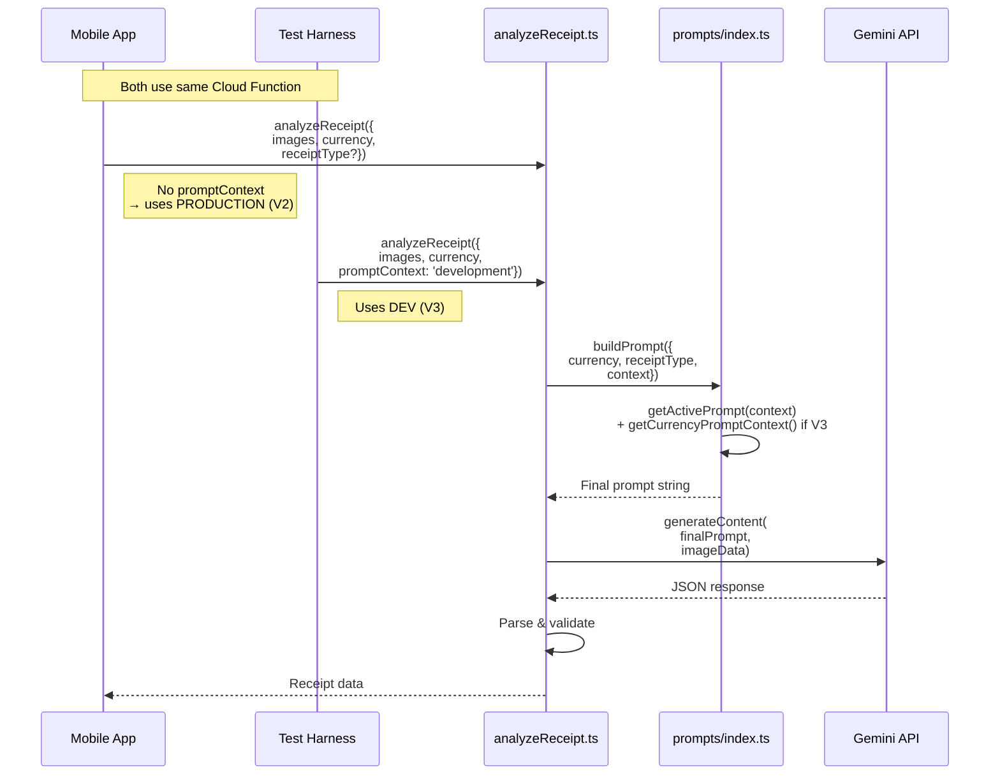
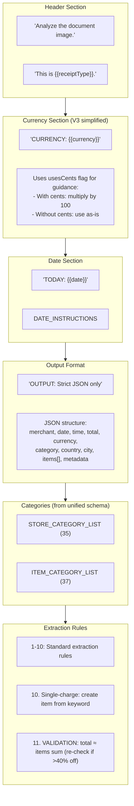

# Prompt Architecture

Visual documentation of how prompts are constructed, managed, and deployed.

## 1. Unified Schema (Single Source of Truth)

V3 introduces a **unified schema** that centralizes all category and currency definitions:

```
shared/schema/
├── categories.ts   # 35 store + 37 item categories
├── currencies.ts   # 20+ currencies with usesCents flag
└── index.ts        # Re-exports everything
```



## 2. Prompt Component Structure

How individual prompt pieces combine to form the final prompt:



## 3. Dual Prompt System

The system supports **two parallel prompts** for safe development:

| Prompt | Version | Purpose | Used By |
|--------|---------|---------|---------|
| `PRODUCTION_PROMPT` | V2 | Stable prompt for real users | Mobile app (`promptContext='production'`) |
| `DEV_PROMPT` | V3 | Experimental prompt for testing | Test harness (`promptContext='development'`) |



### Workflow

1. **Create/Edit V3 prompt** - experimental version
2. **Set `DEV_PROMPT = PROMPT_V3`** - test harness uses it
3. **Deploy to Cloud Function** - both prompts available
4. **Test with harness** - sends `promptContext='development'`
5. **Mobile app unaffected** - sends no context, defaults to `'production'`
6. **Promote when ready** - set `PRODUCTION_PROMPT = PROMPT_V3`

## 4. Currency System (V3)

V3 simplifies currency handling with a `usesCents` flag:



### Supported Currencies (20+)

| Region | Currencies | usesCents |
|--------|------------|-----------|
| Americas | CLP, COP | false |
| Americas | USD, CAD, MXN, BRL, ARS, PEN | true |
| Europe | EUR, GBP, CHF | true |
| Asia | JPY, KRW | false |
| Asia | CNY, INR | true |
| Other | AUD, NZD, AED, ZAR, ILS | true |

## 5. Variable Substitution Flow

How template variables are replaced at runtime:



## 6. Deployment Pipeline

How prompts flow from development to production:



## 7. Cloud Function Integration

How the prompt is used in receipt analysis:



## 8. V3 Prompt Structure

Detailed breakdown of V3 prompt components:



## File Locations

| Component | Location | Purpose |
|-----------|----------|---------|
| `categories.ts` | `shared/schema/` | **Single source**: 35 store + 37 item categories |
| `currencies.ts` | `shared/schema/` | **Single source**: 20+ currencies with usesCents flag |
| `output-schema.ts` | `prompt-testing/prompts/` | Re-exports categories, JSON helpers |
| `input-hints.ts` | `prompt-testing/prompts/` | Legacy currency exports, InputHints interface |
| `types.ts` | `prompt-testing/prompts/` | PromptConfig interface |
| `v1-original.ts` | `prompt-testing/prompts/` | Baseline prompt (simple) |
| `v2-multi-currency...ts` | `prompt-testing/prompts/` | V2 prompt (legacy) |
| `v3-category-standardization.ts` | `prompt-testing/prompts/` | **V3.2.0 prompt (production)** |
| `index.ts` | `prompt-testing/prompts/` | Registry, PRODUCTION/DEV prompts, buildPrompt() |
| `transaction.ts` | `src/types/` | App types (re-exports from unified schema) |
| `totalValidation.ts` | `src/utils/` | Client-side total validation utility |
| `TotalMismatchDialog.tsx` | `src/components/scan/` | Dialog for total correction |

## API Reference

### Core Exports (from `prompts/index.ts`)

```typescript
// Active prompts
PRODUCTION_PROMPT: PromptConfig  // V2 - For mobile app users
DEV_PROMPT: PromptConfig         // V3 - For test harness

// Build prompt with variables replaced
buildPrompt({ currency, date, receiptType, promptConfig?, context? }): string

// Get prompt by ID
getPrompt(id: string): PromptConfig

// List all registered prompts
listPrompts(): PromptConfig[]

// Get active prompt by context
getActivePrompt(context: 'production' | 'development'): PromptConfig
```

### Unified Schema Exports (from `shared/schema/index.ts`)

```typescript
// Categories
STORE_CATEGORIES: readonly string[]  // 35 categories
ITEM_CATEGORIES: readonly string[]   // 37 categories
STORE_CATEGORY_LIST: string          // Comma-separated for prompts
ITEM_CATEGORY_LIST: string           // Comma-separated for prompts
type StoreCategory = ...             // Union type
type ItemCategory = ...              // Union type

// Currencies
CURRENCIES: Record<string, CurrencyDefinition>
CURRENCY_CODES: string[]             // All currency codes
getCurrencyPromptContext(code: string): string  // For V3 prompts
getCurrency(code: string): CurrencyDefinition

interface CurrencyDefinition {
  code: string;      // "USD"
  name: string;      // "US Dollar"
  symbol: string;    // "$"
  usesCents: boolean; // true
  decimals: 0 | 2;   // 2
}
```

### Types

```typescript
interface PromptConfig {
  id: string;           // "v3-category-standardization"
  name: string;         // "Category Standardization"
  description: string;  // What this prompt does
  version: string;      // "3.0.0"
  createdAt: string;    // "2026-01-06"
  prompt: string;       // The actual prompt text with placeholders
}

type ReceiptType =
  | 'supermarket' | 'restaurant' | 'pharmacy' | 'gas_station'
  | 'utility_bill' | 'parking' | 'transport_ticket'
  | 'online_purchase' | 'subscription' | 'auto';
```

## V3 Category Lists

### Store Categories (35)

```
Food & Dining:       Supermarket, Restaurant, Bakery, Butcher, StreetVendor
Health & Wellness:   Pharmacy, Medical, Veterinary, HealthBeauty
Retail - General:    Bazaar, Clothing, Electronics, HomeGoods, Furniture, Hardware, GardenCenter
Retail - Specialty:  PetShop, BooksMedia, OfficeSupplies, SportsOutdoors, ToysGames, Jewelry, Optical, MusicStore
Automotive:          Automotive, GasStation, Transport
Services:            Services, BankingFinance, Education, TravelAgency, Subscription
Hospitality:         HotelLodging, Entertainment
Government:          Government
Other:               CharityDonation, Other
```

### Item Categories (37)

```
Food - Fresh:        Produce, Meat & Seafood, Bakery, Dairy & Eggs
Food - Packaged:     Pantry, Frozen Foods, Snacks, Beverages, Alcohol
Food - Prepared:     Prepared Food
Health & Personal:   Health & Beauty, Personal Care, Pharmacy, Supplements, Baby Products
Household:           Cleaning Supplies, Household, Pet Supplies
Non-Food Retail:     Clothing, Electronics, Hardware, Garden, Automotive, Sports & Outdoors,
                     Toys & Games, Books & Media, Office & Stationery, Crafts & Hobbies,
                     Furniture, Musical Instruments
Services & Fees:     Service, Tax & Fees, Subscription, Insurance, Loan Payment, Tobacco
Other:               Other
```

## Key Concepts

1. **Unified Schema**: Categories and currencies defined once in `shared/schema/`, imported everywhere
2. **usesCents Flag**: Simple boolean instead of verbose currency context strings
3. **Dual Prompt System**: PRODUCTION_PROMPT for app users, DEV_PROMPT for testing
4. **Context-Aware Selection**: `buildPrompt()` uses V3 currency context for V3, legacy for V1/V2
5. **Prebuild Copy**: Schema and prompts copied to functions during build
6. **Template Variables**: `{{currency}}`, `{{date}}`, `{{receiptType}}` replaced at runtime
7. **Versioning**: Each prompt has id, version, and metadata for tracking
8. **Prepared Food**: New V3 category for restaurant meals (sandwiches, pizza, etc.)
9. **Financial Categories**: New V3 item categories: Insurance, Loan Payment, Subscription
