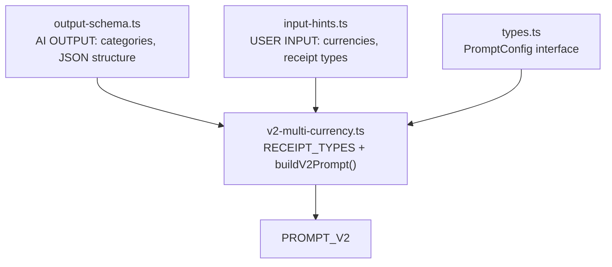
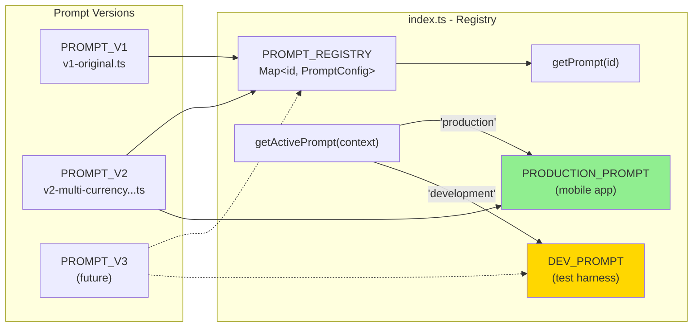
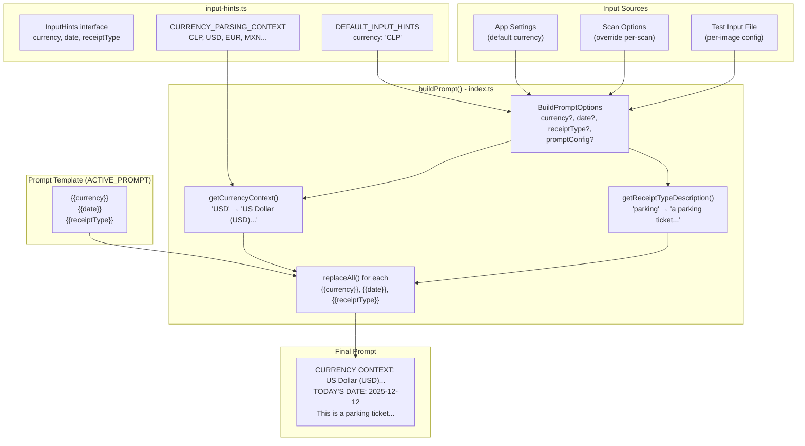
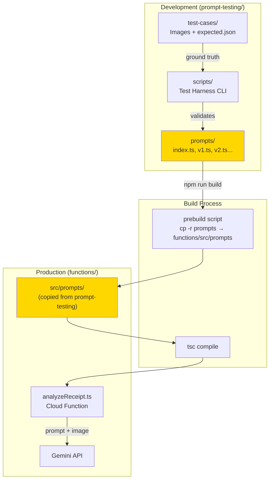
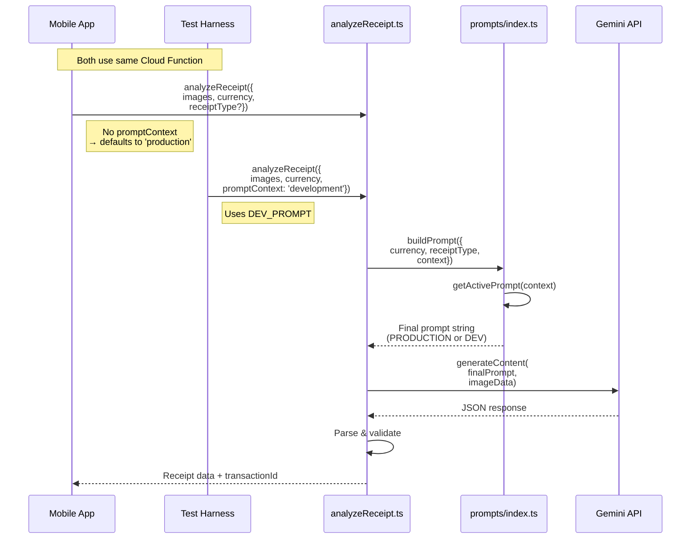
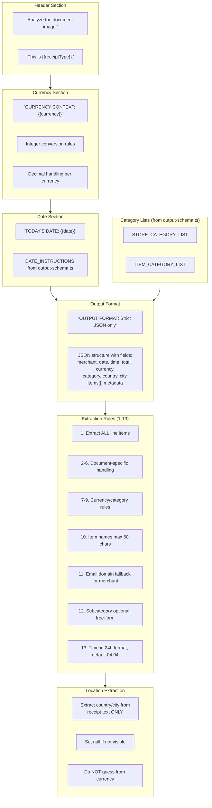
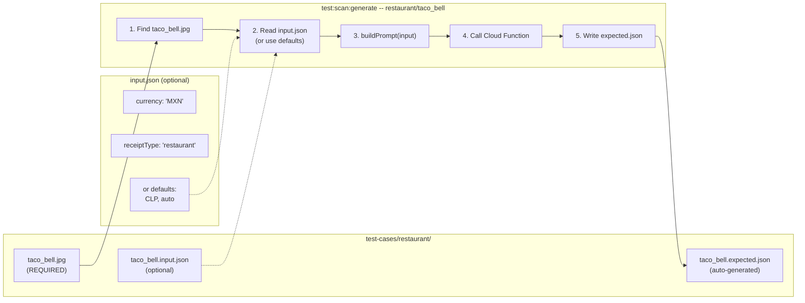

# Prompt Architecture

Visual documentation of how prompts are constructed, managed, and deployed.

## 1. Prompt Component Structure

How individual prompt pieces combine to form the final prompt:



## 2. Dual Prompt System

The system supports **two parallel prompts** for safe development:

| Prompt | Purpose | Used By |
|--------|---------|---------|
| `PRODUCTION_PROMPT` | Stable prompt for real users | Mobile app (`promptContext='production'`) |
| `DEV_PROMPT` | Experimental prompt for testing | Test harness (`promptContext='development'`) |



### Workflow

1. **Create V3 prompt** - new experimental version
2. **Set `DEV_PROMPT = PROMPT_V3`** - test harness uses it
3. **Deploy to Cloud Function** - both prompts available
4. **Test with harness** - sends `promptContext='development'`
5. **Mobile app unaffected** - sends no context, defaults to `'production'`
6. **Promote when ready** - set `PRODUCTION_PROMPT = PROMPT_V3`

## 3. Variable Substitution Flow

How template variables are replaced at runtime using the generic `buildPrompt()` function:



### Input Variable Priority

Variables are resolved with this priority (highest to lowest):

1. **Per-image test config** (`input` in `.expected.json`) - for testing specific scenarios
2. **Scan options** (passed to Cloud Function) - for user overrides at scan time
3. **App settings** (user's default currency) - from user preferences
4. **Defaults** (`DEFAULT_INPUT_HINTS`) - CLP, auto, today's date

## 4. Deployment Pipeline

How prompts flow from development to production:



## 5. Cloud Function Integration

How the prompt is used in the actual receipt analysis:



### Request Parameters

| Parameter | Type | Required | Default | Description |
|-----------|------|----------|---------|-------------|
| `images` | `string[]` | Yes | - | Base64-encoded images (data URI format) |
| `currency` | `string` | Yes | - | Currency code (CLP, USD, EUR, MXN...) |
| `receiptType` | `ReceiptType` | No | `'auto'` | Hint for document type (parking, supermarket...) |
| `promptContext` | `'production' \| 'development'` | No | `'production'` | Which prompt to use (PRODUCTION or DEV) |

## 6. Complete V2 Prompt Structure

Detailed breakdown of V2 prompt components (v2.1.0):



## File Locations

| Component | Location | Purpose |
|-----------|----------|---------|
| `output-schema.ts` | `prompt-testing/prompts/` | **AI OUTPUT**: Store/item categories, JSON structure (what AI must output) |
| `input-hints.ts` | `prompt-testing/prompts/` | **USER INPUT**: Currencies, receipt types, date (pre-scan hints) |
| `types.ts` | `prompt-testing/prompts/` | PromptConfig interface, re-exports category types from output-schema.ts |
| `v1-original.ts` | `prompt-testing/prompts/` | Baseline prompt (simple) |
| `v2-multi-currency...ts` | `prompt-testing/prompts/` | Enhanced prompt v2.6.0 (current active) with location/time extraction, name limits, email fallback, free-form subcategories |
| `index.ts` | `prompt-testing/prompts/` | Registry, PRODUCTION_PROMPT, DEV_PROMPT, buildPrompt() |
| `config.ts` | `prompt-testing/scripts/` | Test harness config, validStoreTypes (folder names) |
| `analyzeReceipt.ts` | `functions/src/` | Cloud Function that uses buildPrompt() |
| `*.input.json` | `prompt-testing/test-cases/` | Per-image input variables (created before generate) |
| `*.expected.json` | `prompt-testing/test-cases/` | AI results + corrections (created by generate) |

## API Reference

### Core Exports (from `prompts/index.ts`)

```typescript
// Active prompts
PRODUCTION_PROMPT: PromptConfig  // For mobile app users
DEV_PROMPT: PromptConfig         // For test harness

// Build prompt with variables replaced
buildPrompt({ currency, date, receiptType, promptConfig? }): string

// Get prompt by ID
getPrompt(id: string): PromptConfig

// List all registered prompts
listPrompts(): PromptConfig[]

// Get active prompt by context
getActivePrompt(context: 'production' | 'development'): PromptConfig
```

### Types

```typescript
interface PromptConfig {
  id: string;           // "v2-multi-currency-types"
  name: string;         // "Multi-Currency + Receipt Types"
  description: string;  // What this prompt does
  version: string;      // "2.6.0"
  createdAt: string;    // "2025-12-12"
  prompt: string;       // The actual prompt text with placeholders
}

type ReceiptType =
  | 'supermarket' | 'restaurant' | 'pharmacy' | 'gas_station'
  | 'utility_bill' | 'parking' | 'transport_ticket'
  | 'online_purchase' | 'subscription' | 'auto';
```

## Type Derivation Pattern

To prevent duplication between arrays and types, we use `as const` with type inference:

```typescript
// output-schema.ts - Single source of truth for AI output
export const STORE_CATEGORIES = [
  'Supermarket',
  'Restaurant',
  // ...
] as const;

// Type derived from array (not duplicated!)
export type StoreCategory = (typeof STORE_CATEGORIES)[number];
```

This pattern is used for:
- `STORE_CATEGORIES` / `StoreCategory` in output-schema.ts
- `ITEM_CATEGORIES` / `ItemCategory` in output-schema.ts
- `CONFIG.validStoreTypes` / `ValidStoreType` in config.ts

**Note**: The app's `src/types/transaction.ts` has its own `StoreCategory` type for the frontend. Keep them in sync manually when categories change.

## 7. Per-Image Test Input Configuration

Test cases can optionally specify input variables using a separate `.input.json` file.
This mirrors the app flow: user settings are known before the scan button is pressed.

**Only the image file is required.** Input and expected files are optional.



### Test Case File Structure

Each test case has 1 required file and 2 optional files:

```
test-cases/restaurant/
├── taco_bell.jpg           # REQUIRED - Receipt image (.jpg, .jpeg, or .png)
├── taco_bell.input.json    # OPTIONAL - Input variables (uses defaults if missing)
└── taco_bell.expected.json # AUTO-GENERATED - AI results + corrections
```

| File | Required | Created By | Purpose |
|------|----------|------------|---------|
| `*.jpg` / `*.jpeg` / `*.png` | **Yes** | You | Receipt image |
| `*.input.json` | No | You (optional) | Custom currency/receiptType |
| `*.expected.json` | No | `generate` command | AI results + corrections |

### CLI Path Resolution

The generate command accepts paths without file extensions:

```bash
npm run test:scan:generate -- restaurant/taco_bell
```

The CLI automatically:
1. Searches for `taco_bell.jpg`, `taco_bell.jpeg`, or `taco_bell.png`
2. Looks for optional `taco_bell.input.json`
3. Creates `taco_bell.expected.json`

### Input File Format (`.input.json`)

Optionally created before running `test:scan:generate`:

```json
{
  "currency": "MXN",
  "receiptType": "restaurant"
}
```

| Field | Type | Default | Description |
|-------|------|---------|-------------|
| `currency` | `string` | `"CLP"` | Currency code for price parsing |
| `receiptType` | `ReceiptType` | `"auto"` | Document type hint |

### Expected File Format (`.expected.json`)

Generated by the test harness, includes the input that was used:

```json
{
  "metadata": { ... },
  "input": {
    "currency": "MXN",
    "receiptType": "restaurant"
  },
  "aiExtraction": { ... },
  "corrections": { ... }
}
```

### Why Separate Input Files?

Input files are **optional** but useful when you need to test non-default scenarios.

This design mirrors the real app flow:

1. **App flow**: User's settings (currency) exist BEFORE they tap "Scan"
2. **Test flow**: Input file (if present) is read BEFORE running the scan

The input variables affect what prompt is built, which affects what the AI extracts.
When no input file exists, defaults are used (CLP currency, auto receipt type).

### Supported Receipt Types

Organized by category:

| Category | Receipt Types |
|----------|---------------|
| Grocery & Food | `supermarket`, `restaurant`, `cafe`, `bar`, `bakery` |
| Retail | `general_store`, `department_store`, `clothing_store`, `electronics_store`, `furniture_store`, `bookstore` |
| Health | `pharmacy`, `medical_clinic`, `dental_clinic`, `optical_store` |
| Automotive | `gas_station`, `auto_repair`, `car_wash` |
| Travel | `hotel`, `car_rental`, `airline_ticket` |
| Entertainment | `movie_theater`, `concert_ticket`, `event_ticket`, `museum_entry` |
| Services | `utility_bill`, `parking`, `transport_ticket`, `cleaning_service`, `home_improvement` |
| Fitness | `gym_membership`, `spa_service` |
| Education | `tuition_payment` |
| Government | `tax_payment`, `court_fee` |
| Other | `donation_receipt`, `online_purchase`, `subscription`, `auto` |

### Supported Currencies

| Code | Description | Decimal Handling |
|------|-------------|------------------|
| `CLP` | Chilean Peso | Integers only |
| `USD` | US Dollar | Cents (multiply by 100) |
| `EUR` | Euro | Cents (multiply by 100) |
| `MXN` | Mexican Peso | Centavos possible |
| `ARS` | Argentine Peso | Integers common |
| `COP` | Colombian Peso | Integers only |
| `PEN` | Peruvian Sol | Centimos possible |
| `BRL` | Brazilian Real | Centavos possible |
| `GBP` | British Pound | Pence (multiply by 100) |

## Key Concepts

1. **Single Source of Truth**: Arrays define values, types are derived (no duplication)
2. **Prebuild Copy**: Prompts are copied to functions during build
3. **Template Variables**: `{{currency}}`, `{{date}}`, `{{receiptType}}` replaced at runtime
4. **Dual Prompt System**: PRODUCTION_PROMPT for app users, DEV_PROMPT for testing
5. **Versioning**: Each prompt has id, version, and metadata for tracking
6. **Input Hints**: User-provided pre-scan context defined in `input-hints.ts` (currencies: CLP, USD, EUR)
7. **Location Extraction**: Country/city extracted from receipt text only, null if not visible
8. **Image-Only Required**: Only the image file is required; input.json and expected.json are optional
9. **Extension-Free Paths**: CLI accepts `restaurant/taco_bell` and auto-detects `.jpg/.jpeg/.png`
10. **Generic buildPrompt()**: Single function works with any prompt version, handles all variable substitution
11. **Context-Aware Selection**: `promptContext` parameter controls which prompt is used (production or development)
12. **Name Length Limits**: Item names max 50 characters to avoid cryptic multi-line descriptions
13. **Email Domain Fallback**: For unclear merchant names, extract from email domain on receipt (e.g., `info@mufin.cl` → "Mufin")
14. **Free-Form Subcategories**: Subcategory is optional and AI-generated (not predefined). Only used when it adds useful granularity (e.g., "Fresh Fruits", "Craft Beer")
15. **Time Extraction**: Time in 24-hour format (HH:MM). Default "04:04" if not found on receipt (404 = not found)
